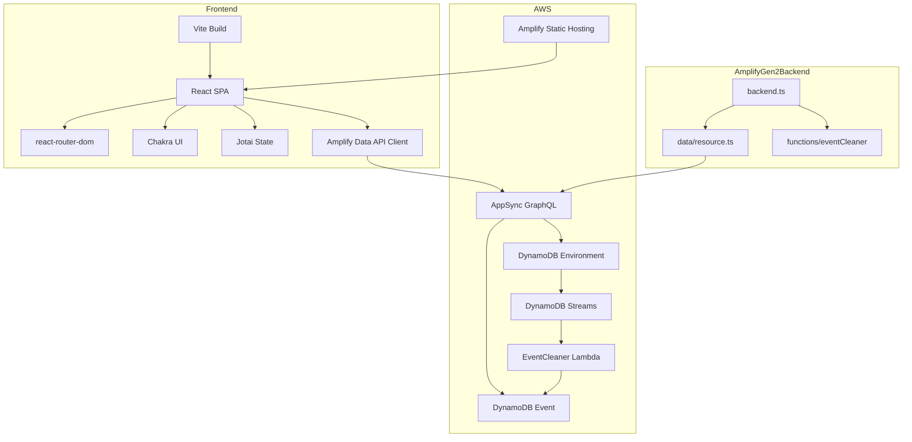
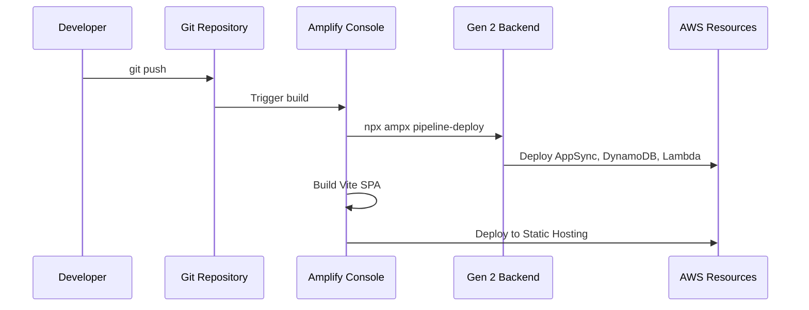
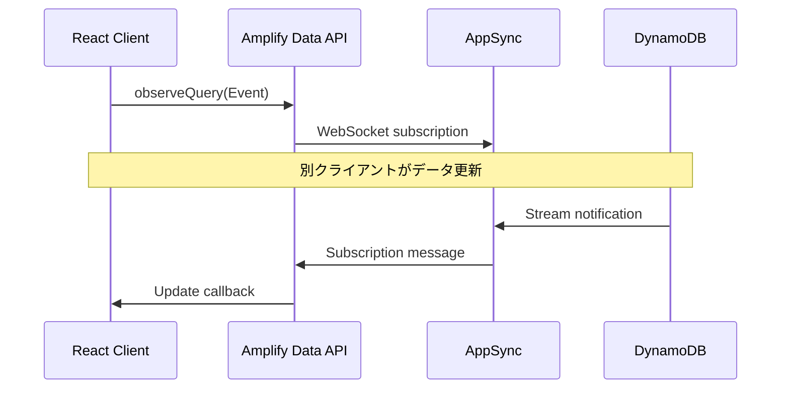
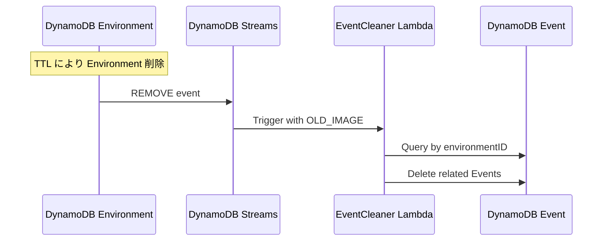
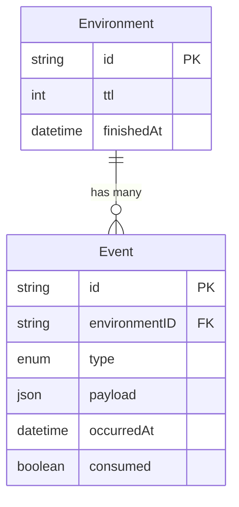
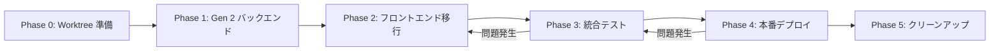

# Technical Design Document

## Overview

**Purpose**: 本設計ドキュメントは、AWS Amplify Gen 1 から Gen 2 への移行、および Astro から Vite + React (SPA) へのフロントエンドフレームワーク移行を定義する。バックエンドは TypeScript-first の宣言的定義に移行し、フロントエンドはシンプルな SPA 構成に変更する。

**Users**: 開発者がバックエンドリソースの管理とフロントエンド開発を効率的に行えるようにする。エンドユーザーへの機能変更はなし。

**Impact**: プロジェクト構成を大幅に簡素化。CLI ベースからコードファーストへの移行により、Infrastructure as Code の恩恵を受ける。

### Goals

- Amplify Gen 2 の TypeScript-first アプローチでバックエンドを定義
- DataStore から Amplify Data API への移行によりリアルタイム同期を維持
- Astro から Vite + React への移行で SSR 不要なシンプル構成を実現
- カスタムビルドスクリプトを削除し、標準的なビルドフローを確立
- 既存の React コンポーネントとビジネスロジックを維持

### Non-Goals

- データ移行（新規デプロイとして扱う）
- ビジネスロジックの変更
- UI/UX の変更
- 認証方式の変更（Identity Pool 認証を維持）

## Architecture

### Existing Architecture Analysis

**現在の構成（Gen 1）**:
- `amplify/backend/` に JSON/CloudFormation ベースの設定
- `amplify/backend/api/` に GraphQL スキーマ（schema.graphql）
- `amplify/backend/function/` に Lambda 関数
- フロントエンドは Astro + React (SSR)
- DataStore による自動同期

**移行が必要な理由**:
- Gen 1 は CLI 依存でコード管理が困難
- DataStore は Gen 2 で非サポート
- Astro SSR は不要な複雑性を追加

### Architecture Pattern & Boundary Map



**Architecture Integration**:
- **Selected pattern**: Amplify Gen 2 Full Stack - TypeScript-first の宣言的定義
- **Domain boundaries**: バックエンド（amplify/）とフロントエンド（src/）を明確に分離
- **Existing patterns preserved**: Logic 層（src/logic/）の純粋関数、Components 層の Chakra UI ベース
- **New components rationale**: react-router-dom の追加（クライアントサイドルーティング用）
- **Steering compliance**: TypeScript strict mode、Biome linter、UI/Logic 分離を維持

### Technology Stack

| Layer | Choice / Version | Role in Feature | Notes |
|-------|------------------|-----------------|-------|
| Frontend | Vite 6.x | ビルドツール | Astro から移行 |
| Frontend | React 18 | UI ライブラリ | 維持 |
| Frontend | react-router-dom 7.x | クライアントルーティング | 新規追加 |
| Frontend | Chakra UI 2.x | UI コンポーネント | 維持 |
| Frontend | Jotai 2.x | 状態管理 | 維持 |
| Backend | @aws-amplify/backend | バックエンド定義 | Gen 2 新規 |
| Backend | aws-amplify 6.x | クライアント SDK | 維持 |
| Data | AWS AppSync | GraphQL API | 維持 |
| Data | Amazon DynamoDB | NoSQL データベース | 維持 |
| Infrastructure | Amplify Gen 2 CLI | デプロイ | ampx コマンド |
| Hosting | Amplify Static Hosting | SPA ホスティング | SSR から移行 |

## System Flows

### バックエンドデプロイフロー



### リアルタイムデータ同期フロー



### EventCleaner トリガーフロー



## Requirements Traceability

| Requirement | Summary | Components | Interfaces | Flows |
|-------------|---------|------------|------------|-------|
| 1.1-1.5 | Gen 2 バックエンド定義 | AmplifyBackend | defineBackend, defineData, defineFunction | デプロイフロー |
| 2.1-2.7 | GraphQL API 移行 | AmplifyData | Schema definition | - |
| 3.1-3.6 | Lambda 関数移行 | EventCleanerFunction | DynamoDB Streams | EventCleaner フロー |
| 4.1-4.2 | TTL 設定 | AmplifyData | CDK construct | - |
| 5.1-5.8 | フロントエンド移行 | ViteApp, AppRouter | react-router-dom | - |
| 6.1-6.5 | Static Hosting | AmplifyHosting | amplify.yml | デプロイフロー |
| 7.1-7.7 | データアクセス移行 | ApiClient, EventService, EnvironmentService | Amplify Data API | データ同期フロー |
| 8.1-8.6 | 開発ワークフロー | - | ampx CLI | - |
| 9.1-9.6 | ドキュメント更新 | - | - | - |
| 10.1-10.5 | CI/CD 更新 | - | amplify.yml | デプロイフロー |
| 11.1-11.6 | クリーンアップ | - | - | - |

## Components and Interfaces

### Component Summary

| Component | Domain/Layer | Intent | Req Coverage | Key Dependencies | Contracts |
|-----------|--------------|--------|--------------|------------------|-----------|
| AmplifyBackend | Backend | バックエンドリソースの統合定義 | 1.1-1.5 | @aws-amplify/backend (P0) | Service |
| AmplifyData | Backend | GraphQL スキーマ定義 | 2.1-2.7, 4.1-4.2 | AmplifyBackend (P0) | Service |
| EventCleanerFunction | Backend | Environment 削除時の Event クリーンアップ | 3.1-3.6 | AmplifyData (P0), CDK (P0) | Service |
| ViteApp | Frontend | SPA エントリーポイント | 5.1-5.8 | Vite (P0), React (P0) | - |
| AppRouter | Frontend | クライアントサイドルーティング | 5.4-5.6 | react-router-dom (P0) | - |
| ApiClient | Frontend | Amplify Data API クライアント | 7.1-7.2 | aws-amplify (P0) | Service |
| EventService | Frontend | Event エンティティ操作 | 7.3-7.6 | ApiClient (P0) | Service |
| EnvironmentService | Frontend | Environment エンティティ操作 | 7.7 | ApiClient (P0) | Service |

---

### Backend Layer

#### AmplifyBackend

| Field | Detail |
|-------|--------|
| Intent | Amplify Gen 2 バックエンドリソースの統合エントリーポイント |
| Requirements | 1.1, 1.2, 1.3, 1.4, 1.5 |

**Responsibilities & Constraints**
- `defineBackend()` で Data と Function を統合
- CDK を使用したカスタムリソース定義
- DynamoDB Streams トリガーの設定

**Dependencies**
- Outbound: AmplifyData — スキーマ定義 (P0)
- Outbound: EventCleanerFunction — Lambda 関数 (P0)
- External: @aws-amplify/backend — バックエンド定義 API (P0)
- External: aws-cdk-lib — カスタムリソース定義 (P0)

**Contracts**: Service [x]

##### Service Interface

```typescript
// amplify/backend.ts
import { defineBackend } from "@aws-amplify/backend";
import { data } from "./data/resource";
import { eventCleaner } from "./functions/eventCleaner/resource";

const backend = defineBackend({
  data,
  eventCleaner,
});

// CDK による DynamoDB Streams トリガー設定
const environmentTable = backend.data.resources.tables["Environment"];
const eventTable = backend.data.resources.tables["Event"];

// EventSourceMapping の設定は CDK で実装
```

**Implementation Notes**
- Integration: CDK で DynamoDB Streams → Lambda のイベントソースマッピング設定
- Validation: sandbox 環境で動作確認後に本番デプロイ
- Risks: CDK 設定の複雑性。公式サンプルを参照

---

#### AmplifyData

| Field | Detail |
|-------|--------|
| Intent | GraphQL スキーマと DynamoDB テーブルの定義 |
| Requirements | 2.1, 2.2, 2.3, 2.4, 2.5, 2.6, 2.7, 4.1, 4.2 |

**Responsibilities & Constraints**
- Event, Environment モデルの定義
- EventType enum の定義
- リレーションとセカンダリインデックスの設定
- Identity Pool (guest) 認証の設定

**Dependencies**
- External: @aws-amplify/backend — defineData API (P0)

**Contracts**: Service [x]

##### Service Interface

```typescript
// amplify/data/resource.ts
import { type ClientSchema, a, defineData } from "@aws-amplify/backend";

const schema = a.schema({
  EventType: a.enum([
    "INITIALIZE",
    "JOIN",
    "LEAVE",
    "GENERATE",
    "RETRY",
    "FINISH",
  ]),

  Environment: a
    .model({
      ttl: a.integer().required(),
      finishedAt: a.datetime(),
      events: a.hasMany("Event", "environmentID"),
    })
    .authorization((allow) => [allow.guest()]),

  Event: a
    .model({
      environmentID: a.id().required(),
      type: a.ref("EventType").required(),
      payload: a.json().required(),
      occurredAt: a.datetime().required(),
      consumed: a.boolean(),
      environment: a.belongsTo("Environment", "environmentID"),
    })
    .secondaryIndexes((index) => [
      index("environmentID").sortKeys(["occurredAt"]).name("byEnvironment"),
    ])
    .authorization((allow) => [allow.guest()]),
});

export type Schema = ClientSchema<typeof schema>;
export const data = defineData({
  schema,
  authorizationModes: {
    defaultAuthorizationMode: "identityPool",
  },
});
```

**Implementation Notes**
- Integration: TTL は DynamoDB の TTL 機能で自動削除
- Validation: スキーマ変更後は sandbox で動作確認
- Risks: Gen 1 スキーマとの互換性確認が必要

---

#### EventCleanerFunction

| Field | Detail |
|-------|--------|
| Intent | Environment 削除時に関連 Event を削除する Lambda 関数 |
| Requirements | 3.1, 3.2, 3.3, 3.4, 3.5, 3.6 |

**Responsibilities & Constraints**
- DynamoDB Streams からの REMOVE イベント処理
- byEnvironment インデックスを使用した Event 検索
- 関連 Event の削除

**Dependencies**
- Inbound: DynamoDB Streams — トリガー (P0)
- Outbound: DynamoDB Event テーブル — 削除対象 (P0)
- External: @aws-amplify/backend — defineFunction API (P0)
- External: @aws-sdk/client-dynamodb — DynamoDB 操作 (P0)

**Contracts**: Service [x]

##### Service Interface

```typescript
// amplify/functions/eventCleaner/resource.ts
import { defineFunction } from "@aws-amplify/backend";

export const eventCleaner = defineFunction({
  name: "eventCleaner",
  entry: "./handler.ts",
  runtime: 22, // Node.js 22
  timeoutSeconds: 60,
});
```

```typescript
// amplify/functions/eventCleaner/handler.ts
import type { DynamoDBStreamHandler } from "aws-lambda";
import { DynamoDBClient } from "@aws-sdk/client-dynamodb";
import {
  DynamoDBDocumentClient,
  QueryCommand,
  DeleteCommand,
} from "@aws-sdk/lib-dynamodb";

const ddb = DynamoDBDocumentClient.from(new DynamoDBClient({}));

export const handler: DynamoDBStreamHandler = async (event) => {
  for (const record of event.Records) {
    if (record.eventName !== "REMOVE" || !record.dynamodb?.Keys) continue;

    const envId = record.dynamodb.Keys.id?.S;
    if (!envId) continue;

    // Query events by environmentID
    const events = await ddb.send(
      new QueryCommand({
        TableName: process.env.EVENT_TABLE_NAME,
        IndexName: "byEnvironment",
        KeyConditionExpression: "environmentID = :envId",
        ExpressionAttributeValues: { ":envId": envId },
      })
    );

    // Delete each event
    for (const item of events.Items ?? []) {
      await ddb.send(
        new DeleteCommand({
          TableName: process.env.EVENT_TABLE_NAME,
          Key: { id: item.id },
        })
      );
    }
  }
};
```

**Implementation Notes**
- Integration: 環境変数 EVENT_TABLE_NAME は CDK で設定
- Validation: 削除ログを CloudWatch で確認
- Risks: 大量削除時のスロットリング。BatchWrite への最適化を検討

---

### Frontend Layer

#### ViteApp

| Field | Detail |
|-------|--------|
| Intent | Vite ベースの SPA エントリーポイント |
| Requirements | 5.1, 5.2, 5.3, 5.7, 5.8 |

**Responsibilities & Constraints**
- React アプリケーションのマウント
- ChakraProvider による UI テーマ適用
- Amplify の初期設定

**Dependencies**
- Outbound: AppRouter — ルーティング (P0)
- External: Vite — ビルドツール (P0)
- External: React — UI ライブラリ (P0)
- External: Chakra UI — UI コンポーネント (P0)
- External: aws-amplify — Amplify SDK (P0)

**Contracts**: なし（エントリーポイント）

**Implementation Notes**
- Integration: `index.html` → `src/main.tsx` → `App.tsx`
- Validation: `npm run dev` で動作確認

---

#### AppRouter

| Field | Detail |
|-------|--------|
| Intent | クライアントサイドルーティング |
| Requirements | 5.4, 5.5, 5.6 |

**Responsibilities & Constraints**
- `/` ルートで Main コンポーネント表示
- `/share/:id` ルートで Share コンポーネント表示
- パラメータ抽出と Props 受け渡し

**Dependencies**
- Inbound: ViteApp — マウント (P0)
- Outbound: Main, Share — ページコンポーネント (P0)
- External: react-router-dom — ルーティング (P0)

**Contracts**: なし（ルーティング設定のみ）

##### ルーティング設定

```typescript
// src/App.tsx
import { BrowserRouter, Routes, Route, useParams } from "react-router-dom";
import Main from "./components/Main";
import Share from "./components/Share";

function ShareWrapper() {
  const { id } = useParams<{ id: string }>();
  return <Share sharedId={id ?? ""} />;
}

export default function App() {
  return (
    <BrowserRouter>
      <Routes>
        <Route path="/" element={<Main />} />
        <Route path="/share/:id" element={<ShareWrapper />} />
      </Routes>
    </BrowserRouter>
  );
}
```

**Implementation Notes**
- Integration: Main, Share コンポーネントは既存コードをそのまま使用
- Validation: 各ルートへのナビゲーションをテスト

---

#### ApiClient

| Field | Detail |
|-------|--------|
| Intent | Amplify Data API クライアントの生成と設定 |
| Requirements | 7.1, 7.2 |

**Responsibilities & Constraints**
- `amplify_outputs.json` の読み込み
- `generateClient<Schema>()` によるクライアント生成
- 型安全なクライアントの提供

**Dependencies**
- External: aws-amplify — Amplify SDK (P0)
- External: amplify_outputs.json — 設定ファイル (P0)

**Contracts**: Service [x]

##### Service Interface

```typescript
// src/api/client.ts
import { Amplify } from "aws-amplify";
import { generateClient } from "aws-amplify/data";
import type { Schema } from "../../amplify/data/resource";
import outputs from "../../amplify_outputs.json";

Amplify.configure(outputs);

export const client = generateClient<Schema>();
export type { Schema };
```

**Implementation Notes**
- Integration: amplify_outputs.json は `npx ampx generate outputs` で生成
- Validation: クライアント生成後に簡単なクエリで疎通確認

---

#### EventService

| Field | Detail |
|-------|--------|
| Intent | Event エンティティの CRUD 操作とリアルタイム同期 |
| Requirements | 7.3, 7.4, 7.5, 7.6 |

**Responsibilities & Constraints**
- Event の作成、取得、削除
- observeQuery によるリアルタイム同期
- 既存 API インターフェースの維持

**Dependencies**
- Inbound: Components — データ操作 (P0)
- Outbound: ApiClient — Amplify Data API (P0)

**Contracts**: Service [x]

##### Service Interface

```typescript
// src/api/event.ts
import { client, type Schema } from "./client";
import type { CurrentSettings, GameMembers } from "@logic";

export const EventType = {
  Initialize: "INITIALIZE",
  Join: "JOIN",
  Leave: "LEAVE",
  Generate: "GENERATE",
  Retry: "RETRY",
  Finish: "FINISH",
} as const;

export type EventType = (typeof EventType)[keyof typeof EventType];

type EventModel = Schema["Event"]["type"];

export interface Event {
  id: string;
  type: EventType;
  payload: unknown;
  occurredAt: Date;
}

// Event 発行
async function emit(
  environmentID: string,
  type: EventType,
  payload?: unknown
): Promise<void> {
  await client.models.Event.create({
    environmentID,
    type,
    payload: JSON.stringify(payload ?? {}),
    occurredAt: new Date().toISOString(),
  });
}

export function eventEmitter(envId: string) {
  return {
    initialize: (payload: CurrentSettings) =>
      emit(envId, EventType.Initialize, payload),
    join: () => emit(envId, EventType.Join),
    leave: (memberId: number) =>
      emit(envId, EventType.Leave, { memberId }),
    generate: (members: GameMembers) =>
      emit(envId, EventType.Generate, { members }),
    retry: (members: GameMembers) =>
      emit(envId, EventType.Retry, { members }),
    finish: () => emit(envId, EventType.Finish),
  };
}

// リアルタイム購読
export function subscribeEvent(
  environmentID: string,
  handler: (event: Event) => void
) {
  const subscription = client.models.Event.observeQuery({
    filter: { environmentID: { eq: environmentID } },
  }).subscribe({
    next: ({ items }) => {
      items.map(toEvent).forEach(handler);
    },
  });

  return {
    unsubscribe: () => subscription.unsubscribe(),
  };
}

// 全 Event 取得
export async function findAllEvents(environmentID: string): Promise<Event[]> {
  const { data } = await client.models.Event.list({
    filter: { environmentID: { eq: environmentID } },
  });
  return (data ?? [])
    .map(toEvent)
    .sort((a, b) => a.occurredAt.getTime() - b.occurredAt.getTime());
}

function toEvent(model: EventModel): Event {
  return {
    id: model.id,
    type: model.type as EventType,
    payload: JSON.parse(model.payload as string),
    occurredAt: new Date(model.occurredAt),
  };
}
```

**Implementation Notes**
- Integration: 既存の eventEmitter, subscribeEvent, findAllEvents API を維持
- Validation: リアルタイム同期のテスト必須
- Risks: フィルタ構文の違いに注意

---

#### EnvironmentService

| Field | Detail |
|-------|--------|
| Intent | Environment エンティティの CRUD 操作 |
| Requirements | 7.7 |

**Responsibilities & Constraints**
- Environment の作成、更新
- TTL 設定
- 既存 API インターフェースの維持

**Dependencies**
- Inbound: Components — データ操作 (P0)
- Outbound: ApiClient — Amplify Data API (P0)

**Contracts**: Service [x]

##### Service Interface

```typescript
// src/api/environment.ts
import { client } from "./client";
import ms from "ms";

const ttl = (lifetime: number) => Math.floor((Date.now() + lifetime) / 1000);

export async function createEnvironment(): Promise<{ id: string }> {
  const { data } = await client.models.Environment.create({
    ttl: ttl(ms("7d")),
  });
  if (!data) throw new Error("Failed to create environment");
  return { id: data.id };
}

export async function finishEnvironment(id: string): Promise<void> {
  await client.models.Environment.update({
    id,
    finishedAt: new Date().toISOString(),
  });
}
```

**Implementation Notes**
- Integration: 既存の createEnvironment, finishEnvironment API を維持
- Validation: TTL による自動削除を sandbox で確認

---

## Data Models

### Domain Model

**Aggregates**:
- **Environment**: ゲームセッションの単位。TTL による自動削除
- **Event**: セッション内のイベント履歴。Environment に従属

**Business Rules**:
- Environment 削除時に関連 Event も削除
- Event は時系列順に処理
- TTL は 7 日間



### Physical Data Model

**DynamoDB Tables**:

| Table | Partition Key | Sort Key | GSI | TTL |
|-------|---------------|----------|-----|-----|
| Environment | id | - | - | ttl |
| Event | id | - | byEnvironment (environmentID, occurredAt) | - |

**Indexes**:
- `byEnvironment`: environmentID での Event 検索用

## Error Handling

### Error Categories and Responses

**User Errors (4xx)**:
- Invalid input → Zod バリデーションでフロントエンドで検出
- Not found → ナビゲーションガイダンス

**System Errors (5xx)**:
- AppSync/DynamoDB 障害 → リトライ + ユーザー通知
- Lambda タイムアウト → CloudWatch アラート

**Business Logic Errors (422)**:
- 不正な状態遷移 → フロントエンドで防止

### Monitoring

- CloudWatch Logs: Lambda 実行ログ
- AppSync Logs: GraphQL リクエストログ
- Amplify Hosting: ビルド/デプロイログ

## Testing Strategy

### Unit Tests
- EventService: emit, findAllEvents のモック付きテスト
- EnvironmentService: create, finish のモック付きテスト
- EventCleanerHandler: DynamoDB Streams イベント処理

### Integration Tests
- Amplify Data API との疎通確認
- リアルタイム同期（observeQuery）の動作確認
- DynamoDB Streams → Lambda トリガーの動作確認

### E2E Tests
- `/` ルートでの初期設定フロー
- `/share/:id` ルートでの共有ビュー表示
- メンバー生成と統計表示

## Migration Strategy

### Git Worktree アプローチ

Gen 1 と Gen 2 は同じ `amplify/` パスを使用するため、同一プロジェクトで共存できない。また、`.gitignore` で除外されたローカル設定ファイル（`amplify/.config/local-*.json`、`amplify/team-provider-info.json`）がブランチ切り替えでも残り続けるため、**Git Worktree を使用して完全に別のディレクトリツリーで移行作業を行う**。

**ディレクトリ構成**:
- `doubles-member-generator/`: main ブランチ（Gen 1、本番稼働中）
- `doubles-member-generator-gen2/`: update ブランチ（Gen 2 移行作業用 worktree）

### Phase 0: 準備（worktree セットアップ）
1. spec ファイルをコミット
2. Gen 1 `amplify/` ディレクトリを削除（worktree 内のみ）

### Phase 1: Gen 2 バックエンド作成（worktree 内）
1. `npm create amplify@latest` で Gen 2 初期化
2. `amplify/backend.ts` 作成
3. `amplify/data/resource.ts` でスキーマ定義
4. `amplify/functions/eventCleaner/` で Lambda 定義
5. CDK で DynamoDB Streams トリガー設定
6. `npx ampx sandbox` で動作確認

### Phase 2: フロントエンド移行（worktree 内）
1. Vite 設定ファイルの作成（`vite.config.ts`、`index.html`）
2. エントリーポイント（`src/main.tsx`、`src/App.tsx`）の作成
3. react-router-dom によるルーティング設定
4. `src/api/client.ts` の作成（Amplify Data API クライアント）
5. `src/api/event.ts` の Amplify Data API 移行
6. `src/api/environment.ts` の Amplify Data API 移行
7. Astro 関連ファイルの削除
8. ローカル動作確認（`npm run dev`）

### Phase 3: 統合テスト
1. sandbox 環境でのフル統合テスト
2. リアルタイム同期の確認
3. EventCleaner の動作確認（TTL 削除トリガー）

### Phase 4: 本番デプロイ（カットオーバー移行）

**前提条件**:
- ダウンタイム許容（短時間の DNS 切り替え時間）
- 既存データ破棄可（新規デプロイとして扱う）

**手順**:

1. **Amplify Console で Gen 2 アプリを新規作成**
   - update ブランチを接続
   - ビルド設定（amplify.yml）の確認
   - 初回デプロイを実行

2. **Gen 2 アプリのデプロイ完了を確認**
   - Amplify 提供の一時ドメイン（*.amplifyapp.com）で動作確認
   - 主要機能（環境作成、イベント発行、共有URL）のテスト

3. **Gen 1 アプリからカスタムドメインを削除**
   - Amplify Console > Gen 1 アプリ > ドメイン管理 > 削除
   - Route 53 の CNAME レコードが解放されるまで待機

4. **Gen 2 アプリにカスタムドメインを設定**
   - Amplify Console > Gen 2 アプリ > ドメイン管理 > 追加
   - SSL 証明書のプロビジョニング完了を待機（数分〜数時間）

5. **DNS 伝播を確認**
   - `dig` または `nslookup` で新しい CNAME を確認
   - 複数地域からのアクセス確認

6. **本番動作確認**
   - カスタムドメインでの全機能テスト
   - リアルタイム同期の確認

7. **Gen 1 アプリを削除**
   - Amplify Console から Gen 1 アプリを削除
   - 関連する CloudFormation スタックの削除確認

### Phase 5: クリーンアップ
1. update ブランチを main にマージ
2. worktree の削除
3. 不要な依存関係の削除
4. ドキュメント更新



### 環境構成（ブランチベース）

本番運用では、ブランチごとに異なるバックエンド環境を使い分ける。

| ブランチ | バックエンド | 用途 |
|----------|-------------|------|
| main | main 環境をデプロイ | 本番 |
| develop | develop 環境をデプロイ | 開発・テスト |
| feature/* | develop 環境を参照 | 機能開発 |

**amplify.yml の条件分岐**:

main/develop ブランチではバックエンドをデプロイし、feature ブランチでは既存の develop バックエンドを参照する。

```yaml
backend:
  phases:
    build:
      commands:
        - npm ci --cache .npm --prefer-offline
        - |
          if [ "$AWS_BRANCH" = "main" ] || [ "$AWS_BRANCH" = "develop" ]; then
            npx ampx pipeline-deploy --branch $AWS_BRANCH --app-id $AWS_APP_ID
          else
            npx ampx generate outputs --branch develop --app-id $AWS_APP_ID
          fi
```

**メリット**:
- feature ブランチでも即座にプレビュー環境が利用可能
- main/develop はそれぞれ独立したバックエンドを持つ
- デプロイ時間の短縮（feature ブランチはバックエンドデプロイ不要）
