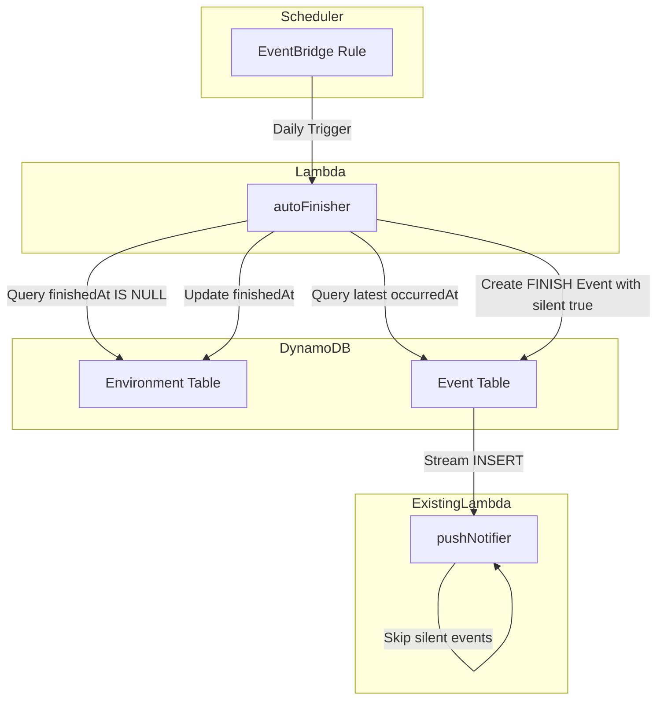
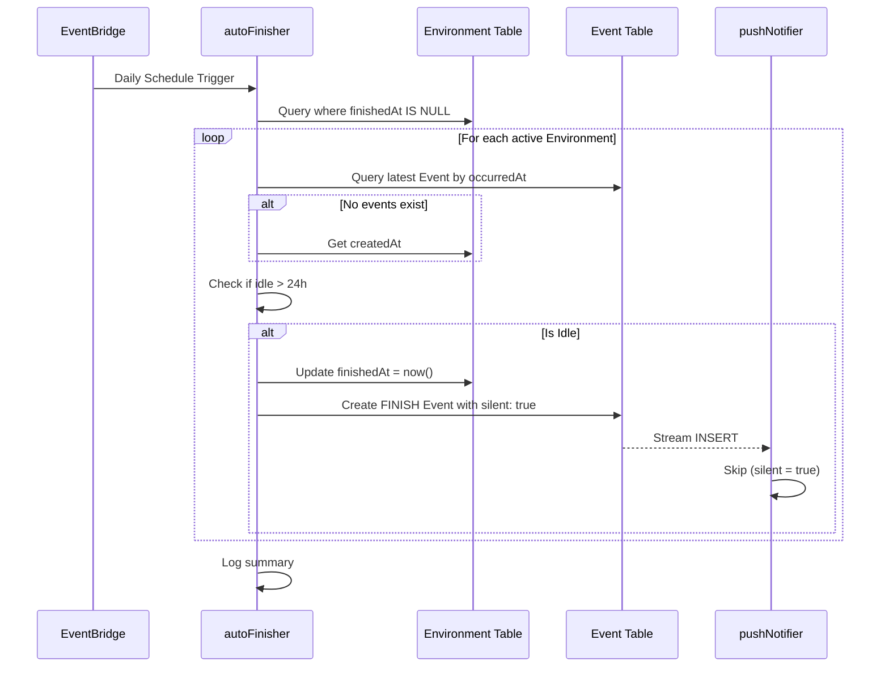

# Design Document: Auto-Finish

## Overview

**Purpose**: 最終イベントから24時間以上経過した Environment を自動的に終了状態にし、放置されたリソースを適切にクリーンアップする機能を提供する。

**Users**: システム運用者が本機能を活用し、人手を介さず継続的にアイドル Environment を検出・終了する。共有リンクを受け取ったユーザーは、自動終了時の不要な通知から保護される。

**Impact**: 現行システムに新規 Lambda 関数とスケジュール設定を追加。既存の pushNotifier、TTL による物理削除機構には影響を与えない。

### Goals
- 最終イベントから24時間以上経過した Environment を自動検出
- 検出された Environment の `finishedAt` を設定し終了状態へ遷移
- 1日1回の定期実行による継続的なクリーンアップ
- 自動終了時の Push 通知抑制（`silent: true`）

### Non-Goals
- TTL による物理削除タイミングの変更
- 手動終了機能の変更
- 共有画面 UI の変更（終了状態表示は既存機能で対応）
- アイドル判定閾値（24時間）のカスタマイズ

## Architecture

### Existing Architecture Analysis

現在のバックエンドは以下の Lambda 関数で構成される：

- **eventCleaner**: Environment TTL 削除時に子レコード（Event, PushSubscription）を削除
- **pushNotifier**: Event テーブルへの INSERT を検知し Push 通知を送信

両関数とも `amplify/functions/` 配下に配置され、`backend.ts` で IAM 権限とイベントソースマッピングを設定するパターンに従う。

### Architecture Pattern & Boundary Map



**Architecture Integration**:
- Selected pattern: スケジュール駆動 Lambda（既存パターンと一貫）
- Domain/feature boundaries: autoFinisher は Environment/Event の読み書きに責務を持つ
- Existing patterns preserved: `defineFunction` + `backend.ts` での権限設定
- New components rationale: 定期実行のため新規 Lambda が必要
- Steering compliance: Amplify Gen2 パターン、TypeScript strict mode を遵守

### Technology Stack

| Layer | Choice / Version | Role in Feature | Notes |
|-------|------------------|-----------------|-------|
| Backend / Services | AWS Lambda (Node.js 22) | アイドル検出・終了処理の実行 | 既存と同じランタイム |
| Messaging / Events | EventBridge Rules | 日次スケジュールトリガー | Amplify Gen2 `schedule` プロパティ |
| Data / Storage | DynamoDB | Environment/Event の読み書き | 既存テーブル使用、スキーマ変更なし |
| Infrastructure / Runtime | Amplify Gen2 CDK | Lambda 定義と IAM 権限設定 | 既存パターン踏襲 |

## System Flows

### アイドル Environment 検出・終了フロー



フロー後の決定事項:
- アイドル判定は最終イベントの `occurredAt` を基準とし、イベントが存在しない場合は `createdAt` を使用
- 終了処理は `finishedAt` 更新と FINISH イベント発行の2ステップで構成
- エラー発生時は該当 Environment をスキップし、他の処理を継続

## Requirements Traceability

| Requirement | Summary | Components | Interfaces | Flows |
|-------------|---------|------------|------------|-------|
| 1.1-1.4 | アイドル Environment 自動検出 | autoFinisher | getIdleEnvironments | 検出フロー |
| 2.1-2.4 | 自動終了処理実行 | autoFinisher | finishEnvironment | 終了フロー |
| 3.1-3.4 | 定期実行スケジュール | autoFinisher resource | schedule | - |
| 4.1-4.3 | 既存 TTL 機構との連携 | - | - | - |
| 5.1-5.3 | 冪等性と安全性 | autoFinisher | finishEnvironment | 終了フロー |
| 6.1-6.2 | Push 通知抑制 | autoFinisher, pushNotifier | createFinishEvent | 終了フロー |

## Components and Interfaces

| Component | Domain/Layer | Intent | Req Coverage | Key Dependencies | Contracts |
|-----------|--------------|--------|--------------|------------------|-----------|
| autoFinisher Lambda | Backend | アイドル Environment 検出・終了 | 1, 2, 3, 5, 6 | DynamoDB (P0), EventBridge (P0) | Service, Batch |
| autoFinisher resource | Infrastructure | Lambda 定義とスケジュール設定 | 3 | Amplify Gen2 (P0) | - |

### Backend

#### autoFinisher Lambda

| Field | Detail |
|-------|--------|
| Intent | 日次スケジュールでアイドル Environment を検出し終了処理を実行 |
| Requirements | 1.1-1.4, 2.1-2.4, 3.3-3.4, 5.1-5.3, 6.1-6.2 |

**Responsibilities & Constraints**
- アイドル状態（最終イベントから24時間以上経過）の Environment を検出
- 対象 Environment の `finishedAt` を現在日時に更新
- `silent: true` フラグ付きの FINISH イベントを発行
- 1回の実行で複数 Environment をバッチ処理
- 既に終了済み（`finishedAt` 設定済み）の Environment はスキップ（冪等性）

**Dependencies**
- Inbound: EventBridge — 日次スケジュールトリガー (P0)
- Outbound: DynamoDB Environment Table — 読み取り・更新 (P0)
- Outbound: DynamoDB Event Table — 読み取り・書き込み (P0)

**Contracts**: Service [x] / Batch [x]

##### Service Interface

```typescript
interface AutoFinisherService {
  /** アイドル状態の Environment ID リストを取得 */
  getIdleEnvironments(thresholdHours: number): Promise<IdleEnvironment[]>;

  /** 指定 Environment を終了状態に更新 */
  finishEnvironment(environmentId: string): Promise<FinishResult>;
}

interface IdleEnvironment {
  id: string;
  lastActivityAt: Date; // 最終イベント occurredAt または createdAt
}

interface FinishResult {
  environmentId: string;
  success: boolean;
  error?: string;
}
```

- Preconditions: Lambda が DynamoDB テーブルへの適切な IAM 権限を持つ
- Postconditions: アイドル Environment は `finishedAt` が設定され FINISH イベントが発行される
- Invariants: 既に終了済みの Environment は再更新されない

##### Batch / Job Contract

- Trigger: EventBridge Rule（毎日 UTC 0:00）
- Input / validation: なし（スケジュールトリガー）
- Output / destination: CloudWatch Logs（サマリー出力）
- Idempotency & recovery: `finishedAt` 設定済みチェックにより冪等、タイムアウト時は次回実行で再検出

**Implementation Notes**
- Integration: `backend.ts` で IAM 権限設定、`resourceGroupName: "data"` で循環依存回避
- Validation: Environment 取得後に `finishedAt` 再チェック（競合対策）
- Risks: 大量 Environment によるタイムアウト → ページネーション実装で対応

### Infrastructure

#### autoFinisher resource

| Field | Detail |
|-------|--------|
| Intent | Lambda 関数定義とスケジュール設定 |
| Requirements | 3.1-3.2 |

**Responsibilities & Constraints**
- `defineFunction` による Lambda 定義
- `schedule: "every day"` による日次実行設定
- `resourceGroupName: "data"` で data スタックに配置

**Dependencies**
- External: @aws-amplify/backend — Lambda 定義 (P0)

**Implementation Notes**
- Integration: 既存の eventCleaner/pushNotifier と同様のパターン
- Validation: なし
- Risks: なし

## Data Models

### Domain Model

既存モデルを使用、新規エンティティ追加なし。

**Environment Aggregate**:
- `finishedAt` (datetime, nullable): 終了日時。設定されると終了状態
- `events` (hasMany Event): 関連イベント

**Event Entity**:
- `type` (EventType): イベント種別（FINISH を使用）
- `payload` (json): イベントペイロード（`silent: true` を含む）
- `occurredAt` (datetime): 発生日時（アイドル判定基準）

**Business Rules & Invariants**:
- アイドル判定: 最終イベント `occurredAt` から24時間以上経過
- イベントが存在しない場合は Environment の `createdAt` を基準とする
- `finishedAt` が設定済みの Environment は終了処理対象外

### Logical Data Model

**Event payload for auto-finish**:

```typescript
interface AutoFinishEventPayload {
  /** 通知抑制フラグ */
  silent: true;
  /** 自動終了であることを示すフラグ */
  auto: true;
}
```

**クエリパターン**:

| Query | Purpose | Index | Condition |
|-------|---------|-------|-----------|
| 未終了 Environment 取得 | アイドル検出対象 | GSI なし（Scan） | `finishedAt` IS NULL |
| 最新イベント取得 | アイドル判定 | byEnvironment | `environmentID` = :id, ORDER BY `occurredAt` DESC, LIMIT 1 |

**Note**: 未終了 Environment の Scan は、アクティブな Environment 数が限定的（数百〜数千程度）であるため許容。大規模化時は GSI 追加を検討。

## Error Handling

### Error Strategy

個々の Environment 処理でエラーが発生した場合、該当 Environment をスキップし他の処理を継続する。これにより単一の障害が全体のバッチ処理を妨げない。

### Error Categories and Responses

**System Errors**:
- DynamoDB 接続エラー → 個別 Environment スキップ、エラーログ出力
- Lambda タイムアウト → 未処理 Environment は次回実行で再検出

**Business Logic Errors**:
- 競合による更新失敗 → 冪等性により問題なし
- 不正なデータ形式 → エラーログ出力、スキップ

### Monitoring

- **CloudWatch Logs**: 処理開始/完了タイムスタンプ、検査件数、終了件数、エラー件数
- **CloudWatch Metrics**: Lambda 実行時間、エラー数（標準メトリクス）

## Testing Strategy

### Unit Tests
- `getIdleEnvironments`: 24時間閾値判定ロジック
- `finishEnvironment`: 更新とイベント発行ロジック
- アイドル判定: イベントあり/なしの分岐

### Integration Tests
- DynamoDB との統合: 未終了 Environment Scan、更新操作
- イベント発行と pushNotifier の連携確認（silent フラグ尊重）

### E2E Tests
- スケジュール実行のエンドツーエンド確認（sandbox 環境）
- 24時間経過後の自動終了動作確認
