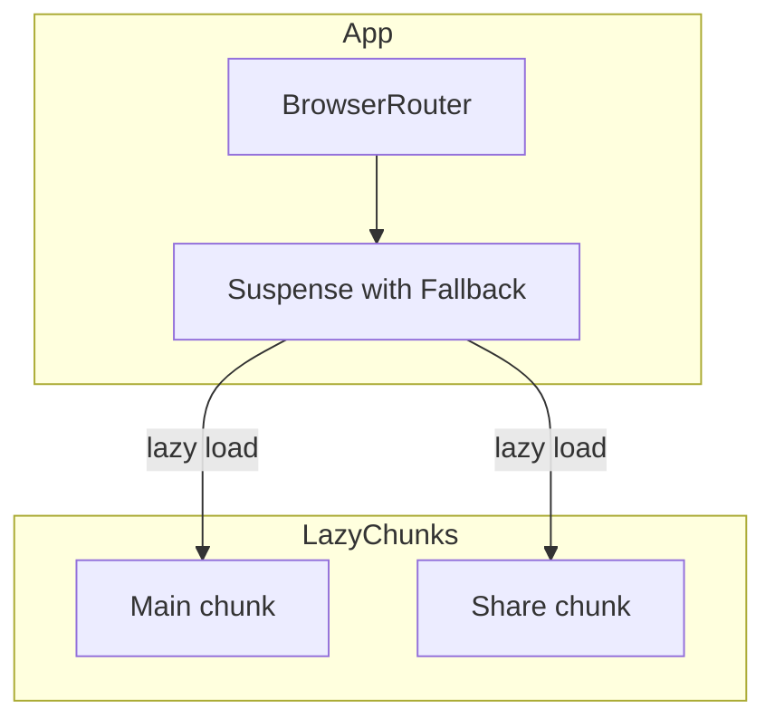

# Design Document

## Overview

**Purpose**: React.lazyとSuspenseを使用してルートベースのコード分割を実現し、初期バンドルサイズを削減する。

**Users**: 開発者がビルド成果物のサイズ最適化を行う。

**Impact**: App.tsxのルーティング定義を変更し、MainとShareコンポーネントを動的インポートに変更する。

### Goals
- 最小限のコード変更でルートごとのチャンク分割を実現
- 既存の開発ワークフロー（HMR、テスト、パスエイリアス）を維持

### Non-Goals
- ベンダーライブラリの細かい分離設定
- vite.config.tsの変更
- 外部ライブラリの追加

## Architecture

### Existing Architecture Analysis

現在のApp.tsxは静的インポートで各ページコンポーネントを読み込んでいる：

```
src/App.tsx
├── import Main from "./components/Main"
├── import Share from "./components/Share"
└── Routes
    ├── "/" → Main
    └── "/share/:id" → ShareWrapper → Share
```

### Architecture Pattern & Boundary Map

**Architecture Integration**:
- Selected pattern: React.lazy + Suspense（React標準API）
- 既存パターンを維持し、インポート方法のみ変更
- Steering compliance: 追加依存なし、TypeScript strict mode維持



### Technology Stack

| Layer | Choice / Version | Role in Feature | Notes |
|-------|------------------|-----------------|-------|
| Frontend | React 19 + React.lazy | 動的インポートとSuspense | 標準API使用 |
| Build | Vite 7 | 動的インポートの自動チャンク分割 | 設定変更不要 |

## Requirements Traceability

| Requirement | Summary | Components | Interfaces | Flows |
|-------------|---------|------------|------------|-------|
| 1.1 | React.lazyで動的インポート | App | - | - |
| 1.2 | SuspenseでフォールバックUI | App | - | - |
| 1.3 | Viteデフォルト設定維持 | - | - | - |
| 2.1 | HMR機能維持 | - | - | - |
| 2.2 | テスト変更なし | - | - | - |
| 2.3 | パスエイリアス維持 | - | - | - |

## Components and Interfaces

| Component | Domain/Layer | Intent | Req Coverage | Key Dependencies | Contracts |
|-----------|--------------|--------|--------------|------------------|-----------|
| App | UI/Routing | ルート定義とSuspense境界 | 1.1, 1.2, 1.3 | React, react-router-dom | - |

### UI / Routing Layer

#### App

| Field | Detail |
|-------|--------|
| Intent | ルートごとのコンポーネントをlazy loadingで読み込む |
| Requirements | 1.1, 1.2, 1.3 |

**Responsibilities & Constraints**
- React.lazyでMain/Shareコンポーネントを動的インポート
- Suspenseでフォールバック（ローディング表示）を提供
- 既存のProvider構造（ChakraProvider, Jotai Provider）は変更しない

**Dependencies**
- Inbound: main.tsx — アプリケーションエントリポイント (P0)
- Outbound: Main, Share — 遅延読み込み対象コンポーネント (P0)

**Contracts**: State [x]

##### State Management

変更箇所のみ記載：

```typescript
// Before: 静的インポート
import Main from "./components/Main";
import Share from "./components/Share";

// After: 動的インポート
const Main = lazy(() => import("./components/Main"));
const Share = lazy(() => import("./components/Share"));
```

**Implementation Notes**
- Integration: Suspenseは`<Routes>`をラップする形で配置
- Validation: ビルド後に`dist/assets/`ディレクトリでチャンク分割を確認
- Risks: なし（標準APIの適用のみ）

## Testing Strategy

### Unit Tests
- 既存のApp.test.tsx、Main.test.tsx、Share.test.tsxが変更なしで動作することを確認

### Build Verification
- `npm run build`実行後、`dist/assets/`に複数のJSチャンクが生成されることを確認
