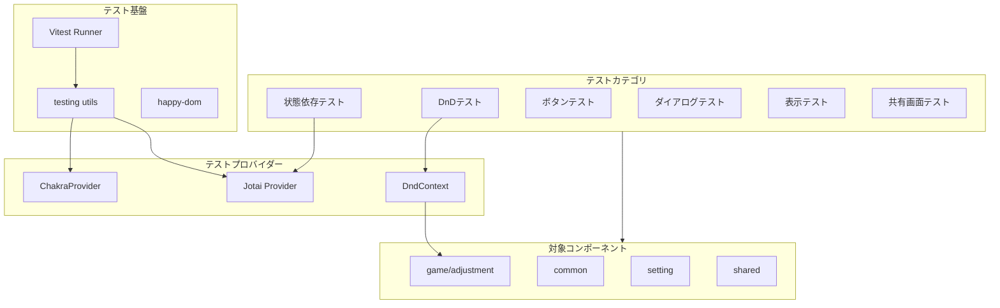

# Design Document: Component Test Coverage

## Overview

**Purpose**: 本設計は、バドミントンダブルスのコート割り当てアプリケーションにおけるReactコンポーネントのテストカバレッジを48%から70%以上に向上させるためのテスト実装アーキテクチャを定義する。

**Users**: 開発者がコンポーネントの振る舞いを検証し、リグレッションを防止するために使用する。

**Impact**: 既存のテスト基盤（Vitest + Testing Library + カスタムrender関数）を拡張し、17個の未テストコンポーネントにテストを追加する。

### Goals
- 未テストの17コンポーネントに振る舞いテストを追加
- ブランチカバレッジをgame/adjustment: 50%以上、common: 70%以上に向上
- DnD機能、状態依存振る舞い、設定による振る舞い変化のテストを実装
- 既存テストパターンとの一貫性を維持

### Non-Goals
- E2Eテスト（Playwright）の追加（将来スコープ）
- ロジック層（`src/logic/`）のテスト追加（既存カバレッジ十分）
- ビジュアルリグレッションテストの導入

## Architecture

### Existing Architecture Analysis

現在のテスト基盤は以下の構成：
- **テストランナー**: Vitest v4.0.17
- **テストユーティリティ**: @testing-library/react v16.3.2
- **DOM環境**: happy-dom v20.3.4
- **カスタムrender**: `src/testing/utils.tsx`（ChakraProvider + Jotai Provider統合済み）

既存テストパターン：
- コンポーネントと同一ディレクトリに`*.test.tsx`配置
- `describe`ネストで機能グループ化（日本語）
- `beforeEach`でモック関数クリア
- `screen.getByRole`でアクセシビリティ重視のセレクタ

### Architecture Pattern & Boundary Map



**Architecture Integration**:
- 選択パターン: 既存テスト基盤の拡張（Extension Pattern）
- ドメイン境界: テストカテゴリ別にテストケースをグループ化
- 既存パターン維持: カスタムrender関数、describeネスト、beforeEachパターン
- 新規追加: DndContext統合ヘルパー、状態事前条件ファクトリ

### Technology Stack

| Layer | Choice / Version | Role in Feature | Notes |
|-------|------------------|-----------------|-------|
| Test Runner | Vitest 4.0.17 | テスト実行・カバレッジ計測 | 既存 |
| Test Utilities | @testing-library/react 16.3.2 | DOM操作・クエリ | 既存 |
| DOM Environment | happy-dom 20.3.4 | DOM エミュレーション | 既存 |
| DnD Testing | @dnd-kit/core 6.1.0 | DndContextラッピング | 既存、テスト用途拡張 |
| State Management | jotai/utils | useHydrateAtomsでアトム初期化 | 既存 |

## Requirements Traceability

| Requirement | Summary | Components | Test Pattern |
|-------------|---------|------------|--------------|
| 1.1-1.8 | DnD機能テスト | MemberBox, MemberDroppable, AdjustmentPane | ハンドラーモック + KeyboardSensor |
| 2.1-2.8 | 状態依存振る舞い | Main, AdjustmentPane, StatisticsPane, InitialSettingPane | initialAtomValues |
| 3.1-3.5 | アルゴリズム設定 | AlgorithmBadge, AlgorithmInput, GenerateButton | props変更検証 |
| 4.1-4.6 | コート数・メンバー数 | CourtCountInput, InitMemberCountInput, InitialSettingPane | コールバック検証 |
| 5.1-5.6 | 履歴操作 | HistoryPane, HistoryDialog, GamePane | 履歴状態パターン |
| 6.1-6.10 | ボタン振る舞い | ResetButton, ShareButton, HelpButton等 | クリック + ダイアログ |
| 7.1-7.9 | ダイアログ状態遷移 | UsageAlertDialog, AdjustmentDialog等 | isOpen制御 |
| 8.1-8.7 | 表示条件付きレンダリング | MemberCountPane, RestMembersPane等 | props条件分岐 |
| 9.1-9.6 | 共有画面 | Share, SharedPane | APIモック + 状態 |
| 10.1-10.8 | テストパターン一貫性 | 全テストファイル | 構造規約 |
| 11.1-11.8 | ブランチカバレッジ | 全テストスイート | 分岐網羅 |

## Components and Interfaces

| Component | Domain/Layer | Intent | Req Coverage | Key Dependencies | Contracts |
|-----------|--------------|--------|--------------|------------------|-----------|
| DndTestWrapper | Testing/Utility | DnDコンポーネントのテストラッパー | 1.x, 10.7 | DndContext (P0) | - |
| StatePresetFactory | Testing/Utility | アトム初期値プリセット生成 | 2.x, 10.5, 11.8 | settingsAtom (P0) | State |
| BaseButtonTestSuite | Testing/Pattern | ボタンテストの共通パターン | 6.x, 10.x | - | - |
| BaseDialogTestSuite | Testing/Pattern | ダイアログテストの共通パターン | 7.x, 10.6 | - | - |

### Testing / Utility

#### DndTestWrapper

| Field | Detail |
|-------|--------|
| Intent | DnDコンポーネントをテスト可能な環境でラップする |
| Requirements | 1.1, 1.2, 1.3, 1.4, 1.5, 1.6, 1.7, 1.8, 10.7 |

**Responsibilities & Constraints**
- DndContextの提供とonDragEndハンドラーのモック化
- KeyboardSensorによるドラッグシミュレーションのサポート
- getBoundingClientRectのモック（必要な場合）

**Dependencies**
- External: @dnd-kit/core — DndContext提供 (P0)

**Contracts**: State [x]

##### State Management
- **State model**: ドラッグ状態（active item, over target）
- **Persistence**: テストスコープ内のみ
- **Strategy**: 各テストで独立したDndContextインスタンス

**Implementation Notes**
- Integration: 既存のrender関数と組み合わせて使用
- Validation: onDragEnd呼び出し時のevent.active/event.over検証
- Risks: jsdom環境でのgetBoundingClientRect制限（`research.md`参照）

#### StatePresetFactory

| Field | Detail |
|-------|--------|
| Intent | テスト用のJotaiアトム初期値プリセットを生成する |
| Requirements | 2.1, 2.2, 2.3, 2.4, 2.5, 2.6, 2.7, 2.8, 10.5, 11.8 |

**Responsibilities & Constraints**
- 一般的なテストシナリオに対応したプリセット提供
- 型安全なアトム値生成

**Dependencies**
- Inbound: settingsAtom, previousSettingsAtom, shareIdAtom — 初期値設定対象 (P0)

**Contracts**: State [x]

##### Service Interface
```typescript
interface StatePresets {
  /** 初期状態（courtCount=0、ゲーム未開始） */
  emptyState(): AtomTuple[];

  /** ゲーム進行中状態 */
  gameInProgress(options: {
    courtCount: number;
    memberCount: number;
    historyCount: number;
    algorithm?: Algorithm;
  }): AtomTuple[];

  /** 前回設定あり状態 */
  withPreviousSettings(previous: CurrentSettings): AtomTuple[];

  /** 休憩メンバーなし状態（メンバー数 = コート数×4） */
  noRestMembers(courtCount: number): AtomTuple[];

  /** 休憩メンバーあり状態（メンバー数 > コート数×4） */
  withRestMembers(courtCount: number, restCount: number): AtomTuple[];
}
```
- Preconditions: 有効なパラメータ値
- Postconditions: 有効なAtomTuple配列を返す
- Invariants: 返却値は常にrender関数のinitialAtomValuesに使用可能

**Implementation Notes**
- Integration: `src/testing/utils.tsx`のinitialAtomValuesオプションと連携
- Validation: 型レベルでの値検証

## Testing Strategy

本設計書自体がテスト実装の設計であるため、このセクションでは各テストカテゴリの戦略を定義する。

### DnDテスト戦略（Requirements 1.x）

**アプローチ**: ハンドラーモック戦略

```typescript
// テストパターン例
describe("AdjustmentPane", () => {
  describe("ドラッグ&ドロップ操作", () => {
    it("onDragEndでメンバー位置が交換される", () => {
      const mockOnChange = vi.fn();
      render(<AdjustmentPane {...props} onChange={mockOnChange} />);

      // DragEndEventをシミュレート（ハンドラー直接呼び出し）
      // または KeyboardSensor経由のfireEvent.keyDown
    });
  });
});
```

**対象テストケース**:
- MemberBox: isDragging状態変化（1.1, 1.2）
- MemberDroppable: isOver状態変化（1.3, 1.4）
- AdjustmentPane: onDragEnd処理（1.5, 1.6, 1.7, 1.8）

### 状態依存テスト戦略（Requirements 2.x）

**アプローチ**: initialAtomValuesによる事前条件設定

```typescript
// テストパターン例
describe("Main", () => {
  describe("画面切り替え", () => {
    it("courtCount=0の場合、InitialSettingPaneを表示する", () => {
      render(<Main />, {
        initialAtomValues: StatePresets.emptyState(),
      });
      expect(screen.getByText(/初期設定/)).toBeInTheDocument();
    });

    it("courtCount>0の場合、GamePaneを表示する", () => {
      render(<Main />, {
        initialAtomValues: StatePresets.gameInProgress({ courtCount: 2, memberCount: 10 }),
      });
      expect(screen.getByText(/コート 1/)).toBeInTheDocument();
    });
  });
});
```

**対象テストケース**:
- Main: courtCountによる画面切り替え（2.1, 2.2）
- AdjustmentPane: histories有無による表示（2.3, 2.4）
- StatisticsPane: メンバー数による表示（2.5, 2.6）
- InitialSettingPane: previousSettings有無（2.7, 2.8）

### ボタンテスト戦略（Requirements 6.x）

**アプローチ**: クリック + ダイアログ連携検証

```typescript
// テストパターン例
describe("ResetButton", () => {
  const mockOnReset = vi.fn();

  beforeEach(() => {
    mockOnReset.mockClear();
  });

  it("クリックで確認ダイアログが表示される", () => {
    render(<ResetButton onReset={mockOnReset} />);
    fireEvent.click(screen.getByRole("button"));
    expect(screen.getByText(/リセットしますか/)).toBeInTheDocument();
  });

  it("OKクリックでonResetが呼ばれる", () => {
    render(<ResetButton onReset={mockOnReset} />);
    fireEvent.click(screen.getByRole("button"));
    fireEvent.click(screen.getByRole("button", { name: /OK/ }));
    expect(mockOnReset).toHaveBeenCalledTimes(1);
  });
});
```

**対象コンポーネント**:
- ResetButton（6.1, 6.2, 6.3）
- ShareButton（6.4, 6.5, 6.6）
- HelpButton（6.7）
- HistoryButton（6.8）
- MemberButton（6.9）
- LineShareButton（6.10）

### ダイアログテスト戦略（Requirements 7.x）

**アプローチ**: isOpen props制御 + コールバック検証

```typescript
// テストパターン例
describe("UsageAlertDialog", () => {
  it("isOpen=trueでダイアログが表示される", () => {
    render(<UsageAlertDialog isOpen={true} onClose={vi.fn()} />);
    expect(screen.getByRole("alertdialog")).toBeInTheDocument();
  });

  it("閉じるボタンでonCloseが呼ばれる", () => {
    const mockOnClose = vi.fn();
    render(<UsageAlertDialog isOpen={true} onClose={mockOnClose} />);
    fireEvent.click(screen.getByRole("button", { name: /閉じる/ }));
    expect(mockOnClose).toHaveBeenCalledTimes(1);
  });
});
```

**対象コンポーネント**:
- UsageAlertDialog（7.1, 7.2）
- AdjustmentDialog（7.3, 7.4, 7.5）
- HistoryDialog（7.6, 7.7）
- MemberDialog（7.8, 7.9）

### 共有画面テスト戦略（Requirements 9.x）

**アプローチ**: APIモック + ローディング/エラー状態検証

```typescript
// テストパターン例
describe("Share", () => {
  it("有効なURLでデータが表示される", async () => {
    vi.mocked(getEnvironment).mockResolvedValue(mockSharedData);
    render(<Share />);
    await waitFor(() => {
      expect(screen.getByText(/コート 1/)).toBeInTheDocument();
    });
  });

  it("無効なURLでエラーが表示される", async () => {
    vi.mocked(getEnvironment).mockRejectedValue(new Error("Not found"));
    render(<Share />);
    await waitFor(() => {
      expect(screen.getByText(/エラー/)).toBeInTheDocument();
    });
  });
});
```

### ブランチカバレッジ戦略（Requirements 11.x）

**対象分岐パターン**:

| パターン | テストケース例 |
|----------|---------------|
| disabled状態 | `<Button isDisabled={true}>` の無効化確認 |
| 空データ | `histories=[]` での空状態表示 |
| エラー状態 | API失敗時のエラーメッセージ |
| ローディング | 非同期処理中のスピナー表示 |
| 条件付きレンダリング | `showStatistics`の true/false 両方 |

**カバレッジ目標**:
- game/adjustment: 50%以上（現状35%）
- common: 70%以上（現状53%）

## Error Handling

テストにおけるエラーハンドリング戦略：

### エラーカテゴリと対応

**テスト失敗時**
- アサーションエラー: 明確なエラーメッセージで原因特定
- タイムアウト: waitForの適切なタイムアウト設定

**モック関連**
- モック未リセット: beforeEachで`mockClear()`
- 不正なモック戻り値: 型安全なモック定義

**非同期処理**
- Promise未解決: `await waitFor()`の使用
- 競合状態: act()ラッパーの適切な使用

## Supporting References

### テストファイル命名規則

```
[ComponentName].test.tsx
```

### describe構造テンプレート

```typescript
describe("[ComponentName]", () => {
  // モック定義
  const mockCallback = vi.fn();

  beforeEach(() => {
    mockCallback.mockClear();
  });

  describe("基本表示", () => {
    it("[表示要素]が表示される", () => {});
  });

  describe("[機能グループ]", () => {
    it("[操作]で[結果]", () => {});
  });

  describe("条件付き表示", () => {
    it("[条件]の場合、[表示/非表示]", () => {});
  });
});
```

### 新規テストファイル一覧

| ファイル | 対象コンポーネント | 要件 |
|----------|------------------|------|
| `ResetButton.test.tsx` | ResetButton | 6.1-6.3 |
| `ShareButton.test.tsx` | ShareButton | 6.4-6.6 |
| `HelpButton.test.tsx` | HelpButton | 6.7 |
| `HistoryButton.test.tsx` | HistoryButton | 6.8 |
| `MemberButton.test.tsx` | MemberButton | 6.9 |
| `LineShareButton.test.tsx` | LineShareButton | 6.10 |
| `UsageAlertDialog.test.tsx` | UsageAlertDialog | 7.1-7.2 |
| `AdjustmentDialog.test.tsx` | AdjustmentDialog | 7.3-7.5 |
| `HistoryDialog.test.tsx` | HistoryDialog | 7.6-7.7 |
| `MemberDialog.test.tsx` | MemberDialog | 7.8-7.9 |
| `AlgorithmBadge.test.tsx` | AlgorithmBadge | 3.1-3.2 |
| `MemberCountPane.test.tsx` | MemberCountPane | 8.1 |
| `CurrentMemberCountInput.test.tsx` | CurrentMemberCountInput | 8.2-8.3 |
| `RestMembersPane.test.tsx` | RestMembersPane | 8.4-8.5 |
| `CourtMembersBox.test.tsx` | CourtMembersBox | 8.6-8.7 |
| `Share.test.tsx` | Share | 9.1-9.3 |
| `SharedPane.test.tsx` | SharedPane | 9.4-9.6 |

### 既存テストの拡張一覧

| ファイル | 追加内容 | 要件 |
|----------|---------|------|
| `MemberBox.test.tsx` | ドラッグ状態テスト追加 | 1.1-1.2 |
| `MemberDroppable.test.tsx` | ホバー状態テスト追加 | 1.3-1.4 |
| `AdjustmentPane.test.tsx` | DnD操作テスト追加 | 1.5-1.8, 2.3-2.4 |
| `Main.test.tsx` | 画面切り替えテスト追加 | 2.1-2.2 |
| `StatisticsPane.test.tsx` | 表示条件テスト追加 | 2.5-2.6 |
| `InitialSettingPane.test.tsx` | 復元オプションテスト追加 | 2.7-2.8 |
| `AlgorithmInput.test.tsx` | 変更コールバックテスト追加 | 3.3 |
| `GenerateButton.test.tsx` | アルゴリズム検証テスト追加 | 3.4-3.5 |
| `HistoryPane.test.tsx` | 履歴状態テスト追加 | 5.1-5.3, 5.5 |
| `GamePane.test.tsx` | 履歴追加テスト追加 | 5.6 |
