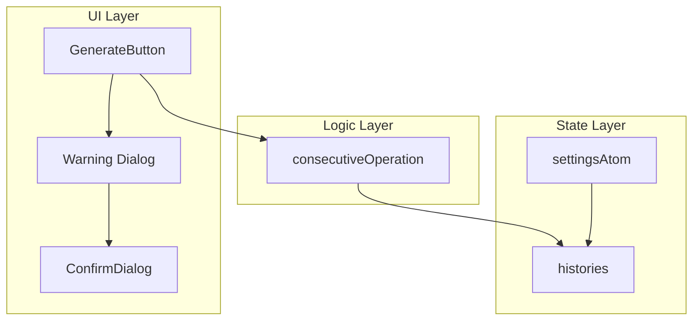
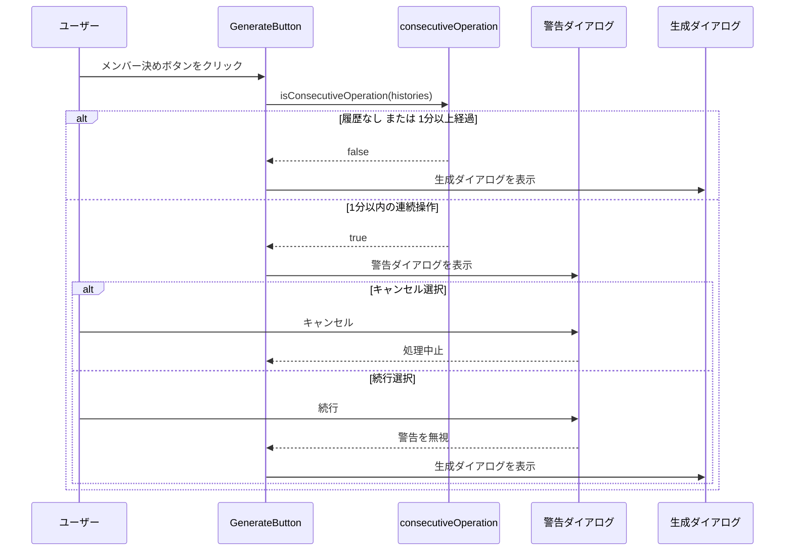

# Design Document: consecutive-decision-warning

## Overview

**Purpose**: 本機能は、ユーザーが短時間（1分以内）に連続して「メンバー決め」ボタンを押した際に警告ダイアログを表示し、履歴データの整合性を保護する。

**Users**: 運営者がメンバー決め操作を行う際に、連続操作による履歴データ破損のリスクを認識し、正規のやり直し手順を案内する。

**Impact**: 既存の `GenerateButton` コンポーネントに警告ロジックを追加し、`ConfirmDialog` を再利用して警告を表示する。

### Goals
- 前回決定から1分以内の連続操作を検出する
- 警告ダイアログで履歴への影響と正規のやり直し手順を案内する
- ユーザーが「続行」または「キャンセル」を選択できるようにする

### Non-Goals
- 1分という閾値の動的変更機能
- 連続操作の履歴ログ記録
- 管理者向けの連続操作統計

## Architecture

### Existing Architecture Analysis
- `GenerateButton.tsx`: 「メンバー決め」ボタンと確認ダイアログを管理
- `ConfirmDialog.tsx`: 汎用的な確認ダイアログコンポーネント
- `src/logic/types.ts`: `History` 型に `time: string` フィールドが存在
- `src/components/state/atoms.ts`: `settingsAtom` で `histories` を管理

### Architecture Pattern & Boundary Map



**Architecture Integration**:
- Selected pattern: 既存のUI/Logic分離パターンを踏襲
- Domain/feature boundaries: ロジック層に連続操作検出関数を追加、UIは既存コンポーネントを拡張
- Existing patterns preserved: `ConfirmDialog` の再利用、ロジック層のユニットテスト併置
- New components rationale: 新規コンポーネントは不要、既存拡張で対応
- Steering compliance: tech.md の TypeScript strict mode、UI/Logic 分離原則を遵守

### Technology Stack

| Layer | Choice / Version | Role in Feature | Notes |
|-------|------------------|-----------------|-------|
| Frontend | React 18 + Chakra UI v3 | 警告ダイアログ表示 | 既存の `ConfirmDialog` を再利用 |
| State | Jotai | 履歴データ参照 | `settingsAtom.histories` から最新履歴を取得 |
| Logic | TypeScript | 連続操作検出 | 純粋関数として実装 |

## System Flows



## Requirements Traceability

| Requirement | Summary | Components | Interfaces | Flows |
|-------------|---------|------------|------------|-------|
| 1.1 | 履歴時刻と現在時刻を比較 | consecutiveOperation | isConsecutiveOperation | メイン処理フロー |
| 1.2 | 1分以内を連続操作として検出 | consecutiveOperation | isConsecutiveOperation | メイン処理フロー |
| 1.3 | 1分以上は通常処理 | consecutiveOperation | isConsecutiveOperation | メイン処理フロー |
| 2.1 | 警告ダイアログ表示 | GenerateButton | - | 警告フロー |
| 2.2 | 履歴への影響説明 | GenerateButton | WarningMessageProps | 警告フロー |
| 2.3 | やり直し手順案内 | GenerateButton | WarningMessageProps | 警告フロー |
| 2.4 | やり直せないことを説明 | GenerateButton | WarningMessageProps | 警告フロー |
| 3.1 | 続行・キャンセルボタン | ConfirmDialog | ConfirmDialogProps | 警告フロー |
| 3.2 | キャンセルで処理中止 | GenerateButton | - | キャンセルフロー |
| 3.3 | 続行で処理実行 | GenerateButton | - | 続行フロー |
| 4.1 | 既存ダイアログに合わせる | ConfirmDialog | - | - |
| 4.2 | theme.ts を利用 | ConfirmDialog | - | - |
| 5.1 | 履歴なしは警告スキップ | consecutiveOperation | isConsecutiveOperation | メイン処理フロー |

## Components and Interfaces

| Component | Domain/Layer | Intent | Req Coverage | Key Dependencies | Contracts |
|-----------|--------------|--------|--------------|------------------|-----------|
| consecutiveOperation | Logic | 連続操作検出ロジック | 1.1, 1.2, 1.3, 5.1 | History 型 (P0) | Service |
| GenerateButton | UI | 警告ダイアログ統合 | 2.1-2.4, 3.2, 3.3 | consecutiveOperation (P0), ConfirmDialog (P0) | State |
| ConfirmDialog | UI | 警告ダイアログ表示 | 3.1, 4.1, 4.2 | theme.ts (P0) | - |

### Logic Layer

#### consecutiveOperation

| Field | Detail |
|-------|--------|
| Intent | 履歴の最新レコードから連続操作かどうかを判定する |
| Requirements | 1.1, 1.2, 1.3, 5.1 |

**Responsibilities & Constraints**
- 履歴配列から最新レコードの `time` フィールドを取得
- 現在時刻との差分が60秒未満かを判定
- 純粋関数として実装（副作用なし）

**Dependencies**
- Inbound: GenerateButton — 連続操作チェック (P0)

**Contracts**: Service [x]

##### Service Interface
```typescript
import type { History } from "./types";

/**
 * 連続操作判定の閾値（ミリ秒）
 */
export const CONSECUTIVE_THRESHOLD_MS = 60 * 1000; // 1分

/**
 * 履歴から連続操作かどうかを判定する
 * @param histories - 履歴配列
 * @param now - 現在時刻（テスト用にオプショナル）
 * @returns 連続操作の場合 true
 */
export function isConsecutiveOperation(
  histories: History[],
  now: Date = new Date()
): boolean;
```

- Preconditions: `histories` が配列であること
- Postconditions: 判定結果（boolean）を返す
- Invariants: 履歴が空または `time` パース失敗時は `false` を返す

**Implementation Notes**
- `time` フィールドは ISO 8601 形式を想定
- パース失敗時は安全側に倒し `false` を返す
- テスト容易性のため `now` パラメータを追加

### UI Layer

#### GenerateButton（拡張）

| Field | Detail |
|-------|--------|
| Intent | 連続操作検出と警告ダイアログ表示を追加 |
| Requirements | 2.1, 2.2, 2.3, 2.4, 3.2, 3.3 |

**Responsibilities & Constraints**
- `handleClick` 内で連続操作をチェック
- 連続操作検出時は警告ダイアログを表示
- キャンセル時は処理を中止、続行時は通常フローへ

**Dependencies**
- Outbound: isConsecutiveOperation — 連続操作判定 (P0)
- Outbound: ConfirmDialog — 警告ダイアログ表示 (P0)

**Contracts**: State [x]

##### State Management
```typescript
// 新規追加する状態
const [showWarning, setShowWarning] = useState(false);
```

- State model: `showWarning` で警告ダイアログの開閉を管理
- Persistence: 不要（一時的なUI状態）

**Implementation Notes**
- 警告メッセージは JSX として `ConfirmDialog` の `children` に渡す
- `okColorPalette="danger"` で警告色を適用
- 「続行」ボタンは警告色、「キャンセル」はデフォルト

#### ConfirmDialog（既存・変更なし）

| Field | Detail |
|-------|--------|
| Intent | 汎用確認ダイアログ |
| Requirements | 3.1, 4.1, 4.2 |

**Implementation Notes**
- 既存コンポーネントをそのまま利用
- `okColorPalette="danger"` で警告用途に対応済み

## Data Models

### Domain Model

既存の `History` 型を使用。変更なし。

```typescript
type History = {
  members: GameMembers;
  time: string;  // ISO 8601 形式
  deleted?: true;
};
```

## Error Handling

### Error Strategy
- `time` フィールドのパース失敗時は警告をスキップ（安全側に倒す）
- 履歴が空の場合は警告をスキップ

### Error Categories and Responses
**User Errors**: なし（ユーザー入力を受け付けない機能）
**System Errors**: 日付パース失敗 → 警告スキップ、ログ出力なし
**Business Logic Errors**: なし

## Testing Strategy

### Unit Tests
- `isConsecutiveOperation`: 履歴あり・1分以内 → `true`
- `isConsecutiveOperation`: 履歴あり・1分以上 → `false`
- `isConsecutiveOperation`: 履歴なし → `false`
- `isConsecutiveOperation`: 不正な `time` フォーマット → `false`

### Integration Tests
- `GenerateButton`: 連続操作時に警告ダイアログが表示される
- `GenerateButton`: キャンセルで処理が中止される
- `GenerateButton`: 続行で通常フローが実行される
