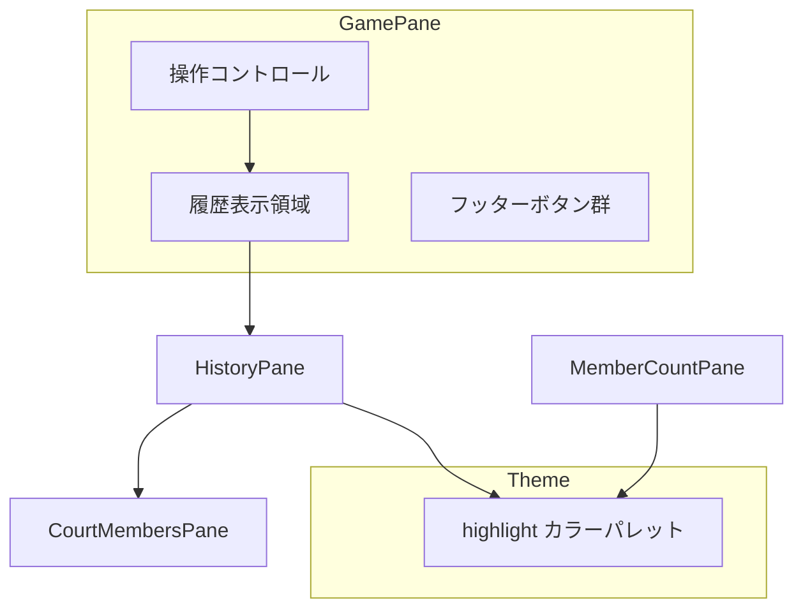

# Design Document

## Overview

**Purpose**: メイン画面（GamePane）を現在のコート表示から直近3件の履歴表示に変更し、ユーザーが現在と過去の割り当て状況を一目で把握できるようにする。

**Users**: バドミントンサークルの運営者・参加者が、公平性の確認やメンバー調整の判断に活用する。

**Impact**: GamePane の表示内容を CourtMembersPane から HistoryPane に変更し、新規 highlight カラーパレットを追加する。

### Goals
- メイン画面で直近3件の履歴を表示する
- 既存の HistoryPane コンポーネントを再利用する
- 「今回」の履歴を視覚的に強調する（highlight カラー使用）
- 履歴表示領域のスクロール対応
- MemberCountPane の outlierLevelColors を統一カラーに変更

### Non-Goals
- HistoryPane への maxItems prop 追加（親での slice で対応）
- 履歴ダイアログの変更（全履歴表示機能は維持）
- 新規コンポーネントの作成（既存コンポーネントの拡張で対応）

## Architecture

### Existing Architecture Analysis

現在の GamePane 構造:
- `Card.Root` でビューポート全体を占有（height: 100dvh）
- `Card.Body` に操作コントロールと CourtMembersPane を配置
- `Card.Footer` にボタン群を配置

HistoryPane 構造:
- `histories` prop で履歴配列を受け取り（未指定時は useSettings() から取得）
- CurrentHistoryPane / PreviousHistoryPane / OlderHistoryPane で表示分け
- 現在は `color: "primary.900"` のみで強調（背景色変更なし）

### Architecture Pattern & Boundary Map



**Architecture Integration**:
- **Selected pattern**: 既存コンポーネント拡張（HistoryPane のスタイル変更 + GamePane への統合）
- **Domain boundaries**: UI レイヤーのみの変更（ロジック層への影響なし）
- **Existing patterns preserved**: Card.Root/Body/Footer 構造、Jotai 状態管理、Chakra UI スタイリング
- **New components rationale**: 新規コンポーネントなし（既存の拡張で対応）
- **Steering compliance**: Chakra UI v3 パターン、TypeScript strict mode 準拠

### Technology Stack

| Layer | Choice / Version | Role in Feature | Notes |
|-------|------------------|-----------------|-------|
| Frontend | React 18 + Chakra UI v3 | UI コンポーネント | 既存スタック |
| State | Jotai | 履歴状態管理 | useSettings() 経由 |
| Styling | Chakra UI theme tokens | highlight カラー定義 | tokens + semanticTokens |

## Requirements Traceability

| Requirement | Summary | Components | Interfaces | Flows |
|-------------|---------|------------|------------|-------|
| 1.1, 1.2, 1.3, 1.4 | メイン画面履歴表示 | GamePane | - | 履歴表示フロー |
| 2.1, 2.2, 2.3 | HistoryPane 再利用 | GamePane, HistoryPane | HistoryPaneProps | - |
| 3.1, 3.2, 3.3, 3.4, 3.5 | highlight カラー追加 | theme.ts, MemberCountPane | - | - |
| 4.1, 4.2, 4.3, 4.4 | 視覚的強調 | HistoryPane | - | - |
| 5.1, 5.2 | スクロール対応 | GamePane | - | - |
| 6.1, 6.2, 6.3, 6.4 | レイアウト整合性 | GamePane | - | - |

## Components and Interfaces

| Component | Domain/Layer | Intent | Req Coverage | Key Dependencies | Contracts |
|-----------|--------------|--------|--------------|------------------|-----------|
| theme.ts | Theme | highlight カラーパレット定義 | 3.1-3.4 | Chakra UI (P0) | - |
| GamePane | UI/Game | 履歴表示統合、スクロール対応 | 1.1-1.4, 2.2, 5.1-5.2, 6.1-6.4 | HistoryPane (P0), useSettings (P0) | State |
| HistoryPane | UI/Common | 視覚的強調強化 | 2.1, 2.3, 4.1-4.4 | CourtMembersPane (P0), highlight color (P1) | - |
| MemberCountPane | UI/Common | outlierLevelColors 変更 | 3.5 | highlight color (P1), danger color (P1) | - |

### Theme Layer

#### theme.ts - highlight カラーパレット追加

| Field | Detail |
|-------|--------|
| Intent | 「現在」を示す新しい強調色（アンバー/ゴールド系）をテーマに追加 |
| Requirements | 3.1, 3.2, 3.3, 3.4 |

**Responsibilities & Constraints**
- highlight カラーパレット（50-900）の定義
- semanticTokens（solid, contrast, fg, muted, subtle, emphasized, focusRing）の定義
- 既存パレット（brand, primary, danger）との整合性維持

**Contracts**: State [x]

##### Color Tokens Definition

```typescript
// tokens.colors に追加
highlight: {
  50:  { value: "#FEF9E7" },
  100: { value: "#FCF3CF" },
  200: { value: "#F9E79F" },
  300: { value: "#F7DC6F" },
  400: { value: "#F4D03F" },
  500: { value: "#F1C40F" },
  600: { value: "#D4AC0D" },
  700: { value: "#B7950B" },
  800: { value: "#9A7D0A" },
  900: { value: "#7D6608" },
}

// semanticTokens.colors に追加
highlight: {
  solid:      { value: "{colors.highlight.500}" },
  contrast:   { value: "white" },
  fg:         { value: "{colors.highlight.700}" },
  muted:      { value: "{colors.highlight.100}" },
  subtle:     { value: "{colors.highlight.200}" },
  emphasized: { value: "{colors.highlight.300}" },
  focusRing:  { value: "{colors.highlight.500}" },
}
```

**Implementation Notes**
- 既存の brand/primary/danger と同一構造で定義
- contrast は白（#FEF9E7 背景での可読性確保）

### UI Layer - Game

#### GamePane - 履歴表示統合

| Field | Detail |
|-------|--------|
| Intent | メイン画面に直近3件の履歴を表示し、スクロール対応を追加 |
| Requirements | 1.1, 1.2, 1.3, 1.4, 2.2, 5.1, 5.2, 6.1, 6.2, 6.3, 6.4 |

**Responsibilities & Constraints**
- CourtMembersPane を HistoryPane に置き換え
- 履歴を `slice(-3)` して HistoryPane に渡す
- 履歴表示領域のみスクロール可能にする
- 操作コントロールとフッターはスクロール対象外

**Dependencies**
- Inbound: App - ルートからの呼び出し (P0)
- Outbound: HistoryPane - 履歴表示 (P0)
- Outbound: useSettings - 状態取得 (P0)

**Contracts**: State [x]

##### Layout Structure

```typescript
// Card.Body 内の構造変更
<Card.Body px={4} py={2} display="flex" flexDirection="column">
  {/* 操作コントロール（固定） */}
  <Stack gap={2}>
    <CurrentMemberCountInput ... />
    <AlgorithmBadge ... />
    <GenerateButton ... />
  </Stack>

  {/* 履歴表示領域（スクロール可能） */}
  {histories.length > 0 && (
    <Box flex={1} overflowY="auto" pt={4}>
      <HistoryPane histories={histories.slice(-3)} />
    </Box>
  )}
</Card.Body>
```

**Implementation Notes**
- `flex={1}` と `overflowY="auto"` で履歴領域のみスクロール
- `histories.slice(-3)` で直近3件に制限
- 履歴が空の場合は履歴領域を非表示（既存動作と同等）

### UI Layer - Common

#### HistoryPane - 視覚的強調強化

| Field | Detail |
|-------|--------|
| Intent | 「今回」の履歴エントリを highlight カラーで強調表示 |
| Requirements | 2.1, 2.3, 4.1, 4.2, 4.3, 4.4 |

**Responsibilities & Constraints**
- CurrentHistoryPane に背景色・ボーダー・ラベル色変更を適用
- 既存の props/機能は維持
- アクセシビリティ要件（コントラスト比 4.5:1 以上）を満たす

**Dependencies**
- Outbound: CourtMembersPane - コート表示 (P0)
- External: highlight color tokens (P1)

##### CurrentHistoryPane スタイル変更

```typescript
// 変更前
<Box key={...} px={2}>
  <Heading ... color={"primary.900"}>

// 変更後
<Box
  key={...}
  px={2}
  py={2}
  bg="highlight.50"
  borderWidth={1}
  borderColor="highlight.300"
  borderRadius="md"
>
  <Heading ... color={"highlight.700"}>
```

**Implementation Notes**
- 背景: highlight.50（薄いゴールド）
- ボーダー: highlight.300（明るいゴールド）
- ラベル色: highlight.700（濃いゴールド）
- コントラスト比: highlight.700 (#B7950B) on highlight.50 (#FEF9E7) ≈ 4.6:1（WCAG AA 準拠）

#### MemberCountPane - outlierLevelColors 変更

| Field | Detail |
|-------|--------|
| Intent | 異常値レベル表示を highlight/danger カラーに統一 |
| Requirements | 3.5 |

**Responsibilities & Constraints**
- outlierLevelColors を highlight.100, highlight.300, danger.200 に変更
- 既存の表示ロジックは維持

##### outlierLevelColors 定義変更

```typescript
// 変更前
const outlierLevelColors = {
  none: "",
  low: "yellow.100",
  medium: "orange.200",
  high: "red.200",
} as const;

// 変更後
const outlierLevelColors = {
  none: "",
  low: "highlight.100",
  medium: "highlight.300",
  high: "danger.200",
} as const;
```

**Implementation Notes**
- テーマカラーへの統一により、カラーパレット全体の一貫性向上
- 既存のロジック変更なし

## Testing Strategy

### Unit Tests
- highlight カラートークンの正確な値検証（theme.ts）
- outlierLevelColors の値変更検証（MemberCountPane）

### Integration Tests
- GamePane + HistoryPane 統合: 履歴表示の正常動作
- 履歴 slice(-3) の動作確認（0件、1件、3件、5件）
- スクロール動作の確認

### E2E/UI Tests
- メイン画面表示時の履歴表示確認
- 生成ボタン押下後の履歴更新確認
- 「今回」エントリの視覚的強調確認
- スクロール操作の動作確認

### Accessibility Tests
- highlight.700 on highlight.50 のコントラスト比検証（4.5:1 以上）
- 色覚特性シミュレーション（Protanopia, Deuteranopia）での視認性確認

## Error Handling

### Error Strategy
- 履歴データ取得エラー: useSettings() の Jotai 状態に依存、エラー時は空配列として扱う
- テーマトークン参照エラー: ビルド時に検出（TypeScript strict mode）

### Error Categories and Responses
**User Errors**: なし（表示のみの機能）
**System Errors**: 履歴データ破損時は履歴領域を非表示
**Business Logic Errors**: なし
