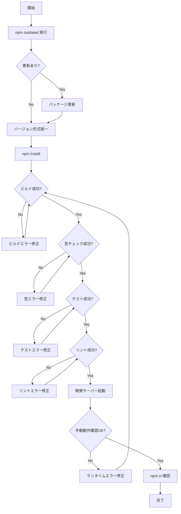

# Design Document: Package Modernization

## Overview

**Purpose**: 本機能は依存パッケージを最新バージョンに更新し、バージョン指定方法を統一することで、開発者のメンテナンス負担を軽減し、セキュリティパッチの自動適用を可能にする。

**Users**: 本プロジェクトの開発者が、依存関係の管理とセキュリティ対応を効率化するために使用する。

**Impact**: package.json および package-lock.json を変更し、すべての依存パッケージを最新の安定バージョンに更新する。

### Goals
- すべての依存パッケージを最新の安定バージョンに更新する
- バージョン指定方法を caret（^）形式に統一する
- ビルド、テスト、型チェックが成功する状態を維持する

### Non-Goals
- アプリケーションロジックの変更
- 新機能の追加
- パッケージの追加・削除（更新のみ）

## Architecture

### Existing Architecture Analysis

本タスクはパッケージ管理のみに焦点を当て、アプリケーションアーキテクチャには変更を加えない。

現在の package.json には以下の問題がある:
- 絶対バージョン指定と範囲指定が混在
- 一部のパッケージが古いバージョンに固定
- `@chakra-ui/react: "^3"` のような不完全な指定

### Architecture Pattern & Boundary Map

アーキテクチャ変更は発生しない。本タスクの成果物は package.json と package-lock.json のみ。

### Technology Stack

| Layer | Choice / Version | Role in Feature | Notes |
|-------|------------------|-----------------|-------|
| Package Manager | npm | 依存関係の更新と解決 | lock ファイルの再生成 |
| Build Tool | Vite | ビルド成功の検証 | 更新後の動作確認 |
| Type Checker | TypeScript | 型互換性の検証 | strict mode で検証 |
| Test Runner | Vitest | テスト成功の検証 | 既存テストの実行 |
| Linter | Biome | コード品質の検証 | lint エラーなしを確認 |

## Requirements Traceability

| Requirement | Summary | Components | Interfaces | Flows |
|-------------|---------|------------|------------|-------|
| 1.1 | npm outdated で更新可能パッケージなし | PackageUpdater | - | 更新フロー |
| 1.2 | 破壊的変更の確認と対応 | PackageUpdater | - | 更新フロー |
| 1.3 | ビルド成功 | BuildValidator | npm scripts | 検証フロー |
| 1.4 | テスト成功 | TestValidator | npm scripts | 検証フロー |
| 1.5 | リント成功 | LintValidator | npm scripts | 検証フロー |
| 2.1, 2.2 | caret 形式への統一 | VersionNormalizer | - | 更新フロー |
| 2.3 | 例外の明記 | VersionNormalizer | - | 更新フロー |
| 2.4 | 完全なバージョン番号 | VersionNormalizer | - | 更新フロー |
| 3.1 | 型チェック成功 | TypeValidator | npm scripts | 検証フロー |
| 3.2 | 型エラーの修正 | TypeValidator | - | 検証フロー |
| 3.3 | @types/* 互換性 | PackageUpdater | - | 更新フロー |
| 4.1 | 開発サーバー起動 | RuntimeValidator | npm scripts | 検証フロー |
| 4.2 | メイン機能動作 | RuntimeValidator | - | 検証フロー |
| 4.3 | 本番ビルド成功 | BuildValidator | npm scripts | 検証フロー |
| 5.1 | lock ファイル更新 | LockFileUpdater | npm | 更新フロー |
| 5.2 | npm ci 成功 | LockFileValidator | npm | 検証フロー |
| 5.3 | 不要な依存なし | LockFileUpdater | npm | 更新フロー |

## Components and Interfaces

| Component | Domain/Layer | Intent | Req Coverage | Key Dependencies | Contracts |
|-----------|--------------|--------|--------------|------------------|-----------|
| PackageUpdater | 更新 | パッケージを最新化 | 1.1, 1.2, 3.3 | npm (P0) | - |
| VersionNormalizer | 更新 | バージョン形式を統一 | 2.1, 2.2, 2.3, 2.4 | package.json (P0) | - |
| LockFileUpdater | 更新 | lock ファイルを再生成 | 5.1, 5.3 | npm (P0) | - |
| BuildValidator | 検証 | ビルド成功を確認 | 1.3, 4.3 | Vite (P0) | - |
| TestValidator | 検証 | テスト成功を確認 | 1.4 | Vitest (P0) | - |
| LintValidator | 検証 | リント成功を確認 | 1.5 | Biome (P0) | - |
| TypeValidator | 検証 | 型チェック成功を確認 | 3.1, 3.2 | TypeScript (P0) | - |
| RuntimeValidator | 検証 | 動作確認を実施 | 4.1, 4.2 | Vite dev server (P0) | - |
| LockFileValidator | 検証 | npm ci 成功を確認 | 5.2 | npm (P0) | - |

### 更新レイヤー

#### PackageUpdater

| Field | Detail |
|-------|--------|
| Intent | npm outdated で検出されたパッケージを最新バージョンに更新 |
| Requirements | 1.1, 1.2, 3.3 |

**Responsibilities & Constraints**
- `npm outdated` で更新対象を特定
- メジャーバージョン更新時は CHANGELOG を確認
- @types/* パッケージはランタイムパッケージと互換性を維持

**Dependencies**
- External: npm — パッケージ管理 (P0)

**Implementation Notes**
- Integration: `npm update` または手動で package.json を編集後 `npm install`
- Validation: `npm outdated` で更新漏れがないことを確認
- Risks: メジャー更新による破壊的変更

#### VersionNormalizer

| Field | Detail |
|-------|--------|
| Intent | package.json のバージョン指定を caret 形式に統一 |
| Requirements | 2.1, 2.2, 2.3, 2.4 |

**Responsibilities & Constraints**
- 絶対指定を caret 形式に変換
- `^x` を `^x.y.z` の完全な形式に変換
- 例外が必要な場合はコメントで理由を明記

**Dependencies**
- External: package.json — 依存関係定義 (P0)

**対象パッケージ（絶対指定）**

dependencies:
- `@emotion/react`: `11.11.3` → `^11.11.3`
- `@formkit/tempo`: `0.0.13` → `^0.0.13`
- `jotai`: `2.6.4` → `^2.6.4`
- `ms`: `2.1.3` → `^2.1.3`
- `react`: `18.2.0` → `^18.2.0`
- `react-dom`: `18.2.0` → `^18.2.0`
- `react-icons`: `5.0.1` → `^5.0.1`
- `ts-pattern`: `5.0.6` → `^5.0.6`

devDependencies:
- `@biomejs/biome`: `1.5.3` → `^1.5.3`
- `@types/ms`: `0.7.34` → `^0.7.34`
- `@types/react`: `18.2.53` → `^18.2.53`
- `@types/react-dom`: `18.2.18` → `^18.2.18`
- `npm-run-all`: `4.1.5` → `^4.1.5`

不完全な指定:
- `@chakra-ui/react`: `^3` → `^3.0.0`（または最新マイナー/パッチ）

**Implementation Notes**
- Integration: package.json を直接編集
- Validation: JSON 構文の正当性を確認
- Risks: 特になし（形式変更のみ）

#### LockFileUpdater

| Field | Detail |
|-------|--------|
| Intent | package-lock.json を最新の依存関係で再生成 |
| Requirements | 5.1, 5.3 |

**Responsibilities & Constraints**
- package.json の変更を反映
- 不要な依存関係を削除

**Dependencies**
- External: npm — lock ファイル生成 (P0)

**Implementation Notes**
- Integration: `npm install` で lock ファイルを再生成
- Validation: lock ファイルのサイズと内容を確認
- Risks: 依存関係の解決に失敗する可能性

### 検証レイヤー

#### BuildValidator

| Field | Detail |
|-------|--------|
| Intent | ビルドが成功することを確認 |
| Requirements | 1.3, 4.3 |

**Responsibilities & Constraints**
- `npm run build` を実行
- 終了コード 0 で成功と判定

**Dependencies**
- External: Vite — ビルドツール (P0)

**Implementation Notes**
- Validation: dist ディレクトリの生成を確認

#### TestValidator

| Field | Detail |
|-------|--------|
| Intent | テストが成功することを確認 |
| Requirements | 1.4 |

**Responsibilities & Constraints**
- `npm run test` を実行
- すべてのテストが pass することを確認

**Dependencies**
- External: Vitest — テストランナー (P0)

#### LintValidator

| Field | Detail |
|-------|--------|
| Intent | リントが成功することを確認 |
| Requirements | 1.5 |

**Responsibilities & Constraints**
- `npm run lint` を実行
- エラーなしで完了することを確認

**Dependencies**
- External: Biome — リンター (P0)

#### TypeValidator

| Field | Detail |
|-------|--------|
| Intent | 型チェックが成功することを確認 |
| Requirements | 3.1, 3.2 |

**Responsibilities & Constraints**
- `npm run typecheck` を実行
- 型エラーがある場合はコード修正

**Dependencies**
- External: TypeScript — 型チェッカー (P0)

#### RuntimeValidator

| Field | Detail |
|-------|--------|
| Intent | アプリケーションが正常に動作することを確認 |
| Requirements | 4.1, 4.2 |

**Responsibilities & Constraints**
- `npm run dev` で開発サーバーを起動
- メイン機能（メンバー生成、ドラッグ&ドロップ）の動作を確認

**Dependencies**
- External: Vite dev server — 開発サーバー (P0)

#### LockFileValidator

| Field | Detail |
|-------|--------|
| Intent | npm ci が成功することを確認 |
| Requirements | 5.2 |

**Responsibilities & Constraints**
- `npm ci` を実行
- クリーンインストールが成功することを確認

**Dependencies**
- External: npm — パッケージマネージャー (P0)

## System Flows

## Testing Strategy

### Unit Tests
- 既存のテストがすべて pass することを確認（新規テストは不要）

### Integration Tests
- `npm run build` → `npm run test` → `npm run lint` → `npm run typecheck` の連続実行

### E2E/UI Tests
- 開発サーバーでの手動動作確認:
  - メンバー生成機能
  - ドラッグ&ドロップによる調整
  - 履歴管理

### CI Validation
- `npm ci` による再現可能なインストール確認

## Error Handling

### Error Strategy
パッケージ更新中に発生するエラーは以下のカテゴリに分類される:

### Error Categories and Responses
- **依存関係解決エラー**: 競合する依存関係 → バージョン調整または peer dependencies の確認
- **ビルドエラー**: 破壊的変更による構文エラー → CHANGELOG 確認とコード修正
- **型エラー**: 型定義の変更 → コードの型アノテーション修正
- **テストエラー**: API 変更による失敗 → テストコードの修正
- **リントエラー**: 新しいルールによる警告 → コードスタイルの修正

## Supporting References

詳細な調査ログと設計判断の根拠は `research.md` を参照。
