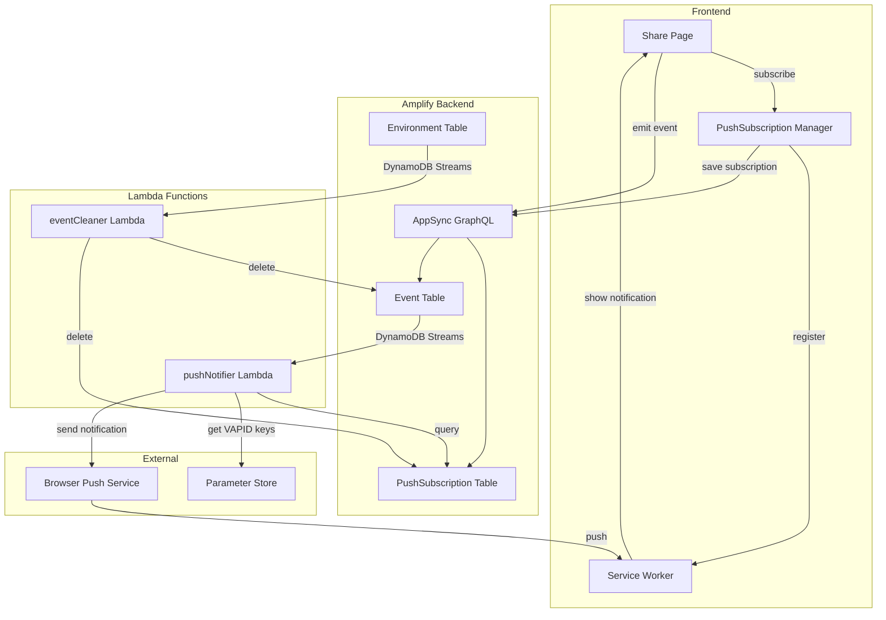
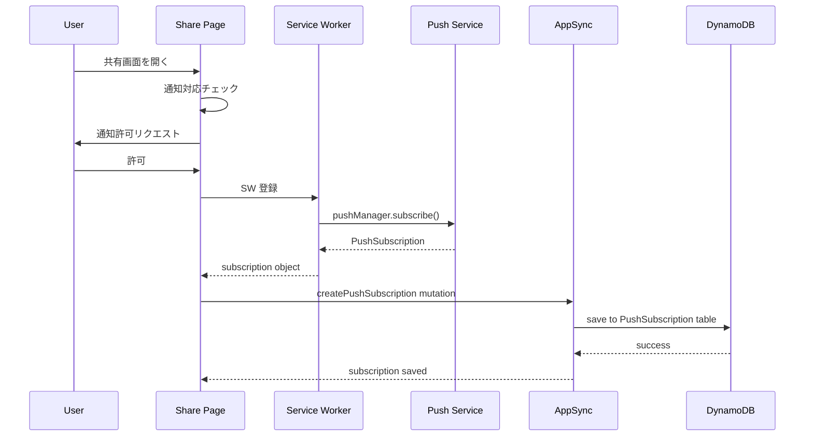
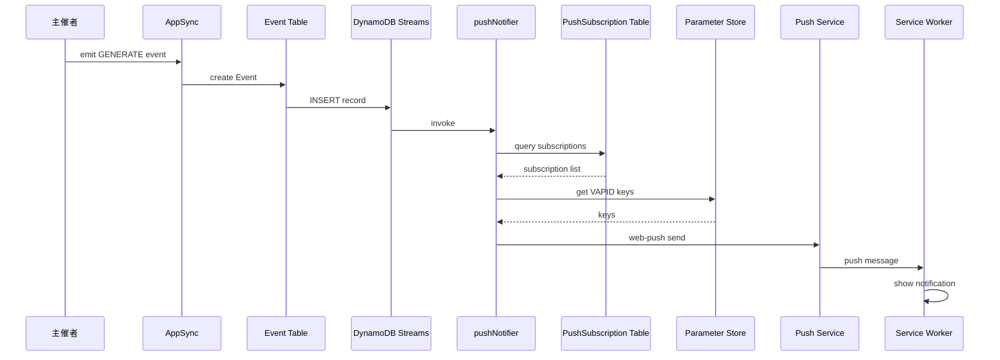
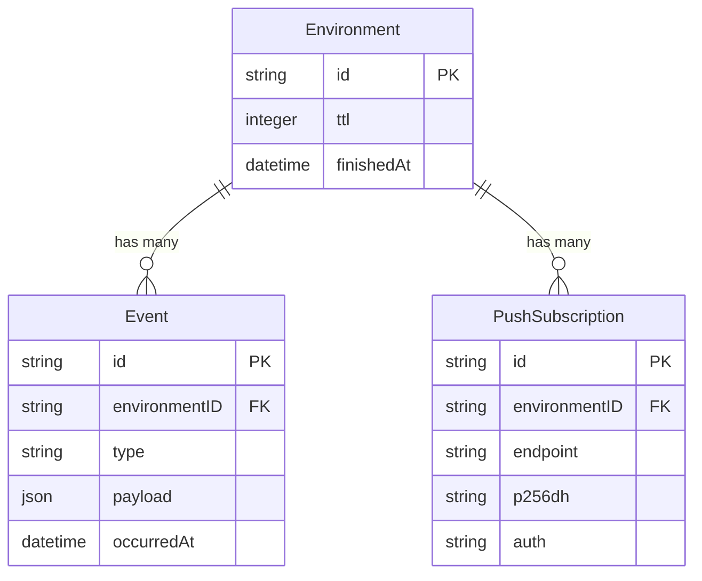

# Design Document: Push Notification

## Overview

**Purpose**: 共有リンクを受け取ったユーザーがブラウザを閉じていても、重要なイベント（メンバー生成、参加、離脱など）をリアルタイムで通知し、共有体験を向上させる。

**Users**: 共有リンクを受け取った参加者および主催者。ブラウザがバックグラウンドまたは閉じている状態でも更新を受信。

**Impact**: 既存の Event テーブルに DynamoDB Streams を追加し、新規 PushSubscription モデルと pushNotifier Lambda を導入。Service Worker をフロントエンドに追加。

### Goals
- Web Push API を使用したブラウザプッシュ通知の実装
- 既存の Amplify Gen2 アーキテクチャとの統合
- ブラウザ非対応時の graceful degradation

### Non-Goals
- モバイルネイティブアプリへのプッシュ通知（FCM/APNs）
- 通知のカスタマイズ UI（通知種別ごとのオン/オフ）
- 通知履歴の保存・閲覧機能
- オフラインキャッシュ（PWA 機能全般）

## Architecture

### Existing Architecture Analysis

現在のシステムは以下の構成：
- **フロントエンド**: Vite + React 19、Chakra UI、Jotai
- **バックエンド**: AWS Amplify Gen2（AppSync GraphQL + DynamoDB）
- **認証**: Cognito Identity Pool（ゲストアクセス）
- **リアルタイム同期**: AppSync observeQuery（ポーリングベース）
- **既存 Lambda**: eventCleaner（Environment 削除時の Event クリーンアップ）

統合ポイント：
- Event テーブルの DynamoDB Streams を活用（eventCleaner と同様のパターン）
- PushSubscription モデルを新規追加し、Environment との関連を定義
- Service Worker を public/ に配置し、Vite ビルドに含める

### Architecture Pattern & Boundary Map



**Architecture Integration**:
- **Selected pattern**: Event-Driven Architecture（DynamoDB Streams + Lambda）
- **Domain/feature boundaries**: 通知ドメインは独立した Lambda で処理、フロントエンドは購読管理のみ担当
- **Existing patterns preserved**: eventCleaner の DynamoDB Streams トリガーパターンを踏襲
- **New components rationale**:
  - PushSubscription モデル: 購読情報の永続化
  - pushNotifier Lambda: 通知送信ロジックの分離
  - Service Worker: ブラウザプッシュ受信
- **Steering compliance**: TypeScript strict mode、Amplify Gen2 パターン準拠

### Technology Stack

| Layer | Choice / Version | Role in Feature | Notes |
|-------|------------------|-----------------|-------|
| Frontend | Service Worker API | プッシュ通知受信・表示 | HTTPS 必須 |
| Frontend | PushManager API | 購読管理 | Safari 16.4+ |
| Backend | web-push ^3.6.7 | VAPID 署名・通知送信 | Lambda で使用 |
| Backend | Lambda (Node.js 22) | 通知送信処理 | 既存パターン踏襲 |
| Data | DynamoDB PushSubscription | 購読情報永続化 | Environment 紐付け |
| Messaging | DynamoDB Streams | イベント駆動トリガー | Event INSERT |
| Infrastructure | Parameter Store | VAPID 秘密鍵管理 | SecureString、main / その他で2セット |

## System Flows

### 購読フロー



### 通知配信フロー



**Key Decisions**:
- 通知送信失敗（410/404）時は Subscription を削除
- Lambda は並列で複数購読者に送信

## Requirements Traceability

| Requirement | Summary | Components | Interfaces | Flows |
|-------------|---------|------------|------------|-------|
| 1.1 | 通知許可リクエスト UI | NotificationBanner | - | 購読フロー |
| 1.2 | 購読登録 | usePushSubscription, SW | createPushSubscription | 購読フロー |
| 1.3 | 拒否時の動作 | NotificationBanner | - | - |
| 1.4 | 非対応ブラウザ対応 | usePushSubscription | - | - |
| 1.5 | 購読状態永続化 | usePushSubscription | - | - |
| 2.1 | 購読情報保存 | PushSubscription Model | createPushSubscription | 購読フロー |
| 2.2 | TTL 連動削除 | eventCleaner | - | - |
| 2.3 | 購読情報暗号化 | - | - | 不要（capability URL）|
| 2.4 | 無効購読削除 | pushNotifier | deletePushSubscription | 通知フロー |
| 3.1-3.7 | イベント通知 | pushNotifier | - | 通知フロー |
| 4.1 | 通知クリック | SW | notificationclick | - |
| 4.2 | 既存タブフォーカス | SW | clients.openWindow | - |
| 4.3 | アイコン表示 | SW | notification options | - |
| 4.4 | 日本語表示 | pushNotifier | notification payload | - |
| 5.1 | Share 画面で SW 登録 | usePushSubscription | - | 購読フロー |
| 5.2-5.4 | SW 更新・受信・エラー | SW | - | 購読フロー |
| 6.1-6.3 | リトライ・オフライン | pushNotifier | - | 通知フロー |

## Components and Interfaces

| Component | Domain/Layer | Intent | Req Coverage | Key Dependencies | Contracts |
|-----------|--------------|--------|--------------|------------------|-----------|
| PushSubscription Model | Data | 購読情報の永続化 | 2.1, 2.2 | Environment (P0) | State |
| usePushSubscription | Frontend/Hook | 購読ライフサイクル管理（useRealtimeSync 類似） | 1.1-1.5, 6.1 | PushManager (P0), AppSync (P1) | Service |
| NotificationBanner | Frontend/UI | 通知許可 UI | 1.1, 1.3, 1.4 | usePushSubscription (P0) | - |
| Service Worker | Frontend | プッシュ受信・表示 | 4.1-4.4, 6.2-6.4 | PushManager (P0) | Event |
| pushNotifier Lambda | Backend | 通知送信 | 3.1-3.6, 5.1, 7.1-7.2 | web-push (P0), DynamoDB (P0), Parameter Store (P1) | Service |
| eventCleaner Lambda | Backend | 購読クリーンアップ（拡張）| 2.2 | DynamoDB (P0) | - |

### Data Layer

#### PushSubscription Model

| Field | Detail |
|-------|--------|
| Intent | プッシュ通知購読情報を Environment に紐づけて永続化 |
| Requirements | 2.1, 2.2, 2.4 |

**Responsibilities & Constraints**
- Environment ごとに複数の購読を管理（1:N）
- 購読情報は endpoint, p256dh, auth キーで構成
- Environment 削除時に連動削除

**Dependencies**
- Inbound: pushNotifier — 購読リストの取得 (P0)
- Inbound: usePushSubscription — 購読の作成・削除 (P0)

**Contracts**: State [x]

##### State Management

```typescript
// amplify/data/resource.ts への追加
PushSubscription: a
  .model({
    environmentID: a.id().required(),
    endpoint: a.string().required(),
    p256dh: a.string().required(),
    auth: a.string().required(),
  })
  .secondaryIndexes((index) => [
    index("environmentID").name("byEnvironment")
  ])
  .authorization((allow) => [
    allow.guest().to(["create"])  // 作成のみ許可、読み取り・削除は禁止
  ])
```

**Security Note**
- endpoint は capability URL のため、漏洩すると第三者が通知を送信可能
- AppSync 経由での読み取りを禁止し、Lambda のみ DynamoDB 直接アクセスで読み取り・削除

**Implementation Notes**
- TTL は設定せず、eventCleaner で連動削除
- 読み取り・削除は Lambda（pushNotifier, eventCleaner）が IAM ポリシーで DynamoDB に直接アクセス

### Frontend Layer

#### usePushSubscription

| Field | Detail |
|-------|--------|
| Intent | プッシュ通知購読のライフサイクル管理（useRealtimeSync 類似パターン） |
| Requirements | 1.1, 1.2, 1.3, 1.4, 1.5, 6.1 |

**Responsibilities & Constraints**
- Share 画面マウント時に Service Worker 登録・購読状態チェック
- ブラウザの通知対応チェック
- PushManager 購読と AppSync への保存
- 購読状態の永続化（atomWithStorage）

**Dependencies**
- Inbound: SharedPane — フック使用 (P0)
- Outbound: AppSync — 購読情報保存 (P0)
- External: PushManager API — ブラウザ購読 (P0)

**Contracts**: Service [x]

##### Service Interface

```typescript
export interface UsePushSubscriptionOptions {
  /** 共有ID（Environment ID） */
  environmentId: string;
  /** 購読状態変更時のコールバック */
  onSubscriptionChange?: (isSubscribed: boolean) => void;
}

/**
 * 購読状態を表す状態マシン
 *
 * 状態遷移:
 * - unsupported: ブラウザ非対応（終端状態）
 * - permission-needed → subscribed: 許可後に購読成功
 * - permission-needed → denied: 許可拒否（終端状態）
 * - permission-needed → registration-failed: SW 登録失敗（終端状態）
 * - ready → subscribed: 再購読成功（localStorage クリア後など）
 */
type PushSubscriptionStatus =
  | "unsupported"          // ブラウザが PUSH 通知をサポートしていない
  | "permission-needed"    // PUSH 通知の許可ダイアログを出す前の状態
  | "ready"                // 許可済みだが未購読（localStorage クリアで購読状態が消えた場合など）
  | "subscribed"           // 購読完了（正常終了）
  | "denied"               // PUSH 通知が拒否された
  | "registration-failed"; // Service Worker 登録処理失敗（Private モードなど）

export interface UsePushSubscriptionResult {
  /** 現在の購読状態 */
  status: PushSubscriptionStatus;
  /** 購読処理中か（ローディング表示用） */
  isSubscribing: boolean;
  /** 通知を購読する */
  subscribe: () => Promise<void>;
}

/**
 * Share 画面でプッシュ通知購読を管理するフック
 * useRealtimeSync と同様のライフサイクル管理パターン
 */
export function usePushSubscription(
  options: UsePushSubscriptionOptions
): UsePushSubscriptionResult;
```

**State Machine Benefits**:
- 単一の `status` フィールドで全状態を表現（複数フラグの組み合わせミスを防止）
- UI 側で状態に応じた表示を switch 文で簡潔に記述可能
- 無効な状態遷移がコンパイル時に検出可能

**Implementation Notes**
- Share 画面の useEffect で自動的に SW 登録・購読状態チェック
- useRealtimeSync 類似: マウント時に初期化、アンマウント時にクリーンアップ
- VAPID 公開鍵は環境変数から取得（`VITE_VAPID_PUBLIC_KEY`）
- 購読状態は `atomWithStorage` で永続化

#### NotificationBanner

| Field | Detail |
|-------|--------|
| Intent | 通知許可を求める UI コンポーネント |
| Requirements | 1.1, 1.3, 1.4 |

**Responsibilities & Constraints**
- 共有画面上部に通知許可バナーを表示
- 非対応ブラウザでは非表示
- 許可/拒否後は非表示
- 既に購読済みの場合は非表示

**Dependencies**
- Outbound: usePushSubscription — 購読処理 (P0)

**Contracts**: State [x]

##### State Management

```typescript
interface NotificationBannerProps {
  /** usePushSubscription から渡される状態 */
  status: PushSubscriptionStatus;
  isSubscribing: boolean;
  /** 購読ボタンクリック時 */
  onSubscribe: () => Promise<void>;
  /** 「後で」ボタンクリック時 */
  onDismiss: () => void;
}
```

**Implementation Notes**
- Chakra UI Alert コンポーネントベース
- 「通知を受け取る」「後で」ボタンを配置
- `status` に基づいて表示/非表示を制御:
  - `permission-needed` / `ready`: バナー表示
  - `subscribed` / `denied` / `unsupported` / `registration-failed`: 非表示

#### Service Worker

| Field | Detail |
|-------|--------|
| Intent | プッシュ通知の受信と表示 |
| Requirements | 4.1, 4.2, 4.3, 4.4, 6.1, 6.2, 6.3, 6.4 |

**Responsibilities & Constraints**
- push イベントでシステム通知を表示
- notificationclick イベントで共有画面を開く/フォーカス
- 既存タブがあればフォーカス、なければ新規タブ

**Dependencies**
- External: Push Service — プッシュメッセージ受信 (P0)

**Contracts**: Event [x]

##### Event Contract

- **Subscribed events**:
  - `push` — プッシュメッセージ受信
  - `notificationclick` — 通知クリック
- **Ordering / delivery guarantees**: ブラウザ Push Service による配信保証

```typescript
// push event payload
interface PushPayload {
  title: string;
  body: string;
  icon: string;
  tag: string;  // eventId（多重送信防止用）
  data: {
    url: string;  // /share/{environmentId}
  };
}

// Service Worker handler
self.addEventListener("push", (event) => {
  const payload: PushPayload = event.data?.json();
  event.waitUntil(
    self.registration.showNotification(payload.title, {
      body: payload.body,
      icon: payload.icon,
      tag: payload.tag,  // 同じ tag の通知は上書きされる（多重送信防止）
      data: payload.data,
    })
  );
});

self.addEventListener("notificationclick", (event) => {
  event.notification.close();
  event.waitUntil(
    clients.matchAll({ type: "window" }).then((clientList) => {
      const targetUrl = event.notification.data.url;
      for (const client of clientList) {
        if (client.url.includes(targetUrl) && "focus" in client) {
          return client.focus();
        }
      }
      return clients.openWindow(targetUrl);
    })
  );
});
```

**Implementation Notes**
- `public/sw.js` に配置、Vite ビルド時にコピー
- Vite PWA プラグインは不使用（シンプルな手動登録）

### Backend Layer

#### pushNotifier Lambda

| Field | Detail |
|-------|--------|
| Intent | イベント発生時に購読者へプッシュ通知を送信 |
| Requirements | 3.1, 3.2, 3.3, 3.4, 3.5, 3.6, 5.1, 7.1, 7.2 |

**Responsibilities & Constraints**
- Event テーブル DynamoDB Streams の INSERT をトリガー
- 対象イベントタイプをフィルタリング（INITIALIZE, RETRY 除外）
- `silent: true` フラグを持つ Event は通知対象から除外
- web-push で通知送信
- 失敗時のリトライと無効購読の削除

**Dependencies**
- Inbound: DynamoDB Streams — Event INSERT トリガー (P0)
- Outbound: PushSubscription Table — 購読リスト取得 (P0)
- Outbound: Parameter Store — VAPID キー取得 (P1)
- External: Browser Push Service — 通知送信 (P0)

**Contracts**: Service [x] / Event [x]

##### Service Interface

```typescript
interface PushNotifierService {
  /** 購読者に通知を送信 */
  sendNotification(
    subscription: SubscriptionData,
    payload: NotificationPayload
  ): Promise<Result<void, PushError>>;
}

interface PushSubscriptionData {
  endpoint: string;
  keys: {
    p256dh: string;
    auth: string;
  };
}

interface NotificationPayload {
  title: string;
  body: string;
  icon: string;
  tag: string;  // eventId（多重送信防止用）
  data: {
    url: string;
  };
}

type PushError =
  | { type: "GONE"; statusCode: 410 }      // 購読無効
  | { type: "NOT_FOUND"; statusCode: 404 } // 購読無効
  | { type: "RATE_LIMITED"; retryAfter: number }
  | { type: "SERVER_ERROR"; statusCode: number };
```

##### Event Contract

- **Subscribed events**: DynamoDB Streams INSERT
- **Ordering / delivery guarantees**:
  - 順序保証なし（並列処理）
  - リトライ: 3回（Lambda 設定）

**Implementation Notes**
- Integration: `amplify/functions/pushNotifier/` に配置
- 公開鍵は環境変数 `VAPID_PUBLIC_KEY` で直接受け取る（Amplify コンソールの `VITE_VAPID_PUBLIC_KEY` から backend.ts でマッピング）
- 秘密鍵は環境変数 `VAPID_PRIVATE_KEY_PARAM` で Parameter Store パスを受け取り、Lambda 起動時にキャッシュ
- 通知メッセージは日本語でハードコード
- **多重送信防止**: 通知ペイロードの `tag` に Event ID を設定。DynamoDB Streams のリトライで同じ Event が再処理されても、ブラウザ側で同じ `tag` の通知は上書きされる

```typescript
const NOTIFICATION_MESSAGES: Record<EventType, (payload: unknown) => string> = {
  GENERATE: () => "新しい組み合わせが生成されました",
  JOIN: () => "新しいメンバーが参加しました",
  LEAVE: () => "メンバーが離脱しました",
  FINISH: () => "共有が終了しました",
};
```

#### eventCleaner Lambda（拡張）

| Field | Detail |
|-------|--------|
| Intent | Environment 削除時に関連 PushSubscription も削除 |
| Requirements | 2.2 |

**Responsibilities & Constraints**
- 既存の Event 削除ロジックに PushSubscription 削除を追加

**Implementation Notes**
- 既存ハンドラに PushSubscription テーブルのクエリ・削除を追加
- 環境変数 `SUBSCRIPTION_TABLE_NAME` を追加

## Data Models

### Domain Model



**Aggregates and Boundaries**:
- Environment が集約ルート
- PushSubscription は Environment のライフサイクルに従属

### Logical Data Model

**PushSubscription Entity**:
- `id`: 自動生成 UUID（主キー）
- `environmentID`: 外部キー、インデックス付き
- `endpoint`: ブラウザ Push Service の URL
- `p256dh`: ECDH 公開鍵（Base64）
- `auth`: 認証シークレット（Base64）

**Indexing**:
- `byEnvironment` GSI: environmentID でパーティション

### Physical Data Model

**DynamoDB Table: PushSubscription**

| Attribute | Type | Notes |
|-----------|------|-------|
| id | String | Primary Key |
| environmentID | String | GSI Partition Key |
| endpoint | String | Push Service URL |
| p256dh | String | ECDH 公開鍵 |
| auth | String | 認証シークレット |
| createdAt | String | ISO8601 |
| updatedAt | String | ISO8601 |

## Error Handling

### Error Strategy

| Error Type | Response | Recovery |
|------------|----------|----------|
| 通知非対応ブラウザ | バナー非表示 | なし（graceful degradation） |
| 通知許可拒否 | バナー非表示 | なし |
| SW 登録失敗 | コンソールログ | 通知機能無効化 |
| 購読保存失敗 | Toast エラー | 再試行ボタン |
| 通知送信 410/404 | 購読削除 | 自動クリーンアップ |
| 通知送信 429 | リトライ | 指数バックオフ |
| 通知送信 5xx | Lambda リトライ | 3回で諦め |

### Monitoring

- Lambda エラーログ: CloudWatch Logs
- 購読数メトリクス: PushSubscription テーブルの項目数
- 通知成功/失敗率: Lambda カスタムメトリクス（将来拡張）

## Testing Strategy

### Unit Tests
- `src/logic/notification.ts` — 通知メッセージ生成ロジック
- `src/hooks/usePushSubscription.ts` — 購読状態管理
- `amplify/functions/pushNotifier/handler.ts` — イベントフィルタリング、除外ロジック

### Integration Tests
- PushSubscription CRUD via AppSync
- DynamoDB Streams → pushNotifier 発火
- eventCleaner による PushSubscription 連動削除

### E2E Tests（手動）
- 共有画面での通知許可フロー
- 別デバイスでの GENERATE 通知受信
- 通知クリック → 共有画面遷移

## Security Considerations

- **VAPID 秘密鍵**: Parameter Store SecureString に保存、Lambda IAM ポリシーで最小権限
- **購読 endpoint 保護**: capability URL のため漏洩すると第三者が通知送信可能。AppSync からの読み取りを禁止（`allow.guest().to(["create"])`）し、Lambda のみ DynamoDB 直接アクセス
- **ゲストアクセス**: 既存の Cognito Identity Pool ゲストアクセスを継続使用
- **CSRF**: 購読登録は AppSync 経由で IAM 認証済み

## Performance & Scalability

- **Lambda 並列実行**: 購読者ごとに Promise.all で並列送信
- **DynamoDB 読み取り**: byEnvironment インデックスで効率的クエリ
- **Push Service 負荷**: ブラウザベンダー側で処理（クライアント負荷なし）
- **スケーリング考慮事項**: 1 Environment あたりの購読者数が数十程度を想定、大規模化時は SQS + Lambda 分散を検討
