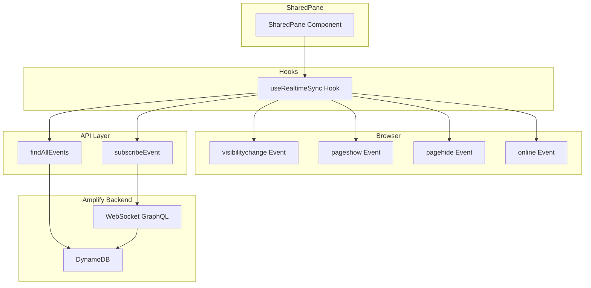
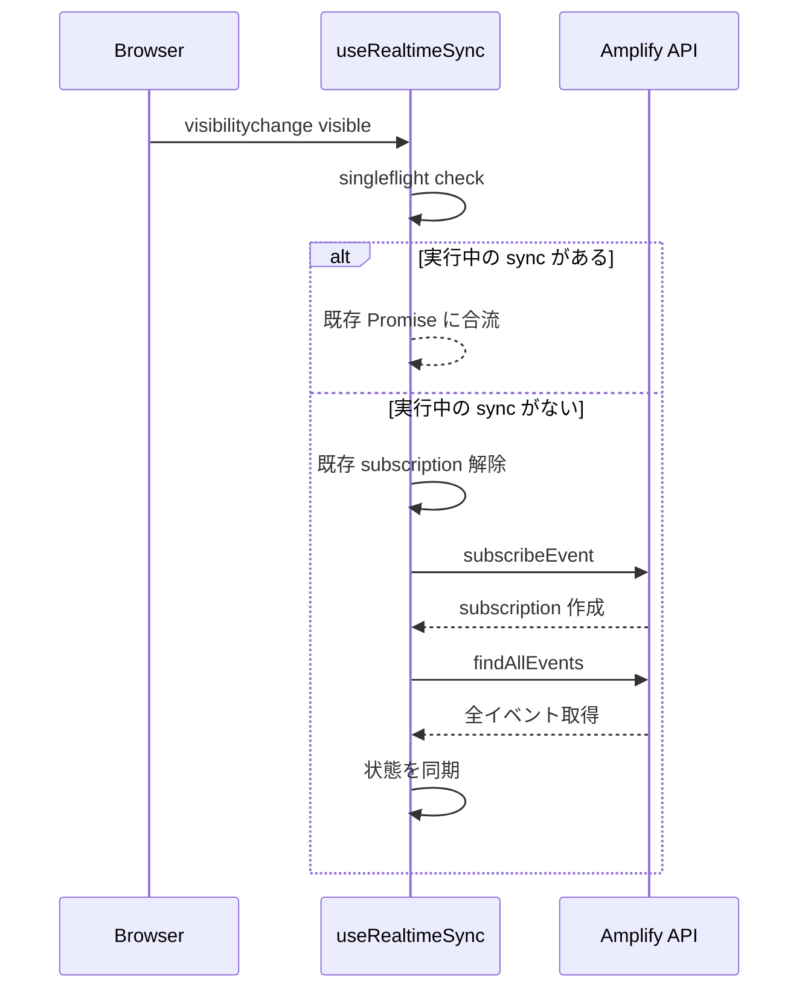
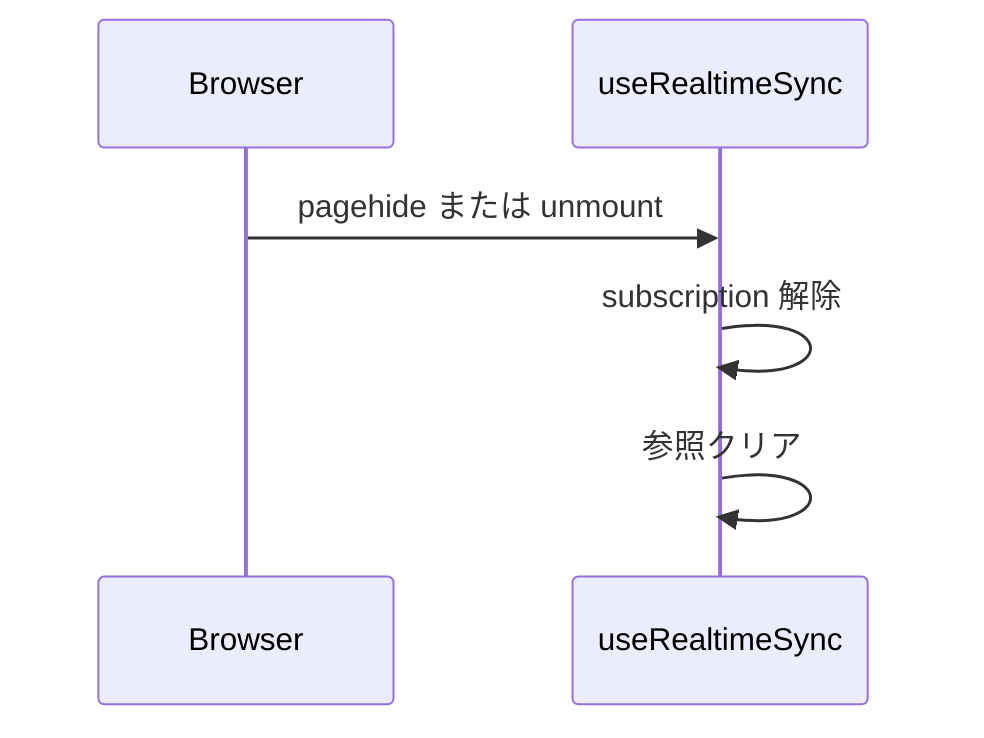

# Design Document

## Overview

**Purpose**: iOS Safari でタブ/アプリがバックグラウンドに回って復帰した際に、AWS Amplify Gen2 の GraphQL Subscription（WebSocket）が切断されリアルタイム共有が停止する問題を解決する。復帰時に確実に再接続し、切断中の取りこぼしを回収して状態を整合させる。

**Users**: 共有画面（`/shared/:id`）を利用するバドミントンサークルの参加者。主に iOS Safari および Android Chrome ユーザーが対象。

**Impact**: 新規カスタムフック `useRealtimeSync` を作成し、SharedPane から利用する。

### Goals
- iOS Safari でバックグラウンド→復帰後、数秒以内にリアルタイム共有を復旧する
- 切断中に発生したイベントの取りこぼしを API fetch で回収する
- subscription の二重購読を防止し、イベントの重複反映を回避する
- `sync()` と `cleanup()` の2つの概念のみで成立させる

### Non-Goals
- PWA 化による常時接続の維持
- `pause` 概念の導入
- 共有画面以外へのライフサイクルハンドリング適用
- オフライン時のローカルキャッシュ機能

## Architecture

### Existing Architecture Analysis

現在の SharedPane コンポーネントの実装を分析した結果:

- **現在のパターン**: `useEffect` で初回マウント時に `findAllEvents()` → `startSubscribe()` を実行
- **subscription 管理**: `subscribed` state で二重 subscribe を防止しているが、復帰時の再 subscribe 機能はない
- **イベント処理**: `proceededEvents` オブジェクトで処理済みイベントを管理し、重複処理を防止
- **クリーンアップ**: アンマウント時の subscription 解除が実装されていない

**課題**:
1. ライフサイクルイベント（`visibilitychange`, `pageshow`, `online`）をリッスンしていない
2. バックグラウンド復帰時に subscription が切断されたままになる
3. アンマウント時の cleanup 処理がない

### Architecture Pattern & Boundary Map



**Architecture Integration**:
- **Selected pattern**: カスタムフック抽出 + sync/cleanup の二関数設計
- **Domain boundaries**: `useRealtimeSync` フックにライフサイクル管理を抽出、SharedPane は UI に専念
- **Existing patterns preserved**: 既存の重複防止ロジック、Jotai による状態管理
- **New components rationale**: フック抽出によりテスト容易性と責務分離を実現
- **Steering compliance**: UI/Logic 分離の原則を強化

### Technology Stack

| Layer | Choice / Version | Role in Feature | Notes |
|-------|------------------|-----------------|-------|
| Frontend | React 18 + TypeScript | カスタムフック、状態管理 | - |
| State | Jotai | コンポーネント状態管理 | 既存パターンを維持 |
| Backend | AWS Amplify Gen2 | GraphQL Subscription、データ取得 | - |
| Browser API | Page Visibility API | ライフサイクルイベント検知 | - |

## System Flows

### 復帰時の sync() フロー



### cleanup() フロー



## Requirements Traceability

| Requirement | Summary | Components | Interfaces | Flows |
|-------------|---------|------------|------------|-------|
| 1.1, 1.2, 1.3 | ライフサイクルハンドラのスコープ制御 | useRealtimeSync | UseRealtimeSyncOptions | - |
| 2.1, 2.2, 2.3, 2.4, 2.5 | ブラウザライフサイクルイベントの検知 | useRealtimeSync | - | - |
| 3.1, 3.2, 3.3, 3.4, 3.5, 3.6, 3.7, 3.8 | Sync 処理の実装 | useRealtimeSync | SyncFunction | 復帰時 sync フロー |
| 4.1, 4.2, 4.3, 4.4 | Cleanup 処理の実装 | useRealtimeSync | - | cleanup フロー |
| 5.1, 5.2, 5.3 | 状態整合性の保証 | useRealtimeSync | - | 復帰時 sync フロー |
| 6.1, 6.2, 6.3 | 非機能要件 | useRealtimeSync | - | - |

## Components and Interfaces

| Component | Domain/Layer | Intent | Req Coverage | Key Dependencies | Contracts |
|-----------|--------------|--------|--------------|------------------|-----------|
| useRealtimeSync | Hooks | ライフサイクル管理と subscription 同期 | 1.1-6.3 | subscribeEvent (P0), findAllEvents (P0) | Service |
| SharedPane | UI | 共有画面の表示 | - | useRealtimeSync (P0) | - |

### Hooks Layer

#### useRealtimeSync

| Field | Detail |
|-------|--------|
| Intent | ブラウザライフサイクルイベントを検知し、subscription の同期と状態回復を行う |
| Requirements | 1.1-1.3, 2.1-2.5, 3.1-3.8, 4.1-4.4, 5.1-5.3, 6.1-6.3 |

**Responsibilities & Constraints**
- ブラウザライフサイクルイベント（visibilitychange, pageshow, pagehide, online）の検知
- subscription のライフサイクル管理（作成、解除、参照保持）
- singleflight パターンによる二重実行防止
- アンマウント時の自動 cleanup

**Dependencies**
- Outbound: subscribeEvent — リアルタイムイベント購読 (P0)
- Outbound: findAllEvents — 全イベント取得 (P0)
- External: Page Visibility API — ブラウザライフサイクルイベント (P0)

**Contracts**: Service [ ✓ ]

##### Hook Interface

```typescript
interface UseRealtimeSyncOptions {
  /** 共有ID */
  sharedId: string;
  /** イベント受信時のコールバック */
  onEvent: (event: Event) => void;
  /** 全イベント取得後のコールバック */
  onSync: (events: Event[]) => void;
}

interface UseRealtimeSyncResult {
  /** 手動で sync を実行する */
  sync: () => Promise<void>;
}

function useRealtimeSync(options: UseRealtimeSyncOptions): UseRealtimeSyncResult;
```

##### sync() Contract

| Aspect | Description |
|--------|-------------|
| Precondition | コンポーネントがマウントされている |
| Postcondition | subscription が有効、状態が最新 |
| Invariant | 同時に1つの sync のみ実行される（singleflight） |
| Error handling | エラー時は Promise 参照をクリアして終了、無限リトライは行わない |

**sync() の処理順序**:
1. 既存 subscription があれば解除
2. 新規 subscription を作成
3. API から最新状態を fetch
4. コールバックで状態を同期

##### cleanup() Contract

| Aspect | Description |
|--------|-------------|
| Trigger | pagehide イベント、またはコンポーネントのアンマウント |
| Postcondition | subscription が解除、全ての参照がクリア |

##### Event Listeners

| Event | Target | Condition | Action |
|-------|--------|-----------|--------|
| `visibilitychange` | `document` | `visibilityState === "visible"` | sync() |
| `pageshow` | `window` | `event.persisted === true` | sync() |
| `pagehide` | `window` | 常に | cleanup() |
| `online` | `window` | 常に | sync() |

**Implementation Notes**
- フックのマウント時に全イベントリスナーを登録、アンマウント時に解除
- singleflight は ref で実行中の Promise を保持して実現
- アンマウント後の非同期処理完了時は何もしない（mounted フラグでガード）

### UI Layer

#### SharedPane

| Field | Detail |
|-------|--------|
| Intent | 共有画面の表示とユーザーインタラクション |
| Requirements | - |

**Responsibilities & Constraints**
- `useRealtimeSync` フックを利用してリアルタイム同期を実現
- イベント受信時の状態更新とトースト表示
- UI のレンダリング

**Dependencies**
- Inbound: なし
- Outbound: useRealtimeSync — ライフサイクル管理 (P0)

**Implementation Notes**
- 既存の `startSubscribe` と関連ロジックを `useRealtimeSync` に移行
- `proceededEvents` による重複防止ロジックはフック内に移動

## Data Models

本機能では新規のデータモデルは追加しない。既存の `Event` モデルと `CurrentSettings` を使用する。

**Invariants**:
- 同一イベントID は1回のみ処理される
- subscription は常に最大1つのみ存在する

## Error Handling

### Error Strategy

sync() でのエラー発生時は singleflight の Promise 参照をクリアして終了する。無限リトライは行わない。

### Error Categories and Responses

| Category | Trigger | Response |
|----------|---------|----------|
| Subscription 作成失敗 | Amplify エラー | Promise 参照をクリア、次回イベントで再試行 |
| API fetch 失敗 | ネットワークエラー | Promise 参照をクリア、subscription は維持 |
| オフライン | ネットワーク切断 | online イベントで sync() 再実行 |

## Testing Strategy

### Unit Tests
- useRealtimeSync: sync/cleanup の動作、singleflight の検証
- アンマウント後の非同期処理が無視されることを検証

### Integration Tests
- ライフサイクルイベント発火時の適切なハンドラ呼び出し
- 複数イベント同時発火時の singleflight 動作

### E2E/UI Tests
- iOS Safari でバックグラウンド→復帰後のリアルタイム共有復旧
- subscription の二重購読が発生しないことの検証

## Performance & Scalability

### Target Metrics
- 復帰後の subscription 再作成: 2秒以内
- 最新状態の fetch と反映: 3秒以内
- 合計復旧時間: 5秒以内
