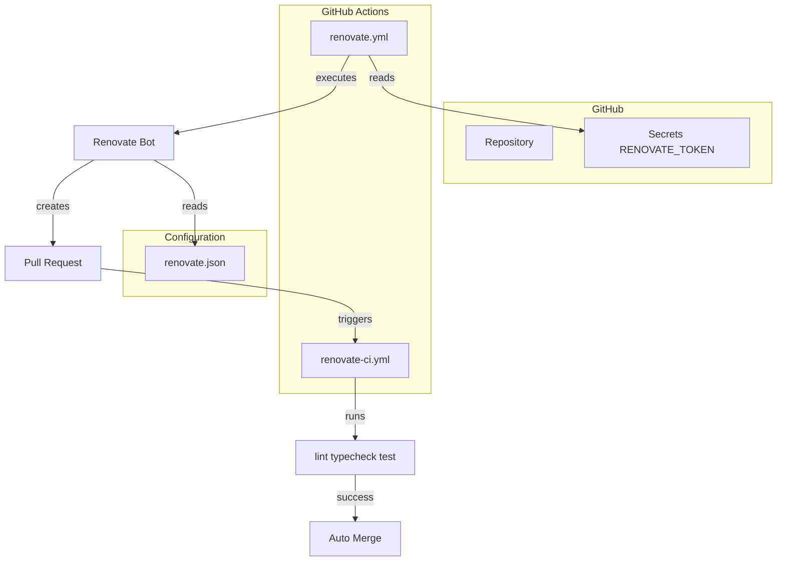

# Design Document: Renovate Automation

## Overview

**Purpose**: 本機能は、doubles-member-generator プロジェクトに Renovate を導入し、依存関係の自動更新を実現する。

**Users**: 開発者が依存関係の更新を自動化し、セキュリティ脆弱性への迅速な対応と最新化を維持する。

**Impact**: プロジェクトルートに設定ファイルを追加し、GitHub Actions ワークフローを新規作成する。

### Goals
- パッチ・マイナーバージョン更新の自動マージによる運用負荷軽減
- メジャーバージョン更新の手動レビューによる破壊的変更の慎重な評価
- セキュリティ脆弱性への即時対応

### Non-Goals
- Renovate 以外の依存関係管理ツールの導入
- 既存 CI ワークフロー（ci.yml）の変更
- asdf パッケージマネージャーのサポート（npm のみ対象）

## Architecture

### Architecture Pattern & Boundary Map



**Architecture Integration**:
- Selected pattern: 設定ファイル + GitHub Actions ワークフロー
- 既存パターン維持: prepare-ci アクションの再利用
- 新規コンポーネント: renovate.json、renovate.yml、renovate-ci.yml

### Technology Stack

| Layer | Choice / Version | Role in Feature | Notes |
|-------|------------------|-----------------|-------|
| Infrastructure | GitHub Actions | ワークフロー実行基盤 | スケジュール実行、手動実行をサポート |
| Tools | renovatebot/github-action v44.2.4 | Renovate Bot 実行 | Self-hosted 方式 |
| Configuration | renovate.json | 更新ルール定義 | Renovate 公式スキーマ準拠 |

## Requirements Traceability

| Requirement | Summary | Components | Files |
|-------------|---------|------------|-------|
| 1.1-1.4 | 設定ファイル基本構成 | RenovateConfig | renovate.json |
| 2.1-2.2 | PR 作成数制限 | RenovateConfig | renovate.json |
| 3.1-3.5 | パッチ・マイナー自動マージ | RenovateConfig | renovate.json |
| 4.1-4.2 | メジャーバージョンレビュー | RenovateConfig | renovate.json |
| 5.1-5.4 | パッケージグルーピング | RenovateConfig | renovate.json |
| 6.1-6.2 | セキュリティアラート | RenovateConfig | renovate.json |
| 7.1-7.5 | Renovate 実行ワークフロー | RenovateWorkflow | renovate.yml |
| 8.1-8.4 | PR 検証ワークフロー | RenovateCIWorkflow | renovate-ci.yml |

## Components and Interfaces

| Component | Domain/Layer | Intent | Req Coverage | Key Dependencies | Contracts |
|-----------|--------------|--------|--------------|------------------|-----------|
| RenovateConfig | Configuration | 依存関係更新ルール定義 | 1-6 | npm packages | File |
| RenovateWorkflow | CI/CD | Renovate Bot 実行 | 7 | RENOVATE_TOKEN (P0) | Workflow |
| RenovateCIWorkflow | CI/CD | PR 検証 | 8 | prepare-ci action (P0) | Workflow |

### Configuration

#### RenovateConfig

| Field | Detail |
|-------|--------|
| Intent | Renovate の動作ルールを JSON 形式で定義 |
| Requirements | 1.1-1.4, 2.1-2.2, 3.1-3.5, 4.1-4.2, 5.1-5.4, 6.1-6.2 |

**Responsibilities & Constraints**
- 依存関係更新の検出ルールを定義
- 自動マージ条件を指定
- パッケージグルーピングを設定

**Dependencies**
- External: Renovate Bot — 設定ファイルの読み取り (P0)

**Contracts**: File

##### File Contract: renovate.json

```json
{
  "$schema": "https://docs.renovatebot.com/renovate-schema.json",
  "extends": ["config:recommended", ":disableDependencyDashboard"],
  "prHourlyLimit": 5,
  "prConcurrentLimit": 10,
  "enabledManagers": ["npm"],
  "packageRules": [
    {
      "description": "Automerge patch and minor updates",
      "matchUpdateTypes": ["patch", "minor"],
      "automerge": true,
      "automergeType": "pr",
      "automergeStrategy": "squash"
    },
    {
      "description": "Major updates require review",
      "matchUpdateTypes": ["major"],
      "automerge": false,
      "reviewers": ["sonodar"]
    },
    {
      "description": "AWS Amplify packages",
      "matchPackagePatterns": ["^@aws-amplify/", "^aws-amplify$"],
      "groupName": "aws-amplify"
    },
    {
      "description": "Testing packages",
      "matchPackagePatterns": ["^@testing-library/", "^vitest$", "^@vitest/"],
      "groupName": "testing"
    },
    {
      "description": "Type definitions",
      "matchPackagePatterns": ["^@types/"],
      "groupName": "types"
    },
    {
      "description": "Group devDependencies minor updates",
      "matchDepTypes": ["devDependencies"],
      "matchUpdateTypes": ["minor"],
      "groupName": "devDependencies-minor"
    }
  ],
  "vulnerabilityAlerts": {
    "enabled": true,
    "schedule": ["at any time"]
  }
}
```

**Implementation Notes**
- `config:recommended` プリセットを継承し、一般的なベストプラクティスを適用
- `:disableDependencyDashboard` で Dependency Dashboard Issue を無効化
- `vulnerabilityAlerts.schedule` を `["at any time"]` に設定してセキュリティアラートを即時対応

### CI/CD

#### RenovateWorkflow

| Field | Detail |
|-------|--------|
| Intent | Renovate Bot をスケジュール実行して PR を作成 |
| Requirements | 7.1-7.5 |

**Responsibilities & Constraints**
- 毎週月曜日の午前0時（UTC）に Renovate を実行
- 手動実行（workflow_dispatch）をサポート
- RENOVATE_TOKEN シークレットで認証

**Dependencies**
- External: renovatebot/github-action v44.2.4 — Renovate Bot 実行 (P0)
- External: RENOVATE_TOKEN — GitHub 認証トークン (P0)

**Contracts**: Workflow

##### Workflow Contract: renovate.yml

```yaml
name: Renovate

on:
  schedule:
    - cron: "0 0 * * 1"  # 毎週月曜 9:00 JST (0:00 UTC)
  workflow_dispatch:

jobs:
  renovate:
    runs-on: ubuntu-latest
    steps:
      - uses: actions/checkout@v4

      - uses: renovatebot/github-action@v44.2.4
        with:
          token: ${{ secrets.RENOVATE_TOKEN }}
        env:
          LOG_LEVEL: info
          RENOVATE_REPOSITORIES: ${{ github.repository }}
```

**Implementation Notes**
- スケジュールは GitHub Actions 側で制御（renovate.json には設定しない）
- `LOG_LEVEL: info` で適切なログ出力レベルを設定

#### RenovateCIWorkflow

| Field | Detail |
|-------|--------|
| Intent | Renovate PR に対して lint, typecheck, test を実行 |
| Requirements | 8.1-8.4 |

**Responsibilities & Constraints**
- main ブランチへの PR 作成時に CI を実行
- 既存の prepare-ci アクションを再利用
- CI 失敗時は自動マージをブロック

**Dependencies**
- Inbound: Renovate PR — CI トリガー (P0)
- Internal: .github/actions/prepare-ci — 環境セットアップ (P0)

**Contracts**: Workflow

##### Workflow Contract: renovate-ci.yml

```yaml
name: Renovate CI

on:
  pull_request:
    branches: [main]

jobs:
  lint:
    name: Lint
    runs-on: ubuntu-latest
    steps:
      - uses: actions/checkout@v4
      - uses: ./.github/actions/prepare-ci
      - run: npm run lint

  typecheck:
    name: Type Check
    runs-on: ubuntu-latest
    steps:
      - uses: actions/checkout@v4
      - uses: ./.github/actions/prepare-ci
        with:
          with-amplify-outputs: true
      - run: npm run typecheck

  test:
    name: Test
    runs-on: ubuntu-latest
    env:
      TZ: Asia/Tokyo
    steps:
      - uses: actions/checkout@v4
      - uses: ./.github/actions/prepare-ci
        with:
          with-amplify-outputs: true
      - run: npm test
```

**Implementation Notes**
- 既存 ci.yml と同様の構成だが、Renovate PR 専用として分離
- prepare-ci アクションを再利用してコード重複を最小化
- coverage アップロードは省略（Renovate PR では不要）

## Error Handling

### Error Strategy
- **RENOVATE_TOKEN 未設定**: ワークフロー実行時にエラーとなり、GitHub Actions の失敗通知で検知
- **CI 失敗**: 自動マージがブロックされ、PR がオープン状態のまま残る

### Monitoring
- GitHub Actions のワークフロー実行履歴で Renovate 実行状況を確認
- 失敗時は GitHub の通知機能で開発者に通知

## Testing Strategy

### Integration Tests
- renovate.json の JSON 構文検証（renovate-config-validator）
- GitHub Actions ワークフローの構文検証（actionlint）

### Manual Verification
- workflow_dispatch で手動実行し、PR が正しく作成されることを確認
- テスト用の依存関係更新で automerge 動作を検証

## Security Considerations

- **RENOVATE_TOKEN**: GitHub Personal Access Token（PAT）または Fine-grained PAT を使用
- **権限スコープ**: `repo` スコープが必要（PR 作成、マージ操作のため）
- **シークレット管理**: GitHub リポジトリの Secrets で安全に管理
