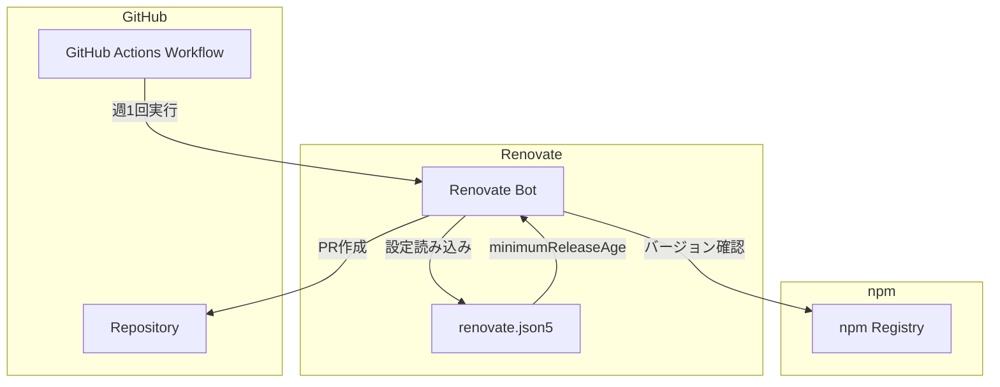
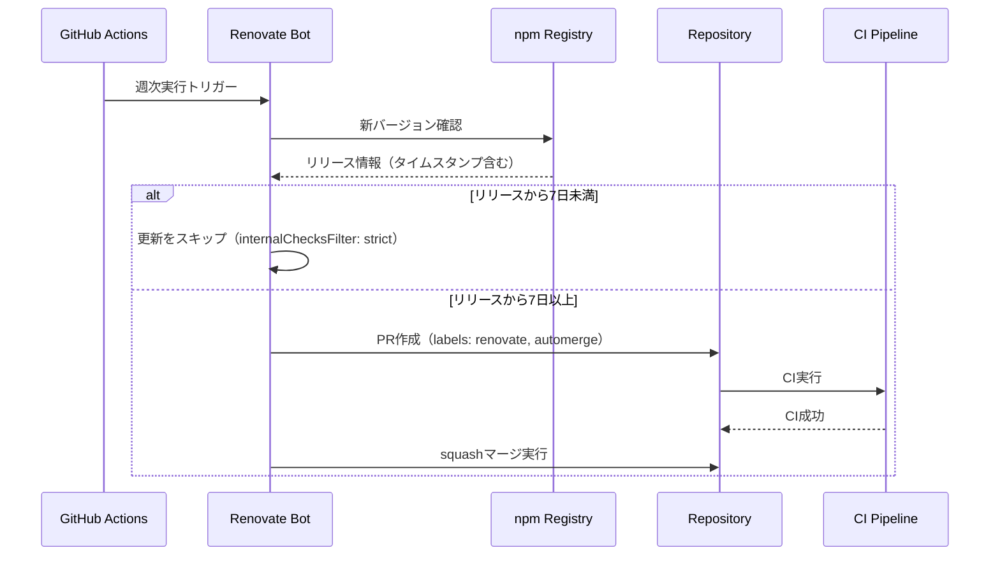
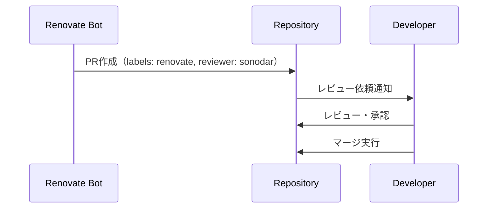

# Technical Design: Renovate Automerge Configuration

## Overview

**Purpose**: Renovate設定を改善し、サプライチェーン攻撃対策と通知削減を両立させる。

**Users**: 開発者（sonodar）がこの設定により、依存関係の自動更新を安全かつ効率的に管理できる。

**Impact**: 既存のrenovate.jsonをrenovate.json5に移行し、猶予期間・グループ化・ラベル付与の設定を追加する。

### Goals
- patch/minor更新に7日間の猶予期間を設け、サプライチェーン攻撃リスクを軽減
- dependencies/devDependenciesの2グループ構成で通知を削減
- 脆弱性対応は猶予期間をバイパスして即時マージ
- メジャーバージョン更新はレビュー必須
- JSON5形式でコメントによる可読性向上

### Non-Goals
- Dependency Dashboardの有効化（現在無効、維持）
- 複雑なパッケージ個別グループ設定
- GitHub Actions以外でのスケジュール管理

### Prerequisites
- Branch Protection Rule から Repository Ruleset への移行（Renovateバイパス設定のため）

## Architecture

### Existing Architecture Analysis
- **現行設定**: renovate.json + GitHub Actionsワークフロー（renovate.yml）
- **週次実行**: 既に `cron: "0 0 * * 1"`（毎週月曜UTC 0:00）で設定済み
- **自動マージ**: patch/minorはautomerge有効だが、猶予期間なし
- **グループ化**: AWS Amplify、testing、types、devDependencies-minorの4グループ

### Architecture Pattern & Boundary Map



**Architecture Integration**:
- **Selected pattern**: 設定ファイル変更のみ（インフラ変更なし）
- **Domain boundaries**: Renovate設定とGitHub Actionsの責務分離を維持
- **Existing patterns preserved**: 週次実行、validateジョブ
- **Steering compliance**: プロジェクトの技術スタック（npm）に準拠

### Technology Stack

| Layer | Choice / Version | Role in Feature | Notes |
|-------|------------------|-----------------|-------|
| Configuration | renovate.json5 | Renovate設定ファイル | JSON5でコメント可能 |
| CI/CD | GitHub Actions | スケジュール実行 | renovatebot/github-action v44.2.4 |
| Bot | Renovate | 依存関係更新自動化 | minimumReleaseAge対応 |

## System Flows

### 自動マージフロー（patch/minor）



### メジャー更新フロー



## Requirements Traceability

| Requirement | Summary | Components | Interfaces |
|-------------|---------|------------|------------|
| 1.1, 1.2, 1.3 | JSON5移行 | renovate.json5 | - |
| 2.1, 2.2, 2.3 | patch/minor自動マージ | automerge設定 | - |
| 2.4 | 猶予期間 | minimumReleaseAge | - |
| 2.5 | PR作成抑制 | internalChecksFilter | - |
| 2.6 | ラベル付与 | labels設定 | - |
| 2.7, 2.8 | グループ化 | packageRules | - |
| 2.9 | lockFileMaintenance無効 | lockFileMaintenance | - |
| 3.1, 3.2, 3.3, 3.4 | メジャー更新 | major packageRule | - |
| 4.1, 4.2, 4.3 | 脆弱性対応 | vulnerabilityAlerts | - |
| 5.1, 5.2 | PR制限 | prConcurrentLimit, prHourlyLimit | - |
| 6.1, 6.2 | スケジュール | GitHub Actions cron | - |
| 7.1, 7.2, 7.3 | ブランチ設定 | baseBranches | - |
| 8.1, 8.2, 8.3, 8.4 | グループ設定削除 | packageRules | - |
| 9.1, 9.2, 9.3, 9.4 | Ruleset移行 | Repository Ruleset | - |

## Components and Interfaces

| Component | Domain | Intent | Req Coverage | Dependencies |
|-----------|--------|--------|--------------|--------------|
| renovate.json5 | Configuration | Renovate設定ファイル | 1-5, 7-8 | Renovate Bot |
| renovate.yml | CI/CD | GitHub Actionsワークフロー | 6 | renovatebot/github-action |
| Repository Ruleset | GitHub Settings | ブランチ保護とバイパス設定 | 9 | GitHub |

### Configuration Layer

#### renovate.json5

| Field | Detail |
|-------|--------|
| Intent | Renovateの動作設定を定義 |
| Requirements | 1.1-1.3, 2.1-2.9, 3.1-3.4, 4.1-4.3, 5.1-5.2, 7.1-7.3, 8.1-8.4 |

**Responsibilities & Constraints**
- Renovate Botの全動作設定を一元管理
- JSON5形式でコメントによる設定意図の文書化
- packageRulesの順序により優先順位を制御

**Dependencies**
- External: Renovate Bot — 設定を読み込み動作（P0）
- External: npm Registry — バージョン情報とリリースタイムスタンプ取得（P0）

**Contracts**: State [x]

##### State Management

**設定スキーマ**:
```json5
{
  "$schema": "https://docs.renovatebot.com/renovate-schema.json",
  "extends": ["config:recommended", ":disableDependencyDashboard"],

  // PR制限（Req 5.1, 5.2）
  "prHourlyLimit": 5,
  "prConcurrentLimit": 10,

  // 対象マネージャー
  "enabledManagers": ["npm"],

  // 対象ブランチ（Req 7.1, 7.2, 7.3）
  "baseBranches": ["develop", "main"],

  // 猶予期間設定（Req 2.4, 2.5）
  "minimumReleaseAge": "7 days",
  "internalChecksFilter": "strict",

  // lockFileMaintenance無効化（Req 2.9）
  "lockFileMaintenance": {
    "enabled": false
  },

  "packageRules": [
    // dependenciesグループ（Req 2.7）
    {
      "description": "Group all dependencies patch/minor updates",
      "matchDepTypes": ["dependencies"],
      "matchUpdateTypes": ["patch", "minor"],
      "groupName": "dependencies",
      "automerge": true,
      "automergeType": "pr",
      "automergeStrategy": "squash",
      "labels": ["renovate", "automerge"]
    },
    // devDependenciesグループ（Req 2.8）
    {
      "description": "Group all devDependencies patch/minor updates",
      "matchDepTypes": ["devDependencies"],
      "matchUpdateTypes": ["patch", "minor"],
      "groupName": "devDependencies",
      "automerge": true,
      "automergeType": "pr",
      "automergeStrategy": "squash",
      "labels": ["renovate", "automerge"]
    },
    // メジャー更新（Req 3.1, 3.2, 3.3, 3.4）
    {
      "description": "Major updates require review",
      "matchUpdateTypes": ["major"],
      "automerge": false,
      "reviewers": ["sonodar"],
      "labels": ["renovate"]
    }
  ],

  // 脆弱性対応（Req 4.1, 4.2, 4.3）
  "vulnerabilityAlerts": {
    "enabled": true,
    "schedule": ["at any time"],
    "automerge": true,
    "automergeType": "pr",
    "automergeStrategy": "squash",
    "labels": ["renovate", "security"]
  }
}
```

**Implementation Notes**
- **Integration**: 既存のrenovate.jsonをリネームしてJSON5形式に変換
- **Validation**: GitHub Actionsのvalidateジョブで構文チェック済み
- **Risks**: npmレジストリのタイムスタンプ欠落時は猶予期間が適用されない可能性

#### renovate.yml（GitHub Actions）

| Field | Detail |
|-------|--------|
| Intent | Renovate Botの週次実行スケジュール |
| Requirements | 6.1, 6.2 |

**Responsibilities & Constraints**
- 週1回のRenovate実行をトリガー
- 設定ファイル変更時のバリデーション

**Dependencies**
- External: renovatebot/github-action — Renovate実行（P0）
- External: RENOVATE_TOKEN — 認証（P0）

**Contracts**: State [x]

##### State Management

**現行設定（変更不要）**:
```yaml
on:
  schedule:
    - cron: "0 0 * * 1"  # 毎週月曜 UTC 0:00（JST 9:00）
```

**Implementation Notes**
- **Integration**: 現行設定で週1回実行済み、変更不要
- **Validation**: ワークフローファイルのパス監視でrenovate.json5への変更を検出するよう更新が必要

## Data Models

### Configuration Model

**Entity: RenovateConfig**
- `$schema`: JSON Schema URL
- `extends`: ベースプリセット配列
- `prHourlyLimit`: 時間あたりPR作成上限
- `prConcurrentLimit`: 同時オープンPR上限
- `baseBranches`: 対象ブランチ配列
- `minimumReleaseAge`: 猶予期間
- `internalChecksFilter`: フィルタモード
- `packageRules`: ルール配列
- `vulnerabilityAlerts`: 脆弱性設定

**Business Rules**:
- packageRulesは配列の後ろが優先
- vulnerabilityAlertsはminimumReleaseAgeをバイパス
- labelsはnon-mergeable（上書き動作）

## Error Handling

### Error Strategy
設定ファイルのエラーはGitHub Actionsのvalidateジョブで検出する。

### Error Categories and Responses
**Configuration Errors**:
- 構文エラー → renovate-config-validatorで検出、PRマージをブロック
- 無効な設定値 → Renovate実行時にエラーログ出力

### Monitoring
- GitHub Actions実行ログで動作確認
- Renovate PRのラベルで更新タイプを識別

## Testing Strategy

### Integration Tests
- renovate.json5の構文検証（renovate-config-validator --strict）
- 設定変更後の初回Renovate実行確認
- patch/minor更新PRのラベル確認
- major更新PRのレビュアー割り当て確認

### Manual Verification
- 猶予期間中の更新がPR作成されないことを確認
- 脆弱性修正が即時PR作成されることを確認（テスト困難、発生時に確認）

## Migration Strategy

### Phase 0: Branch Protection → Ruleset 移行（前提条件）
1. Repository Ruleset を新規作成
   - 対象ブランチ: main, develop
   - ルール: Require PR, Require approvals（既存と同等）
   - **Bypass list**: 「Repository admins」を追加（RENOVATE_TOKENがadminのPATのため）
2. 既存の Branch Protection Rule を削除

### Phase 1: 設定ファイル移行
1. renovate.jsonをrenovate.json5にリネーム
2. JSON5形式でコメント追加
3. 新規設定（minimumReleaseAge、グループ化など）を追加

### Phase 2: ワークフロー更新
1. renovate.ymlのパス監視をrenovate.json5に変更

### Phase 3: 検証
1. PRを作成して設定バリデーション実行
2. マージ後、次回Renovate実行で動作確認

### Rollback
- Ruleset: 問題発生時はBypass listからRenovateを削除し、手動承認に戻す
- 設定ファイル: renovate.json5をrenovate.jsonにリネームし、旧設定に戻す
