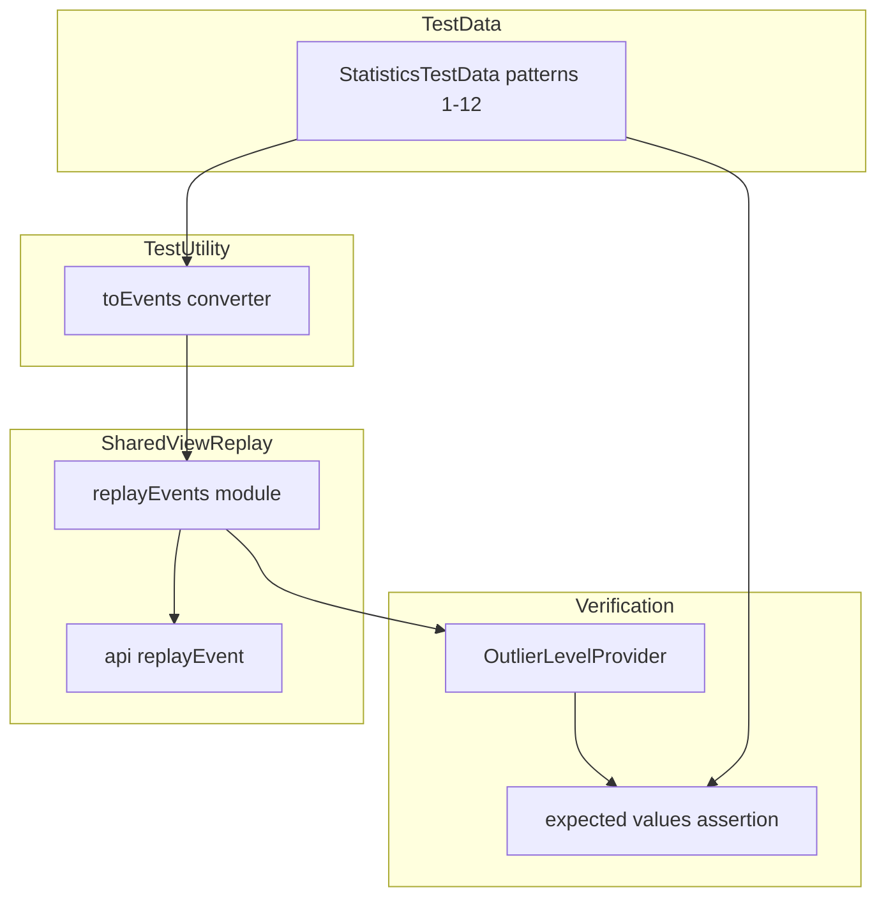

# Design Document

## Overview

**Purpose**: 共有画面（SharedPane）の統計パネルが正しい値を表示することを、イベントリプレイ経路を通じた E2E テストで保証する。

**Users**: 開発者がリグレッションを検出するために使用する。

**Impact**: 既存の `replayEvents()` をテスト可能にするため SharedPane.tsx からモジュール抽出を行い、テストユーティリティにデータ変換関数を追加する。

### Goals
- 全12テストパターンについて、共有画面のイベントリプレイ経路を通じた統計値の正しさを検証する
- テストパターン追加時に自動的にテスト対象に含まれる構造にする

### Non-Goals
- 共有画面の UI レイアウトや視覚的な表示テスト
- 統計ロジック（OutlierLevelProvider）自体の検証（既存テストでカバー済み）
- SharedPane コンポーネント全体のレンダリングテスト

## Architecture

### Existing Architecture Analysis

現在の構成:
- `SharedPane.tsx` 内にローカル関数 `replayEvents()` が定義されており、テストから直接アクセスできない
- メイン画面の統計テスト（`MemberCountPane.statistics.test.tsx`）は `buildGameCounts()` で histories を直接リプレイし、`OutlierLevelProvider` で値を検証する
- `buildGameCounts()` は `addHistory()` を直接呼ぶため、共有画面の `replayEvent()` 経路とは異なる

### Architecture Pattern & Boundary Map



**Architecture Integration**:
- 選択パターン: 既存テストユーティリティの拡張（変換関数追加 + ロジック抽出）
- 既存パターン維持: `src/testing/statistics/` にテストユーティリティを集約する慣行を踏襲
- 新コンポーネント理由: `toEvents` 変換関数は `StatisticsTestData` → `Event[]` の橋渡しに必要。`replayEvents` モジュールは SharedPane からの純粋な抽出

### Technology Stack

| Layer | Choice / Version | Role in Feature | Notes |
|-------|------------------|-----------------|-------|
| Testing | Vitest | テスト実行 | 既存と同一 |
| Testing Utility | src/testing/statistics/ | テストデータ変換 | 既存ディレクトリに追加 |

## Requirements Traceability

| Requirement | Summary | Components | Interfaces | Flows |
|-------------|---------|------------|------------|-------|
| 1.1 | 全パターンで統計値が正しい | toEvents, replayEvents module, テストスイート | StatisticsTestData → Event[] | パターン → 変換 → リプレイ → 検証 |
| 1.2 | 途中参加者の統計値が正しい | toEvents（Join イベント生成） | Join event 生成ロジック | Join → Generate シーケンス |
| 1.3 | エッジケースで統計値が正しい | テストスイート | — | 離脱・アルゴリズム差異パターンのリプレイ |
| 2.1 | 共有画面固有経路で検証 | replayEvents module | replayEvents signature | Event[] → replayEvents → CurrentSettings |
| 2.2 | 新パターン自動取り込み | テストスイート | patterns 配列の動的参照 | — |

## Components and Interfaces

| Component | Domain/Layer | Intent | Req Coverage | Key Dependencies | Contracts |
|-----------|-------------|--------|--------------|-----------------|-----------|
| toEvents | Testing Utility | StatisticsTestData を Event[] に変換 | 1.1, 1.2, 1.3, 2.1 | StatisticsTestData types (P0) | Service |
| replayEvents module | Shared View Logic | Event[] から CurrentSettings を構築 | 2.1 | api/replayEvent (P0) | Service |
| E2E テストスイート | Testing | 全パターンの統計値検証 | 1.1, 1.2, 1.3, 2.1, 2.2 | toEvents (P0), replayEvents (P0), OutlierLevelProvider (P0) | — |

### Testing Utility

#### toEvents

| Field | Detail |
|-------|--------|
| Intent | StatisticsTestData を共有画面用の Event[] に変換する |
| Requirements | 1.1, 1.2, 1.3, 2.1 |

**Responsibilities & Constraints**
- StatisticsTestData の histories と joiners を時系列順の Event[] に変換する
- Initialize イベントには初期メンバー（joiner を除く）で構成された CurrentSettings を payload として含める
- joiner の index に対応する位置で Join イベントを挿入し、その直後（または同時）に Generate イベントを発行する

**Dependencies**
- Inbound: テストスイートから呼び出される (P0)
- Outbound: `src/api/types.ts` の Event 型定義 (P0)
- Outbound: `src/logic/types.ts` の CurrentSettings 型定義 (P0)

**Contracts**: Service [x]

##### Service Interface
```typescript
function toEvents(pattern: StatisticsTestData): Event[];
```
- Preconditions: `pattern.members` と `pattern.joiners` の ID が `join()` の自動採番ロジックと整合すること
- Postconditions: 返り値の先頭は Initialize イベント、以降は Generate/Join イベントの時系列順
- Invariants: 返り値の Event[] を replayEvents に渡した結果の gameCounts が、`buildGameCounts(pattern)` の結果と同一になること

### Shared View Logic

#### replayEvents module

| Field | Detail |
|-------|--------|
| Intent | SharedPane.tsx から抽出した replayEvents ロジックを独立モジュールとして提供する |
| Requirements | 2.1 |

**Responsibilities & Constraints**
- SharedPane.tsx 内のローカル関数 `replayEvents()` をそのまま抽出する
- 振る舞いの変更は一切行わない（純粋な移動）
- SharedPane.tsx からは抽出先をインポートして使用する

**Dependencies**
- Inbound: SharedPane.tsx, テストスイート (P0)
- Outbound: `src/api/event.ts` の `replayEvent()` (P0)

**Contracts**: Service [x]

##### Service Interface
```typescript
function replayEvents(allEvents: Event[]): { settings: CurrentSettings; finished: boolean };
```
- Preconditions: `allEvents[0].type` が `EventType.Initialize` であること
- Postconditions: 全イベントが順次適用された最終状態の CurrentSettings を返す
- Invariants: SharedPane.tsx での既存の呼び出しと同一の結果を返す

## Testing Strategy

### E2E Tests（本仕様の主題）

1. **全パターン網羅テスト**: `src/testing/statistics/` の全パターンを動的にイテレートし、各パターンについて `toEvents → replayEvents → OutlierLevelProvider → assert` のフローを実行
2. **playCount 検証**: 各メンバーの `getValue("playCount", id)` が `expected[id].playCount` と一致
3. **totalRestCount 検証**: 各メンバーの `getValue("totalRestCount", id)` が `expected[id].totalRestCount` と一致
4. **consecutiveRestCount 検証**: 各メンバーの `getValue("restCount", id)` が `expected[id].consecutiveRestCount` と一致
5. **highlightLevel 検証**: 各メンバーの `getLevel(variant, id)` が `expected[id].highlightLevel[variant]` と一致
