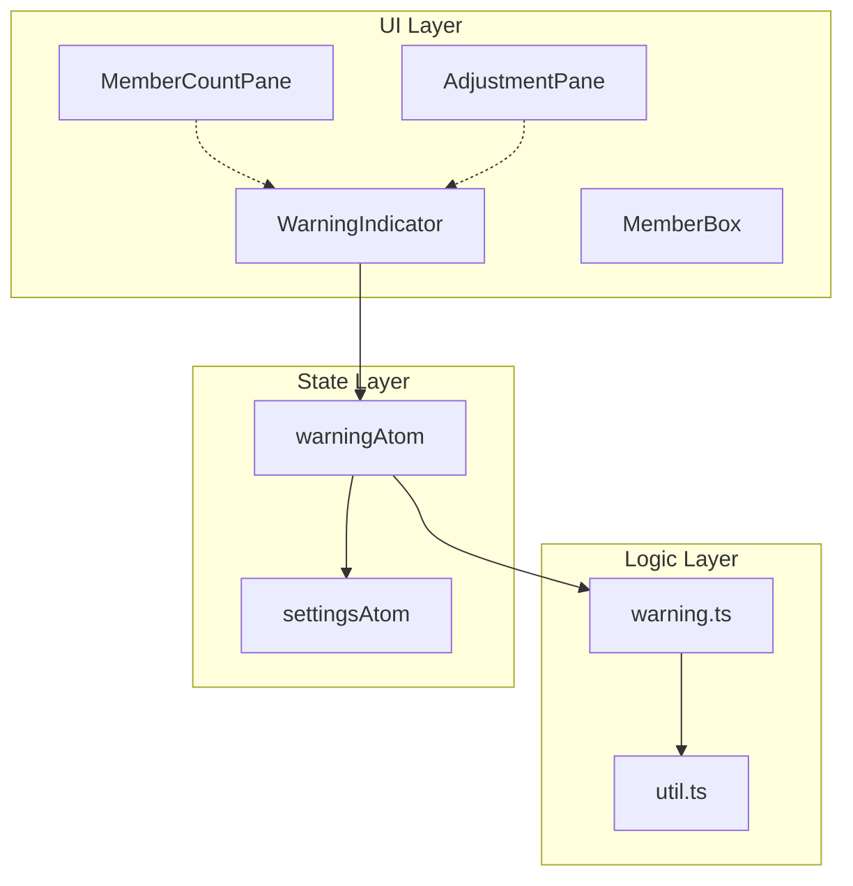
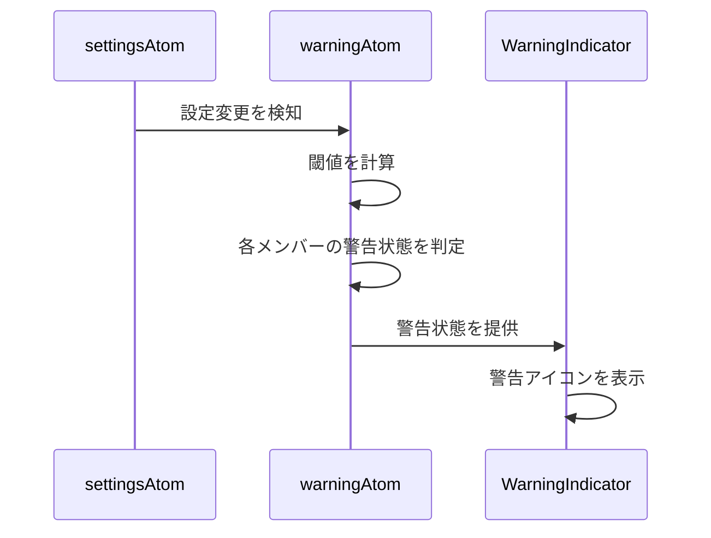
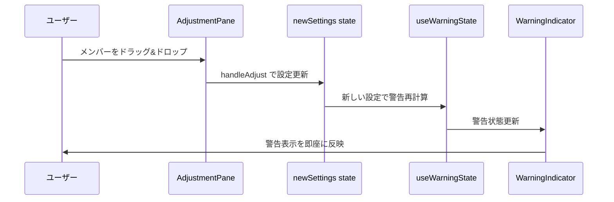
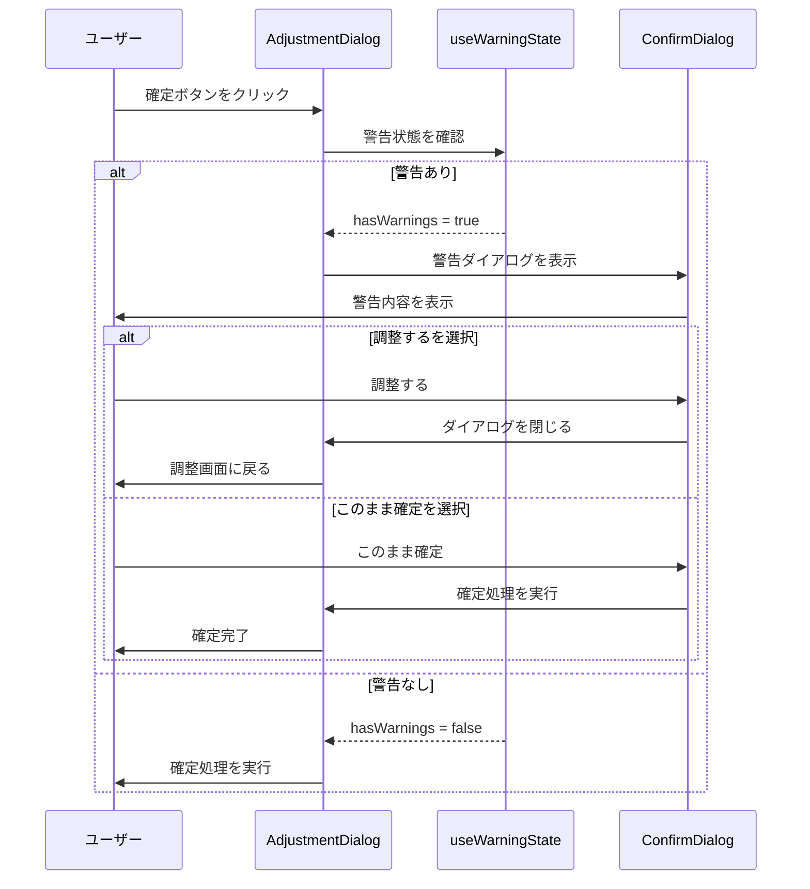

# Design Document

## Overview

**Purpose**: 本機能は、メンバー間の不公平な状態（連続休憩、試合回数差）を検出し、運営者に視覚的な警告を表示する。

**Users**: 運営者がメンバー調整時に公平性の問題を即座に認識し、適切な調整を行える。

**Impact**: 既存のロジック・UIは変更せず、警告機能を独立したモジュールとして追加する。

### Goals
- コート数・メンバー数・アルゴリズムに基づく動的な警告閾値の計算
- 連続休憩と試合回数差の警告検出
- 調整画面・統計画面での警告表示
- 既存機能への影響ゼロ

### Non-Goals
- 既存の `OutlierLevelProvider` や `getOutlierLevel` の変更
- 既存UIコンポーネントの表示ロジック変更
- 同一ペア警告（アプリがペアを決定しないため対象外）

## Architecture

### Existing Architecture Analysis

現在のアーキテクチャ:
- **ロジック層**: `src/logic/` に純粋関数として実装
- **状態管理**: `src/components/state/` に Jotai アトム
- **UI層**: `src/components/` に React コンポーネント

既存の統計機能:
- `OutlierLevelProvider` が `playCount`, `restCount`, `totalRestCount` の外れ値レベルを提供
- `MemberCountPane` が統計をタブ形式で表示
- `MemberBox` がドラッグ可能なメンバーボックスを表示

**保護対象**: 上記の既存機能はすべて変更しない。

### Architecture Pattern & Boundary Map



**Architecture Integration**:
- Selected pattern: 独立モジュール追加（既存機能への影響ゼロ）
- Domain boundaries: 警告機能は `warning.ts` に閉じ込め、UIは `WarningIndicator` として分離
- Existing patterns preserved: ロジック/UI分離、Jotai状態管理、純粋関数
- New components rationale: 既存コードを変更せずに機能追加するため
- Steering compliance: `src/logic/` に純粋関数、`src/components/state/` に状態管理

### Technology Stack

| Layer | Choice / Version | Role in Feature | Notes |
|-------|------------------|-----------------|-------|
| Frontend | React 18 | 警告インジケーターコンポーネント | 既存と同じ |
| State | Jotai | 警告状態の派生アトム | 既存パターンに従う |
| UI | Chakra UI v3 | 警告アイコン・スタイル | 既存と同じ |
| Icons | react-icons | 警告アイコン表示 | 既存で使用中 |

## System Flows

### 警告状態の計算フロー



### メンバー調整時の警告更新



### 確定時の警告ダイアログフロー



## Requirements Traceability

| Requirement | Summary | Components | Interfaces | Flows |
|-------------|---------|------------|------------|-------|
| 1.1, 1.2, 1.3 | 閾値計算（休憩人数算出） | calculateWarningThresholds | WarningThresholds | - |
| 1.4, 1.5 | アルゴリズム補正 | calculateWarningThresholds | WarningThresholds | - |
| 1.6 | 設定変更時の再計算 | warningAtom | - | 警告状態の計算フロー |
| 1.7 | 閾値最小値制約 | calculateWarningThresholds | WarningThresholds | - |
| 2.1, 2.2, 2.3 | 連続休憩警告検出 | detectWarnings | WarningState | - |
| 3.1, 3.2, 3.3 | 試合回数差警告検出 | detectWarnings | WarningState | - |
| 4.1, 4.2, 4.3 | 警告の視覚的表示 | WarningIndicator | WarningIndicatorProps | - |
| 4.4 | リアルタイム更新 | useWarningState | - | メンバー調整時の警告更新 |
| 5.1, 5.2, 5.3 | 統計画面での警告表示 | MemberCountPane + WarningIndicator | - | - |
| 6.1, 6.2 | 調整画面での警告表示 | AdjustmentPane + WarningIndicator | - | - |
| 6.3, 6.4, 6.5 | 確定時の警告ダイアログ | AdjustmentDialog, ConfirmDialog | - | 確定時の警告フロー |

## Components and Interfaces

| Component | Domain/Layer | Intent | Req Coverage | Key Dependencies | Contracts |
|-----------|--------------|--------|--------------|------------------|-----------|
| warning.ts | Logic | 警告閾値計算・警告検出 | 1, 2, 3 | util.ts (P1) | Service |
| warningAtom | State | 警告状態の派生アトム | 1.6, 4.4 | settingsAtom (P0), warning.ts (P0) | State |
| useWarningState | Hooks | 警告状態取得フック | 4.4, 6.1, 6.2 | warningAtom (P0) | - |
| WarningIndicator | UI | 警告アイコン表示 | 4.1, 4.2, 4.3, 5.1, 5.2, 6.1 | useWarningState (P0) | - |
| WarningConfirmDialog | UI | 確定時の警告ダイアログ | 6.3, 6.4, 6.5 | ConfirmDialog (P0), useWarningState (P0) | - |

### Logic Layer

#### warning.ts

| Field | Detail |
|-------|--------|
| Intent | 警告閾値の動的計算と警告状態の検出 |
| Requirements | 1.1, 1.2, 1.3, 1.4, 1.5, 1.6, 1.7, 2.1, 2.2, 2.3, 3.1, 3.2, 3.3 |

**Responsibilities & Constraints**
- 警告閾値の計算（コート数、メンバー数、アルゴリズムから）
- 各メンバーの警告状態判定
- 純粋関数として実装（副作用なし）
- 既存の `util.ts` の関数を再利用

**Dependencies**
- Inbound: なし
- Outbound: `util.ts` — `getContinuousRestCount` (P1)
- External: なし

**Contracts**: Service [x]

##### Service Interface

```typescript
/** 警告閾値 */
type WarningThresholds = {
  /** 連続休憩警告の閾値 */
  consecutiveRestThreshold: number;
  /** 試合回数差警告の閾値 */
  playCountDiffThreshold: number;
};

/** 警告の種類 */
type WarningType = "consecutiveRest" | "playCountDiff";

/** メンバーごとの警告状態 */
type MemberWarning = {
  memberId: number;
  type: WarningType;
  value: number;
  threshold: number;
};

/** 全体の警告状態 */
type WarningState = {
  thresholds: WarningThresholds;
  warnings: MemberWarning[];
  hasWarnings: boolean;
};

/** 閾値計算の入力パラメータ */
type ThresholdParams = {
  courtCount: number;
  memberCount: number;
  algorithm: Algorithm;
};

/**
 * 警告閾値を計算する
 * @param params - コート数、メンバー数、アルゴリズム
 * @returns 計算された閾値
 *
 * ## 数学モデル
 *
 * ### 確率論的アプローチ
 * 完全にランダムに休憩者を選ぶ場合、特定のメンバーが休憩する確率:
 *   p = r / n  (r: 休憩人数, n: メンバー数)
 *
 * 特定のメンバーが k 回連続で休憩する確率（独立と仮定）:
 *   P(連続休憩 ≥ k) ≈ p^k
 *
 * ### 閾値の導出
 * 「通常では起こりにくい」= 確率が有意水準 α 以下
 *   p^k ≤ α
 *
 * 対数を取ると:
 *   k ≥ ln(α) / ln(p)
 *
 * よって基本閾値:
 *   k = ceil(ln(α) / ln(r/n))
 *
 * ここで α = 0.1 (10%) をデフォルトの有意水準とする。
 *
 * ### 計算ロジック
 * 1. 休憩人数 r = メンバー数 - コート数 × 4
 * 2. 休憩確率 p = r / n
 * 3. 基本閾値 = max(1, ceil(ln(0.1) / ln(p)))
 * 4. アルゴリズム補正:
 *    - ばらつき重視（discreteness）: 基本閾値 + 1（緩い基準）
 *    - 均等性重視（evenness）: 基本閾値そのまま（厳しい基準）
 * 5. 休憩人数が0以下の場合: 閾値 = Infinity（警告なし）
 *
 * ### 計算例
 *
 * | 構成 | r | p | 基本閾値 | 均等性 | ばらつき |
 * |------|---|------|---------|--------|---------|
 * | 2コート・10人 | 2 | 0.20 | 2 | 2 | 3 |
 * | 4コート・24人 | 8 | 0.33 | 3 | 3 | 4 |
 * | 1コート・5人 | 1 | 0.20 | 2 | 2 | 3 |
 * | 3コート・16人 | 4 | 0.25 | 2 | 2 | 3 |
 * | 4コート・20人 | 4 | 0.20 | 2 | 2 | 3 |
 *
 * 例: 2コート・10人 → 「2回連続休憩で警告」はユーザーの直感と一致
 */
function calculateWarningThresholds(params: ThresholdParams): WarningThresholds;

/**
 * 警告状態を検出する
 * @param settings - 現在の設定
 * @param thresholds - 警告閾値
 * @returns 警告状態
 *
 * 検出ロジック:
 * 1. 連続休憩警告:
 *    - 各メンバーの連続休憩回数を getContinuousRestCount で取得
 *    - 連続休憩回数 >= consecutiveRestThreshold のメンバーを警告
 * 2. 試合回数差警告:
 *    - 各メンバーの試合回数（補正値適用後）を取得
 *    - 最大値 - 最小値 >= playCountDiffThreshold の場合
 *    - 最小値のメンバーを警告
 */
function detectWarnings(
  settings: CurrentSettings,
  thresholds: WarningThresholds
): WarningState;
```

- Preconditions: `courtCount >= 1`, `memberCount >= courtCount * 4`
- Postconditions: `thresholds.consecutiveRestThreshold >= 1`, `thresholds.playCountDiffThreshold >= 1`
- Invariants: 閾値は常に1以上

**Implementation Notes**
- Integration: `src/logic/index.ts` で re-export
- Validation: 閾値計算時に最小値1を保証
- Risks: 計算式の妥当性は実使用でチューニングが必要

### State Layer

#### warningAtom

| Field | Detail |
|-------|--------|
| Intent | settingsAtom から派生した警告状態を提供 |
| Requirements | 1.6, 4.4 |

**Responsibilities & Constraints**
- `settingsAtom` の変更を監視し、警告状態を自動計算
- 派生アトム（derived atom）として実装
- 再計算は設定変更時のみ

**Dependencies**
- Inbound: UI コンポーネント (P0)
- Outbound: `settingsAtom` (P0), `warning.ts` (P0)

**Contracts**: State [x]

##### State Management

```typescript
import { atom } from "jotai";
import { settingsAtom } from "./atoms";
import { calculateWarningThresholds, detectWarnings } from "@logic";

/** 警告状態の派生アトム */
const warningAtom = atom((get) => {
  const settings = get(settingsAtom);
  const thresholds = calculateWarningThresholds({
    courtCount: settings.courtCount,
    memberCount: settings.members.length,
    algorithm: settings.algorithm,
  });
  return detectWarnings(settings, thresholds);
});
```

- State model: 派生アトム（読み取り専用）
- Persistence: なし（settingsAtom から都度計算）
- Concurrency: Jotai の自動依存追跡

### Hooks Layer

#### useWarningState

| Field | Detail |
|-------|--------|
| Intent | 警告状態を取得するカスタムフック |
| Requirements | 4.4, 6.1, 6.2 |

**Responsibilities & Constraints**
- `warningAtom` から警告状態を取得
- 調整画面では一時的な設定に対する警告も計算可能

**Dependencies**
- Inbound: UI コンポーネント (P0)
- Outbound: `warningAtom` (P0), `warning.ts` (P1)

```typescript
/**
 * グローバル設定の警告状態を取得
 */
function useWarningState(): WarningState;

/**
 * 任意の設定に対する警告状態を計算
 * @param settings - 計算対象の設定
 */
function useWarningStateFor(settings: CurrentSettings): WarningState;
```

### UI Layer

#### WarningIndicator

| Field | Detail |
|-------|--------|
| Intent | 警告アイコンを表示するコンポーネント |
| Requirements | 4.1, 4.2, 4.3, 5.1, 5.2, 6.1 |

**Responsibilities & Constraints**
- 警告状態に応じてアイコンを表示
- 色覚多様性に配慮（アイコン＋色）
- 既存UIを変更せず、追加要素として配置

**Dependencies**
- Inbound: `MemberCountPane`, `AdjustmentPane` から使用 (P0)
- Outbound: `useWarningState` (P0)
- External: `react-icons` (P2)

```typescript
type WarningIndicatorProps = {
  /** メンバーID */
  memberId: number;
  /** 警告状態（外部から渡す場合） */
  warningState?: WarningState;
  /** サイズ */
  size?: "sm" | "md";
};

/**
 * 警告アイコンを表示
 * - 警告がある場合: ⚠️ アイコン（オレンジ/赤）
 * - 警告がない場合: 何も表示しない
 */
function WarningIndicator(props: WarningIndicatorProps): JSX.Element | null;
```

**Implementation Notes**
- Integration: 既存の `MemberCountPane` 内の各メンバー表示に追加配置
- Validation: `memberId` が警告リストに含まれるかチェック
- Risks: 既存レイアウトとの干渉（スペース確保が必要）

#### WarningConfirmDialog

| Field | Detail |
|-------|--------|
| Intent | 警告がある状態で確定時にConfirmDialogを表示 |
| Requirements | 6.3, 6.4, 6.5 |

**Responsibilities & Constraints**
- 警告内容を具体的に表示（どのメンバーがどの警告に該当するか）
- 既存の `ConfirmDialog` コンポーネントを再利用
- 「調整する」「このまま確定」の選択肢を提供

**Dependencies**
- Inbound: `AdjustmentDialog` から使用 (P0)
- Outbound: `ConfirmDialog` (P0), `useWarningState` (P0)

```typescript
type WarningConfirmDialogProps = {
  /** 警告状態 */
  warningState: WarningState;
  /** ダイアログの開閉状態 */
  open: boolean;
  /** 「調整する」選択時のコールバック */
  onAdjust: () => void;
  /** 「このまま確定」選択時のコールバック */
  onConfirm: () => void;
};

/**
 * 警告確認ダイアログ
 * - タイトル: 「ちょっと待ってください」（既存パターンに合わせる）
 * - 本文: 警告内容を箇条書きで表示
 * - ボタン: 「調整する」「このまま確定」
 */
function WarningConfirmDialog(props: WarningConfirmDialogProps): JSX.Element;
```

**Implementation Notes**
- Integration: `AdjustmentDialog` の `handleOk` 内で警告チェック後に表示
- Validation: `warningState.hasWarnings` が true の場合のみ表示
- Risks: なし（既存の `ConfirmDialog` パターンを再利用）

## Data Models

### Domain Model

```typescript
/** 警告閾値 */
type WarningThresholds = {
  consecutiveRestThreshold: number;
  playCountDiffThreshold: number;
};

/** 警告の種類 */
type WarningType = "consecutiveRest" | "playCountDiff";

/** メンバーごとの警告 */
type MemberWarning = {
  memberId: number;
  type: WarningType;
  value: number;      // 実際の値
  threshold: number;  // 閾値
};

/** 警告状態 */
type WarningState = {
  thresholds: WarningThresholds;
  warnings: MemberWarning[];
  hasWarnings: boolean;
};
```

**Business Rules & Invariants**:
- 閾値は常に1以上
- `hasWarnings` は `warnings.length > 0` と等価
- 警告は閾値「以上」で発生（`value >= threshold`）

## Error Handling

### Error Strategy
- 閾値計算で不正な入力（コート数0、メンバー数不足）の場合はデフォルト閾値を返す
- UI表示でエラーが発生した場合は警告を非表示にしてフォールバック

### Error Categories and Responses
- **User Errors**: なし（ユーザー入力を直接受け付けない）
- **System Errors**: 計算エラー → デフォルト閾値でフォールバック
- **Business Logic Errors**: 不正な設定 → 警告非表示

## Testing Strategy

### Unit Tests
- `calculateWarningThresholds`: 各パラメータ組み合わせでの閾値計算
- `detectWarnings`: 警告検出の境界値テスト
- アルゴリズム補正（ばらつき重視 +1、均等性重視 そのまま）

### Integration Tests
- `warningAtom`: 設定変更時の警告状態自動更新
- `useWarningState`: フックからの警告状態取得

### E2E/UI Tests
- 調整画面でのメンバー移動時に警告が更新されることを確認
- 統計画面での警告アイコン表示
