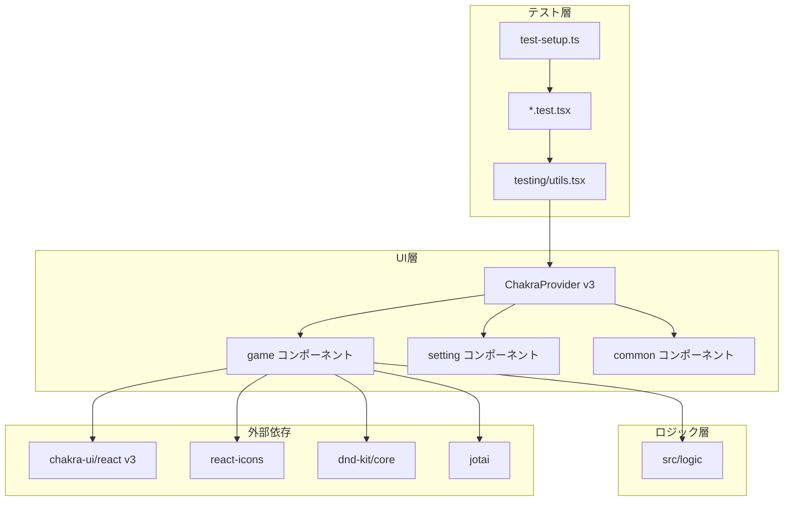
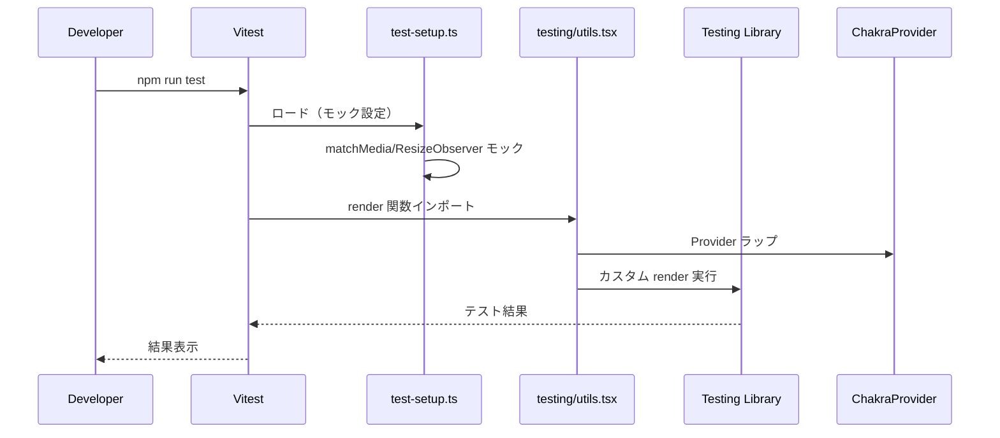
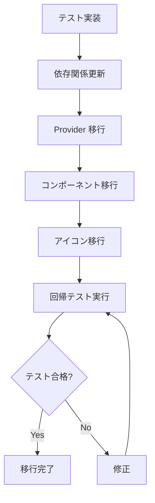
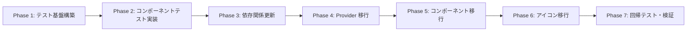

# Design Document: Chakra UI Upgrade

## Overview

**Purpose**: Chakra UI を v2.8.2 から v3 へアップグレードし、自前実装コンポーネントを Chakra 標準コンポーネントに移行することで、パフォーマンス向上、バンドルサイズ削減、保守性向上を実現する。

**Users**: 開発者が移行作業を実施し、エンドユーザーはアップグレード後も既存機能を継続利用する。

**Impact**: UI ライブラリの基盤を刷新し、不要な依存関係（@emotion/styled, framer-motion, @chakra-ui/icons）を削除。33 コンポーネントの Chakra v3 API への移行と、移行前のコンポーネントテスト実装を行う。

### Goals
- 移行前にコンポーネントテストを実装し、回帰確認を可能にする
- Chakra UI v3 への完全移行（段階的移行は不可）
- 不要な依存関係の削除によるバンドルサイズ削減
- 既存の UI/UX と機能を維持

### Non-Goals
- React 19 へのアップグレード（別フェーズ）
- @dnd-kit/core から @dnd-kit/react への移行（別フェーズ）
- ダークモード/ライトモードの実装
- カスタムテーマの実装

## Architecture

### Existing Architecture Analysis

**現在のアーキテクチャ**:
- **UI ライブラリ**: Chakra UI v2.8.2
- **依存関係**: @emotion/react, @emotion/styled, framer-motion, @chakra-ui/icons
- **状態管理**: Jotai（アトミック状態管理）
- **DnD**: @dnd-kit/core
- **テスト**: Vitest + happy-dom + @testing-library/react

**既存パターン**:
- 機能別コンポーネント分離（game/, setting/, common/, shared/）
- ロジック層とUI層の分離（src/logic/ は純粋関数）
- Chakra UI の useToast, useDisclosure 等のフック活用

**移行対象**:
- 33 React コンポーネント
- 7 ファイルで @chakra-ui/icons を使用
- ChakraProvider 設定

### Architecture Pattern & Boundary Map



**Architecture Integration**:
- **Selected pattern**: テスト先行移行（Test-First Migration）
- **Domain boundaries**: テスト層、UI層、ロジック層の分離を維持
- **Existing patterns preserved**: 機能別ディレクトリ構成、ロジック/UI分離
- **New components rationale**: テストユーティリティ（render 関数）の追加
- **Steering compliance**: UI/Logic 分離、テスト併置の原則を維持

### Technology Stack

| Layer | Choice / Version | Role in Feature | Notes |
|-------|------------------|-----------------|-------|
| UI Library | @chakra-ui/react v3.x | コンポーネント基盤 | v2.8.2 から移行 |
| Styling | @emotion/react (v3 依存) | CSS-in-JS | @emotion/styled は削除 |
| Icons | react-icons | アイコンライブラリ | @chakra-ui/icons から移行 |
| Testing | Vitest + @testing-library/react | コンポーネントテスト | 既存基盤を拡張 |
| Test Environment | happy-dom | DOM エミュレーション | 既存設定を維持 |

## System Flows

### コンポーネントテスト実行フロー



### Chakra UI v3 移行フロー



## Requirements Traceability

| Requirement | Summary | Components | Interfaces | Flows |
|-------------|---------|------------|------------|-------|
| 1.1-1.6 | コンポーネントテストの実装 | TestSetup, TestUtils, ComponentTests | CustomRender | テスト実行フロー |
| 2.1-2.5 | Chakra UI v3 へのアップグレード | package.json, Provider | - | 移行フロー |
| 3.1 | プロバイダー設定の移行 | Provider | ChakraProviderProps | 移行フロー |
| 4.1-4.4 | 自前実装コンポーネントの移行 | 全UIコンポーネント | Chakra v3 Props | - |
| 5.1-5.3 | アイコンシステムの移行 | 7 ファイル | react-icons API | - |
| 6.1-6.6 | 既存機能の動作保証 | 全コンポーネント | - | テスト実行フロー |
| 7.1-7.4 | パフォーマンスと品質基準 | ビルド設定 | - | - |

## Components and Interfaces

### コンポーネント概要

| Component | Domain/Layer | Intent | Req Coverage | Key Dependencies | Contracts |
|-----------|--------------|--------|--------------|------------------|-----------|
| TestSetup | テスト基盤 | テスト環境初期化 | 1.4, 1.6 | Vitest (P0) | - |
| TestUtils | テスト基盤 | カスタム render 提供 | 1.1-1.4 | Chakra (P0), Jotai (P1) | Service |
| ComponentTests | テスト | 各コンポーネントのテスト | 1.1-1.6 | TestUtils (P0), RTL (P0) | - |
| ChakraProvider v3 | UI基盤 | アプリ全体のスタイル提供 | 2.1-2.5, 3.1 | @chakra-ui/react v3 (P0) | - |

### テスト基盤

#### TestSetup (test-setup.ts)

| Field | Detail |
|-------|--------|
| Intent | Vitest テスト環境の初期化とブラウザ API モック設定 |
| Requirements | 1.4, 1.6 |

**Responsibilities & Constraints**
- @testing-library/jest-dom のマッチャー統合
- matchMedia, ResizeObserver, IntersectionObserver のモック提供
- 全テストファイルで自動適用

**Dependencies**
- Inbound: Vitest — setupFiles 経由でロード (P0)
- External: @testing-library/jest-dom/vitest — マッチャー拡張 (P0)

**Contracts**: Service [ ]

##### Service Interface

```typescript
// test-setup.ts の拡張内容
interface BrowserAPIMocks {
  matchMedia: (query: string) => MediaQueryList;
  ResizeObserver: typeof ResizeObserver;
  IntersectionObserver: typeof IntersectionObserver;
}

// window オブジェクトへのモック注入
declare global {
  interface Window extends BrowserAPIMocks {}
}
```

- Preconditions: Vitest 設定で setupFiles に指定
- Postconditions: 全テストでブラウザ API モックが利用可能
- Invariants: モックは各テスト後にリセットされない（グローバル設定）

**Implementation Notes**
- Integration: 既存の @testing-library/jest-dom/vitest インポートを維持
- Validation: happy-dom 環境で不足する API のみモック
- Risks: happy-dom 更新で不要になるモックがある可能性

#### TestUtils (src/testing/utils.tsx)

| Field | Detail |
|-------|--------|
| Intent | ChakraProvider と Jotai Provider をラップしたカスタム render 関数を提供 |
| Requirements | 1.1, 1.2, 1.3, 1.4 |

**Responsibilities & Constraints**
- @testing-library/react の render をラップ
- ChakraProvider で全コンポーネントをラップ
- Jotai のテスト用初期状態を設定可能
- 既存の testing-library API を再エクスポート

**Dependencies**
- Outbound: @testing-library/react — 基盤 render 関数 (P0)
- External: @chakra-ui/react v3 — ChakraProvider (P0)
- External: jotai — Provider, useHydrateAtoms (P1)

**Contracts**: Service [x]

##### Service Interface

```typescript
import { render as rtlRender, RenderOptions, RenderResult } from "@testing-library/react";
import { ReactElement } from "react";

interface CustomRenderOptions extends Omit<RenderOptions, "wrapper"> {
  /** Jotai アトムの初期値 */
  initialAtomValues?: Array<[Atom<unknown>, unknown]>;
}

/**
 * ChakraProvider と Jotai Provider をラップしたカスタム render 関数
 */
function render(
  ui: ReactElement,
  options?: CustomRenderOptions
): RenderResult;

// @testing-library/react の API を再エクスポート
export * from "@testing-library/react";
export { render };
```

- Preconditions: テスト対象コンポーネントが React コンポーネントであること
- Postconditions: コンポーネントが Chakra スタイル適用済みでレンダリング
- Invariants: 各 render 呼び出しで新しい Provider インスタンスを生成

**Implementation Notes**
- Integration: Chakra v2 → v3 移行後の Provider 構成に対応
- Validation: Jotai 初期値の型安全性を確保
- Risks: Chakra v3 の Provider API 変更に追従が必要

### テスト対象コンポーネント（優先順位順）

#### Priority 1: コア機能コンポーネント

| Component | Test Focus | Req Coverage |
|-----------|------------|--------------|
| Main | 初期設定/ゲーム画面の条件分岐 | 6.1 |
| InitialSettingPane | 入力操作、バリデーション、開始ボタン | 6.1 |
| GamePane | メンバー生成、離脱、共有ボタン操作 | 6.1, 6.2 |
| GenerateButton | 生成ロジック呼び出し、ローディング状態 | 6.1 |

#### Priority 2: ドラッグ&ドロップ機能

| Component | Test Focus | Req Coverage |
|-----------|------------|--------------|
| AdjustmentPane | DnD コンテキスト、メンバー入れ替え | 1.5, 6.2 |
| MemberBox | ドラッグ可能状態、視覚フィードバック | 1.5 |
| MemberDroppable | ドロップターゲット、ホバー状態 | 1.5 |

#### Priority 3: 統計・表示コンポーネント

| Component | Test Focus | Req Coverage |
|-----------|------------|--------------|
| StatisticsPane | 統計情報表示、警告表示 | 6.3, 6.4 |
| HistoryPane | 履歴一覧表示 | 6.3 |
| CourtMembersPane | コート別メンバー表示 | 6.3 |

#### Priority 4: ダイアログ・入力コンポーネント

| Component | Test Focus | Req Coverage |
|-----------|------------|--------------|
| ShareDialog | URL コピー、共有機能 | 6.5 |
| ConfirmDialog | 確認/キャンセル操作 | 6.1 |
| InitMemberCountInput | 増減ボタン、境界値 | 6.1 |
| CourtCountInput | コート数選択 | 6.1 |

### Chakra UI v3 移行対象コンポーネント

#### アイコン移行マッピング

| @chakra-ui/icons | react-icons 代替 | 使用ファイル |
|------------------|------------------|--------------|
| ArrowForwardIcon | MdArrowForward (md) | InitialSettingPane.tsx |
| AddIcon | MdAdd (md) | InitMemberCountInput.tsx |
| MinusIcon | MdRemove (md) | InitMemberCountInput.tsx |
| QuestionOutlineIcon | MdHelpOutline (md) | HelpButton.tsx |
| ExternalLinkIcon | MdOpenInNew (md) | UsageAlertDialog.tsx |
| ChevronRightIcon | MdChevronRight (md) | UsageAlertDialog.tsx |
| CheckIcon | MdCheck (md) | GenerateButton.tsx |
| RepeatClockIcon | MdHistory (md) | GenerateButton.tsx |
| CopyIcon | MdContentCopy (md) | ShareDialog.tsx |
| SmallCloseIcon | MdClose (md) | ResetButton.tsx |

#### Chakra v3 API 変更対応

| v2 API | v3 API | 影響範囲 |
|--------|--------|----------|
| ChakraProvider + theme | Provider (from snippets) | Main.tsx 相当 |
| useToast | toaster (from snippets) | GamePane, AdjustmentPane |
| useDisclosure | Dialog 状態管理 | 複数ダイアログ |
| isExternal (Link) | external | InitialSettingPane |
| colorScheme prop | colorPalette prop | 全ボタン |
| useRadio/useRadioGroup | SegmentedControl | CourtCountInput, AlgorithmInput |

#### SegmentedControl 移行対象

**CourtCountInput** (現在 55 行 → 移行後 約 15 行)
- 現在: useRadio + useRadioGroup でカスタムボタンスタイルを実装
- 移行後: SegmentedControl.Root + SegmentedControl.Item

**AlgorithmInput** (現在 19 行 → 移行後 約 10 行)
- 現在: RadioGroup + Radio
- 移行後: SegmentedControl.Root + SegmentedControl.Item

```typescript
// 移行後のイメージ（CourtCountInput）
import { SegmentedControl } from "@chakra-ui/react";

export function CourtCountInput({ value, onChange }: Props) {
  return (
    <SegmentedControl.Root
      value={value.toString()}
      onValueChange={(details) => onChange(parseInt(details.value, 10))}
    >
      {COURT_IDS.map((courtId) => (
        <SegmentedControl.Item key={courtId} value={courtId}>
          {courtId}
        </SegmentedControl.Item>
      ))}
    </SegmentedControl.Root>
  );
}
```

## Data Models

本機能ではデータモデルの変更はなし。既存の型定義を維持。

## Error Handling

### Error Strategy
テスト実行時のエラーは Vitest のレポート機能で表示。移行時のコンパイルエラーは TypeScript の型チェックで検出。

### Error Categories and Responses
- **テスト失敗**: アサーションエラー → テストレポートで詳細確認
- **型エラー**: Chakra v3 API 変更 → TypeScript エラーメッセージで修正箇所特定
- **ランタイムエラー**: Provider 未設定 → カスタム render 関数で解決

## Testing Strategy

### Unit Tests (コンポーネントテスト)
1. Main: 条件分岐による画面切り替え
2. InitialSettingPane: フォーム入力と開始ボタン
3. GamePane: メンバー操作とイベント発火
4. GenerateButton: 生成ロジック呼び出し
5. StatisticsPane: 統計情報の表示

### Integration Tests
1. InitialSettingPane → GamePane: 設定完了後の画面遷移
2. AdjustmentPane: DnD によるメンバー入れ替えと状態更新
3. ShareDialog: URL 生成とクリップボードコピー

### E2E/UI Tests (手動確認)
1. 初期設定 → ゲーム開始フロー
2. メンバー生成 → 統計確認フロー
3. ドラッグ&ドロップ調整フロー
4. URL 共有フロー

## Migration Strategy



### Phase 1: テスト基盤構築
- test-setup.ts にブラウザ API モック追加
- src/testing/utils.tsx にカスタム render 関数作成

### Phase 2: コンポーネントテスト実装
- Priority 1-4 の順でテスト作成
- 各コンポーネントの主要機能をカバー

### Phase 3: 依存関係更新
- @chakra-ui/react v3 インストール
- @emotion/styled, framer-motion, @chakra-ui/icons 削除

### Phase 4: Provider 移行
- ChakraProvider を v3 形式に更新
- 必要に応じて createSystem 設定

### Phase 5: コンポーネント移行
- v3 API に合わせてプロップス更新
- 名前空間インポートへの変更（必要に応じて）

### Phase 6: アイコン移行
- @chakra-ui/icons → react-icons に置換
- アイコンマッピング表に従って更新

### Phase 7: 回帰テスト・検証
- 全テスト実行
- 手動での UI 確認
- ビルド・lint・型チェック
